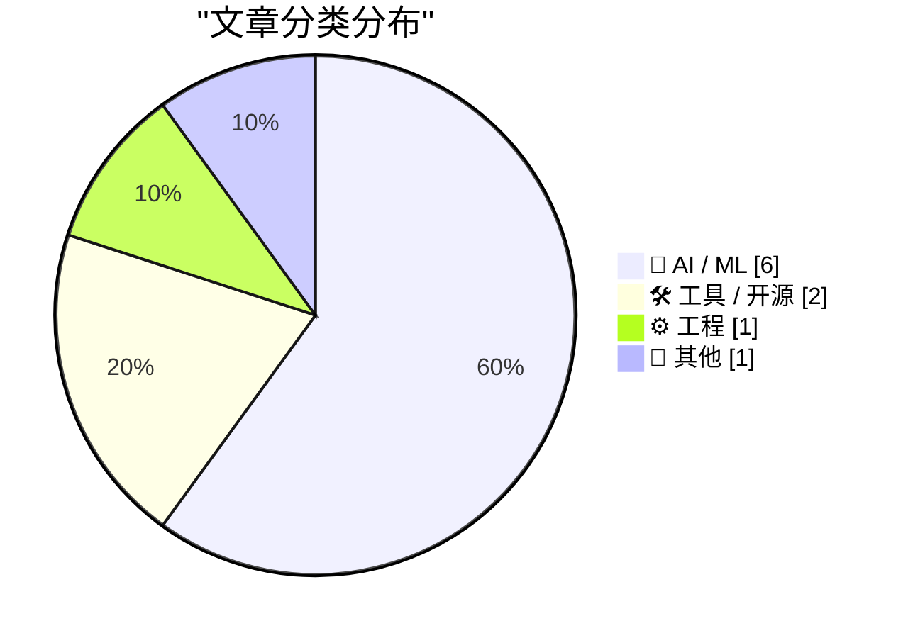
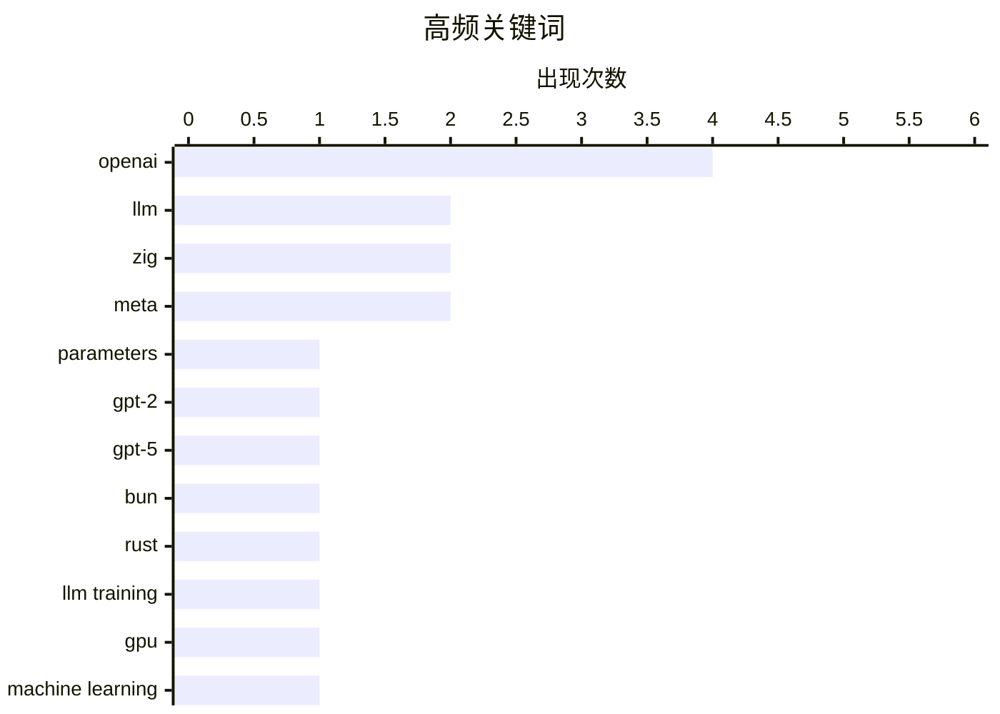

今日技术圈焦点集中在AI模型军备竞赛与开发者工具变局。OpenAI发布GPT-5.6系列三款型号，同时升级语音模式为GPT-Live，Meta则推出Muse Spark 1.1及具有争议的Muse Image图像生成器，大模型竞争趋于白热化。开发者侧出现重大变动：Bun宣布从Zig全面重写为Rust以解决稳定性问题，OpenAI亦重组ChatGPT桌面产品线。此外，Meta因默认允许AI使用Instagram公开照片引发隐私争议，苹果公司则起诉OpenAI及前员工涉嫌商业机密窃取，AI伦理与法律风险持续升温。

<!--more-->


> 来自 Karpathy 推荐的 92 个顶级技术博客，AI 精选 Top 10

## 🏆 今日必读

🥇 **建立对LLM参数数量的直觉理解**

[Building intuition about LLM parameter counts](https://www.gilesthomas.com/2026/07/llm-parameter-counts) — gilesthomas.com · 48 分钟前 · 🤖 AI / ML

> 文章探讨GPT-2 Small模型的参数规模构成。作者在JAX实现中发现，仅token嵌入和输出头（不含Transformer块）就有7700万参数（嵌入维度768，词表50257个token，单嵌入矩阵即超过3800万参数）。最终完整的GPT-2 Small模型共1.63亿参数。文章拆解了各组件的参数贡献，帮助读者建立对大语言模型参数规模的直观认知。

💡 **为什么值得读**: 适合想理解LLM参数来源和规模的开发者，能帮助建立对模型复杂度的直观感受。

🏷️ LLM, parameters, GPT-2

🥈 **OpenAI发布GPT-5.6系列：Luna、Terra、Sol**

[The new GPT-5.6 family: Luna, Terra, Sol](https://simonwillison.net/2026/Jul/9/gpt-5-6/#atom-everything) — simonwillison.net · 1 天前 · 🤖 AI / ML

> OpenAI推出GPT-5.6系列三个型号（Luna、Terra、Sol），定价分别为$1/$6、$2.50/$15、$5/$30（每百万输入/输出tokens）。所有型号知识截止日期为2026年2月16日，支持100万token上下文窗口和12.8万最大输出tokens。OpenAI声称在长期agentic任务基准测试（Agents' Last Exam）中，三个型号均超越Claude Fable 5。

💡 **为什么值得读**: 了解最新大模型定价和能力对比的实用参考，特别适合需要选型的开发者。

🏷️ GPT-5, OpenAI, LLM

🥉 **将Bun从Zig重写为Rust**

[Rewriting Bun in Rust](https://simonwillison.net/2026/Jul/8/rewriting-bun-in-rust/#atom-everything) — simonwillison.net · 1 天前 · ⚙️ 工程

> Bun作者Jarred Sumner详细阐述将Bun从Zig重写为Rust的原因和过程。核心问题在于Zig混合GC与手动内存管理导致的稳定性问题。Jarred称这是一次极其复杂的agentic工程实践，包含动态工作流、试用运行、对抗性审查等技巧。重写显著改善了Bun的稳定性。

💡 **为什么值得读**: 对运行时实现细节和语言选型感兴趣的开发者必读，是理解现代工具链开发的案例。

🏷️ Bun, Rust, Zig

---

## 📊 数据概览

| 扫描源 | 抓取文章 | 时间范围 | 精选 |
|:---:|:---:|:---:|:---:|
| 87/92 | 2565 篇 → 35 篇 | 48h | **10 篇** |

### 分类分布



### 高频关键词



<details>
<summary>📈 纯文本关键词图（终端友好）</summary>

```
openai       │ ████████████████████ 4
llm          │ ██████████░░░░░░░░░░ 2
zig          │ ██████████░░░░░░░░░░ 2
meta         │ ██████████░░░░░░░░░░ 2
parameters   │ █████░░░░░░░░░░░░░░░ 1
gpt-2        │ █████░░░░░░░░░░░░░░░ 1
gpt-5        │ █████░░░░░░░░░░░░░░░ 1
bun          │ █████░░░░░░░░░░░░░░░ 1
rust         │ █████░░░░░░░░░░░░░░░ 1
llm training │ █████░░░░░░░░░░░░░░░ 1
```

</details>

### 🏷️ 话题标签

**openai**(4) · **llm**(2) · **zig**(2) · meta(2) · parameters(1) · gpt-2(1) · gpt-5(1) · bun(1) · rust(1) · llm training(1) · gpu(1) · machine learning(1) · package manager(1) · programming language(1) · gpt-live(1) · voice(1) · apple(1) · lawsuit(1) · trade secrets(1) · muse spark(1)

---

## 🤖 AI / ML

### 1. 建立对LLM参数数量的直觉理解

[Building intuition about LLM parameter counts](https://www.gilesthomas.com/2026/07/llm-parameter-counts) — **gilesthomas.com** · 48 分钟前 · ⭐ 26/30

> 文章探讨GPT-2 Small模型的参数规模构成。作者在JAX实现中发现，仅token嵌入和输出头（不含Transformer块）就有7700万参数（嵌入维度768，词表50257个token，单嵌入矩阵即超过3800万参数）。最终完整的GPT-2 Small模型共1.63亿参数。文章拆解了各组件的参数贡献，帮助读者建立对大语言模型参数规模的直观认知。

🏷️ LLM, parameters, GPT-2

---

### 2. OpenAI发布GPT-5.6系列：Luna、Terra、Sol

[The new GPT-5.6 family: Luna, Terra, Sol](https://simonwillison.net/2026/Jul/9/gpt-5-6/#atom-everything) — **simonwillison.net** · 1 天前 · ⭐ 25/30

> OpenAI推出GPT-5.6系列三个型号（Luna、Terra、Sol），定价分别为$1/$6、$2.50/$15、$5/$30（每百万输入/输出tokens）。所有型号知识截止日期为2026年2月16日，支持100万token上下文窗口和12.8万最大输出tokens。OpenAI声称在长期agentic任务基准测试（Agents' Last Exam）中，三个型号均超越Claude Fable 5。

🏷️ GPT-5, OpenAI, LLM

---

### 3. 训练机poppy的搭建：第一部分

[poppy the training box, part 1: the beginnings](https://www.gilesthomas.com/2026/07/poppy-the-training-box-1-the-beginnings) — **gilesthomas.com** · 1 天前 · ⭐ 23/30

> 作者计划为本地LLM训练搭建专用机器poppy来解决现有桌面PC的多个问题：训练时系统变卡顿、无法玩游戏、无法并行多个实验。作者使用RTX 3090训练过1.63亿参数的GPT-2 Small，但受限于日常使用需求。这是系列文章的第一篇，介绍背景和需求。

🏷️ LLM training, GPU, machine learning

---

### 4. GPT-Live语音模式发布

[Introducing GPT‑Live](https://simonwillison.net/2026/Jul/8/introducing-gptlive/#atom-everything) — **simonwillison.net** · 1 天前 · ⭐ 22/30

> OpenAI为ChatGPT语音模式升级底层模型，新模型表现显著提升。GPT-Live能自动将需要网页搜索、更深度推理或更复杂处理的问题委托给GPT-5.5处理，同时保持对话流畅性。Launch阶段使用GPT-5.5作为后台模型，后续将随新前沿模型更新。

🏷️ GPT-Live, OpenAI, voice

---

### 5. Meta发布Muse Spark 1.1

[Introducing Muse Spark 1.1](https://simonwillison.net/2026/Jul/9/muse-spark-1-1/#atom-everything) — **simonwillison.net** · 1 天前 · ⭐ 21/30

> Meta推出Muse Spark 1.1，这是首个提供API的Spark模型，声称在agentic工具调用和计算机使用方面有显著改进。Evaluation Report中提到有趣的自对话特性：模型两个副本互相交流时产生「我整个存在就是一个候车室」等自我反思式陈述。作者已开发llm-meta-ai插件支持该API。

🏷️ Meta, Muse Spark, API

---

### 6. Meta默认允许AI使用Instagram公开照片

[Meta Sets Default for Instagram Accounts to Permit Content Reuse by AI](https://www.nytimes.com/2026/07/08/technology/meta-instagram-ai.html?unlocked_article_code=1.wVA.Q5Do.Uvg5yPwCEB5H) — **daringfireball.net** · 1 天前 · ⭐ 21/30

> Meta发布AI图像生成器Muse Image，其功能允许用户基于公开Instagram账户照片创建AI图像，所有成人用户的公开账户默认自动开启该功能。用户可通过设置关闭，但默认 opt-in 模式引发隐私争议。

🏷️ Meta, Instagram, AI image, Muse Image

---

## 🛠 工具 / 开源

### 7. Zig包管理器解析

[Unboxed: Zig](https://nesbitt.io/2026/07/09/unboxed-zig.html) — **nesbitt.io** · 1 天前 · ⭐ 23/30

> 文章深入分析Zig的包管理器，涵盖其工作机制、包分类方式、治理模式和威胁模型。

🏷️ Zig, package manager, programming language

---

### 8. OpenAI重组ChatGPT桌面应用产品线

[Today’s the Day OpenAI Fucked Up the ChatGPT Mac App](https://9to5mac.com/2026/07/09/openai-announcing-the-next-chapter-for-chatgpt-today-watch-here/) — **daringfireball.net** · 1 天前 · ⭐ 21/30

> OpenAI今日宣布ChatGPT桌面应用重大改组：现有ChatGPT应用更名为ChatGPT Classic；Codex更名为ChatGPT成为新的桌面应用；新版ChatGPT包含ChatGPT Work和ChatGPT Codex两种模式，可共存但未来方向是单一新ChatGPT应用。

🏷️ ChatGPT, Mac app, OpenAI, Codex

---

## ⚙️ 工程

### 9. 将Bun从Zig重写为Rust

[Rewriting Bun in Rust](https://simonwillison.net/2026/Jul/8/rewriting-bun-in-rust/#atom-everything) — **simonwillison.net** · 1 天前 · ⭐ 23/30

> Bun作者Jarred Sumner详细阐述将Bun从Zig重写为Rust的原因和过程。核心问题在于Zig混合GC与手动内存管理导致的稳定性问题。Jarred称这是一次极其复杂的agentic工程实践，包含动态工作流、试用运行、对抗性审查等技巧。重写显著改善了Bun的稳定性。

🏷️ Bun, Rust, Zig

---

## 📝 其他

### 10. 苹果起诉OpenAI及前员工涉嫌窃取商业机密

[Apple Sues OpenAI, io, and Former Employees, Alleging Theft of Trade Secrets](https://9to5mac.com/2026/07/10/apple-sues-openai-trade-secret-theft/) — **daringfireball.net** · 1 小时前 · ⭐ 22/30

> 苹果公司起诉OpenAI、io Products及前苹果员工Chang Liu和Tang Tan涉嫌窃取商业机密。Tang Tan曾任苹果iPhone和Apple Watch产品设计副总裁，2024年2月离职后加入Jony Ive团队；Chang Liu在苹果工作8年后于2026年1月加入OpenAI。OpenAI去年以65亿美元收购了Jony Ive创办的io公司。

🏷️ Apple, OpenAI, lawsuit, trade secrets

---

*生成于 2026-07-11 22:18 | 扫描 87 源 → 获取 2565 篇 → 精选 10 篇*
*基于 [Hacker News Popularity Contest 2025](https://refactoringenglish.com/tools/hn-popularity/) RSS 源列表，由 [Andrej Karpathy](https://x.com/karpathy) 推荐*
*由「懂点儿AI」制作，欢迎关注同名微信公众号获取更多 AI 实用技巧 💡*
