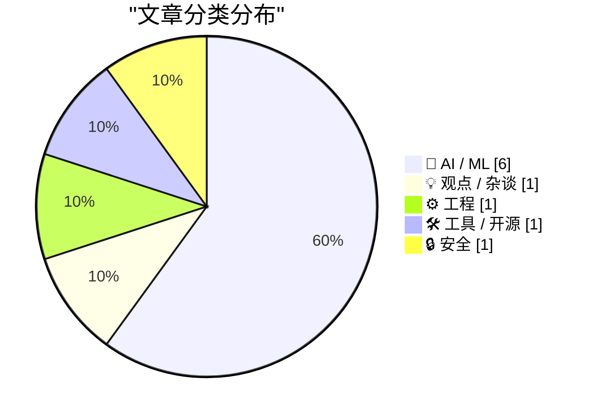
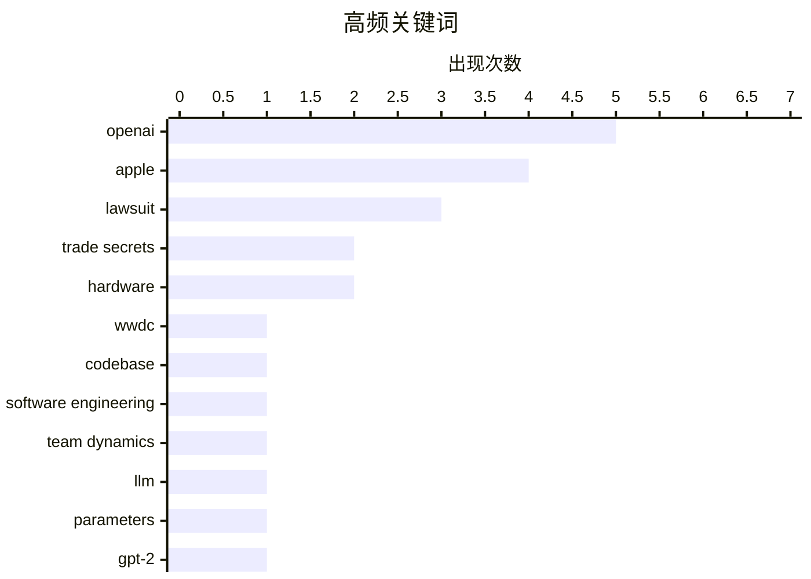

今日技术圈焦点集中在苹果与OpenAI的正面交锋：苹果已正式起诉OpenAI及前苹果员工涉嫌盗取商业秘密，双方人才争夺战愈演愈烈，苹果智能眼镜负责人等核心技术人员被挖角。与此同时，大型代码库的复杂性持续引发讨论，AI参数规模虽已突破亿级，但硬件产品化面临隐私、功耗等现实瓶颈，gehot等从业者开始反思AI技术落地的艰巨性。

<!--more-->


> 来自 Karpathy 推荐的 92 个顶级技术博客，AI 精选 Top 10

## 🏆 今日必读

🥇 **苹果在WWDC对OpenAI合作态度冷淡**

[Ice Cold](https://www.threads.com/@alexheath/post/DaoI2jaEioX) — daringfireball.net · 19 小时前 · 🤖 AI / ML

> 苹果在WWDC期间对OpenAI合作问题态度冷淡，现原因揭晓：苹果刚起诉OpenAI涉嫌盗取消费硬件相关的商业秘密。苹果高管本周在太阳谷与OpenAI高管会面。作者此前询问Siri与ChatGPT相关问题时也遇到同样冷淡的回应，原本以为是不想分散对Siri AI的注意力，现在看来是另有隐情。

💡 **为什么值得读**: 揭示了苹果与OpenAI从合作到诉讼的背后故事，是理解科技巨头AI竞争格局的关键信息。

🏷️ Apple, OpenAI, lawsuit, WWDC

🥈 **苹果起诉OpenAI及前员工涉嫌盗取商业秘密**

[Apple Sues OpenAI, io, and Former Employees, Alleging Theft of Trade Secrets](https://9to5mac.com/2026/07/10/apple-sues-openai-trade-secret-theft/) — daringfireball.net · 1 天前 · 🤖 AI / ML

> 苹果起诉OpenAI、io Products及前员工Tang Tan和Chang Liu涉嫌盗取商业秘密。Tang Tan曾任苹果产品设计副总裁，负责iPhone和Apple Watch设计，于2024年2月离职后加入Jony Ive的团队。Chang Liu在苹果工作8年，离职后于2026年1月加入OpenAI。OpenAI去年以65亿美元收购了io公司。

💡 **为什么值得读**: 深入了解苹果与OpenAI法律纠纷的细节，以及前苹果高管转投OpenAI的完整背景。

🏷️ Apple, OpenAI, lawsuit, trade secrets

🥉 **为不理解你的代码库辩护**

[In defense of not understanding your codebase](https://seangoedecke.com/in-defense-of-not-understanding-your-codebase/) — seangoedecke.com · 22 小时前 · 💡 观点 / 杂谈

> 关于软件工程师需要对自己的代码库了解多少的问题，作者认为小型代码库团队认为必须完全理解，而大型代码库团队认为不可能完全理解。作者为后者辩护，指出在线讨论中前者声音过大，但实际上大型代码库的高人员流动是常态。

💡 **为什么值得读**: 对大型项目开发者的实际工作状态有深刻洞察，挑战了「必须完全理解代码」的常见偏见。

🏷️ codebase, software engineering, team dynamics

---

## 📊 数据概览

| 扫描源 | 抓取文章 | 时间范围 | 精选 |
|:---:|:---:|:---:|:---:|
| 88/92 | 2591 篇 → 33 篇 | 48h | **10 篇** |

### 分类分布



### 高频关键词



<details>
<summary>📈 纯文本关键词图（终端友好）</summary>

```
openai               │ ████████████████████ 5
apple                │ ████████████████░░░░ 4
lawsuit              │ ████████████░░░░░░░░ 3
trade secrets        │ ████████░░░░░░░░░░░░ 2
hardware             │ ████████░░░░░░░░░░░░ 2
wwdc                 │ ████░░░░░░░░░░░░░░░░ 1
codebase             │ ████░░░░░░░░░░░░░░░░ 1
software engineering │ ████░░░░░░░░░░░░░░░░ 1
team dynamics        │ ████░░░░░░░░░░░░░░░░ 1
llm                  │ ████░░░░░░░░░░░░░░░░ 1
```

</details>

### 🏷️ 话题标签

**openai**(5) · **apple**(4) · **lawsuit**(3) · trade secrets(2) · hardware(2) · wwdc(1) · codebase(1) · software engineering(1) · team dynamics(1) · llm(1) · parameters(1) · gpt-2(1) · jax(1) · ar glasses(1) · cameras(1) · privacy(1) · quadrf(1) · drones(1) · wifi(1) · rf detection(1)

---

## 🤖 AI / ML

### 1. 苹果在WWDC对OpenAI合作态度冷淡

[Ice Cold](https://www.threads.com/@alexheath/post/DaoI2jaEioX) — **daringfireball.net** · 19 小时前 · ⭐ 24/30

> 苹果在WWDC期间对OpenAI合作问题态度冷淡，现原因揭晓：苹果刚起诉OpenAI涉嫌盗取消费硬件相关的商业秘密。苹果高管本周在太阳谷与OpenAI高管会面。作者此前询问Siri与ChatGPT相关问题时也遇到同样冷淡的回应，原本以为是不想分散对Siri AI的注意力，现在看来是另有隐情。

🏷️ Apple, OpenAI, lawsuit, WWDC

---

### 2. 苹果起诉OpenAI及前员工涉嫌盗取商业秘密

[Apple Sues OpenAI, io, and Former Employees, Alleging Theft of Trade Secrets](https://9to5mac.com/2026/07/10/apple-sues-openai-trade-secret-theft/) — **daringfireball.net** · 1 天前 · ⭐ 24/30

> 苹果起诉OpenAI、io Products及前员工Tang Tan和Chang Liu涉嫌盗取商业秘密。Tang Tan曾任苹果产品设计副总裁，负责iPhone和Apple Watch设计，于2024年2月离职后加入Jony Ive的团队。Chang Liu在苹果工作8年，离职后于2026年1月加入OpenAI。OpenAI去年以65亿美元收购了io公司。

🏷️ Apple, OpenAI, lawsuit, trade secrets

---

### 3. 建立对LLM参数数量的直观理解

[Building intuition about LLM parameter counts](https://www.gilesthomas.com/2026/07/llm-parameter-counts) — **gilesthomas.com** · 1 天前 · ⭐ 23/30

> 作者在JAX中实现GPT-2时发现，即使是去掉Transformer块、注意力机制和前馈网络的简化模型，也有7700万个参数（词嵌入维度768，词表50257）。最终项目中的LLM有1.63亿参数，展示了参数数量的规模感。

🏷️ LLM, parameters, GPT-2, JAX

---

### 4. Fidji Simo离职OpenAI

[Shocking No One, Fidji Simo, Would-Be Usurper, Is Out at OpenAI](https://www.wsj.com/tech/openai-top-executive-fidji-simo-to-step-down-c3daca47?st=NfBZTe) — **daringfireball.net** · 1 天前 · ⭐ 22/30

> OpenAI二号高管Fidji Simo因健康原因将离职，转任兼职顾问。她此前是Instacart CEO，加入OpenAI后领导了AI编码工具的早期开发。OpenAI在败给Anthropic后紧急转向企业AI编码工具市场，上线了新的编程超级应用，并砍掉了Sora等副项目。

🏷️ OpenAI, executive, departure, leadership

---

### 5. AI 2040与智能崇拜

[AI 2040 and the Cult of Intelligence](https://geohot.github.io//blog/jekyll/update/2026/07/11/ai-2040.html) — **geohot.github.io** · 15 小时前 · ⭐ 22/30

> geohot曾是AI加速主义信徒，读过Yudkowsky的作品后担心递归自我改进的超级AI。但加入现实世界后，他发现做硬件产品极其复杂，现实中充满繁琐细节。他质疑那些AI论文作者是否连换个自行车轮胎都不会。

🏷️ AI, hardware, machine learning, reality

---

### 6. Gurman：苹果与OpenAI人才争夺战

[Gurman on Tang Tan and Paul Meade](https://www.bloomberg.com/news/articles/2026-07-11/openai-engineer-s-lol-moment-set-stage-for-legal-fight-with-apple) — **daringfireball.net** · 4 小时前 · ⭐ 21/30

> 苹果对OpenAI的挖人行为迅速警觉，OpenAI不仅挖走了资深硬件和设计领袖，还从多个工程团队大量招人。6月最新一起是挖走了苹果智能眼镜负责人Paul Meade，苹果未给予过渡期。Tang Tan在苹果25年职业生涯以敢于冒险著称，被形容为「非常接近太阳」地快速行动。

🏷️ OpenAI, Apple, hiring, talent poaching

---

## 💡 观点 / 杂谈

### 7. 为不理解你的代码库辩护

[In defense of not understanding your codebase](https://seangoedecke.com/in-defense-of-not-understanding-your-codebase/) — **seangoedecke.com** · 22 小时前 · ⭐ 23/30

> 关于软件工程师需要对自己的代码库了解多少的问题，作者认为小型代码库团队认为必须完全理解，而大型代码库团队认为不可能完全理解。作者为后者辩护，指出在线讨论中前者声音过大，但实际上大型代码库的高人员流动是常态。

🏷️ codebase, software engineering, team dynamics

---

## ⚙️ 工程

### 8. Nilay Patel：AR眼镜侵犯隐私的必然性

[Quoting Nilay Patel](https://simonwillison.net/2026/Jul/10/nilay-patel/#atom-everything) — **simonwillison.net** · 1 天前 · ⭐ 22/30

> Nilay Patel指出，制作AR眼镜需要在眼睛旁边放置持续录制和处理所见内容的摄像头，目前没有芯片能同时满足足够强大和足够省电的要求。数据必须上传云端处理，这意味着必然侵犯用户隐私。他质疑为实现这个所谓的「下一代产品」而牺牲隐私是否值得。

🏷️ AR glasses, hardware, cameras, privacy

---

## 🛠 工具 / 开源

### 9. QuadRF：可透视墙壁的相控阵无线电

[QuadRF can spot drones and see WiFi through my wall](https://www.jeffgeerling.com/blog/2026/quadrf-can-spot-drones-and-see-wifi-through-my-wall/) — **jeffgeerling.com** · 1 天前 · ⭐ 22/30

> QuadRF是一款基于树莓派5和FPGA的相控阵无线电设备，具有皮秒级定时精度，可进行高级信号处理和波束成形。它能透视墙壁看到WiFi信号并追踪飞行中的无人机。作者感叹开源社区已能做到此等地步，政府能力更不可想象。

🏷️ QuadRF, drones, WiFi, RF detection

---

## 🔒 安全

### 10. OpenAI对诉讼的回应引发质疑

[‘No Interest’](https://x.com/drewpusateri/status/2075708238650089981) — **daringfireball.net** · 18 小时前 · ⭐ 21/30

> OpenAI回应苹果诉讼称「对其他公司的商业秘密不感兴趣」，作者用钱包被偷的例子质疑：如果怀疑某人偷了钱包，说「我对别人的钱包不感兴趣」是非常奇怪的回应。

🏷️ OpenAI, lawsuit, trade secrets, Apple

---

*生成于 2026-07-12 22:19 | 扫描 88 源 → 获取 2591 篇 → 精选 10 篇*
*基于 [Hacker News Popularity Contest 2025](https://refactoringenglish.com/tools/hn-popularity/) RSS 源列表，由 [Andrej Karpathy](https://x.com/karpathy) 推荐*
*由「懂点儿AI」制作，欢迎关注同名微信公众号获取更多 AI 实用技巧 💡*
