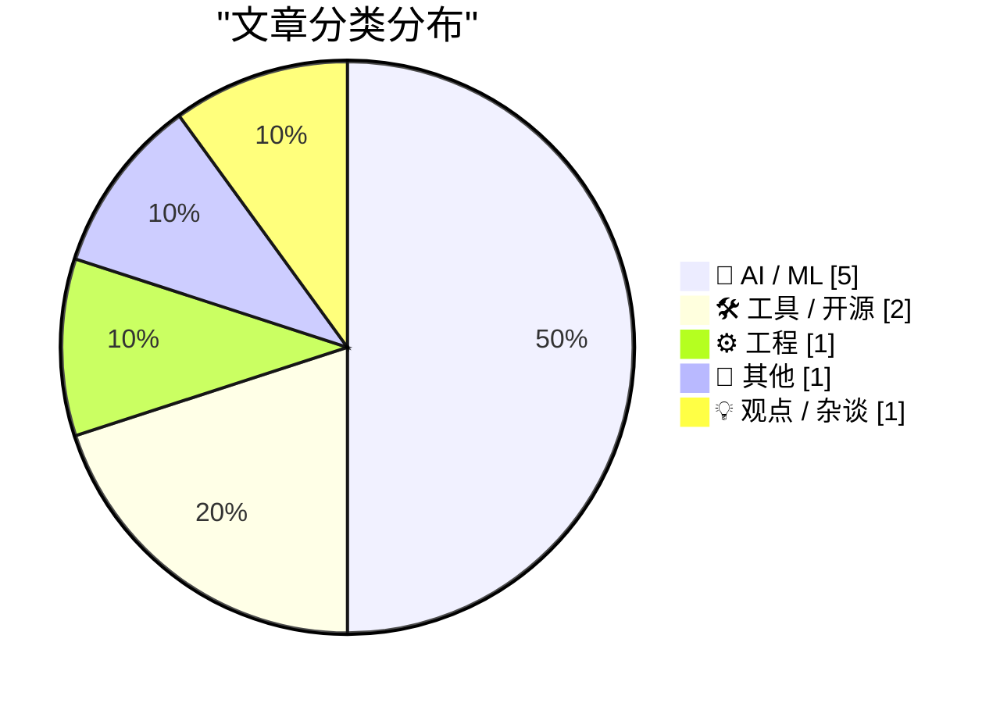
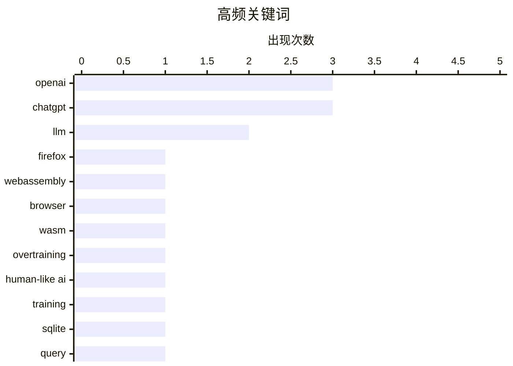

今日看点：AI领域继续呈现产品整合与用户体验回归的双重趋势，OpenAI重组产品线并强化ChatGPT聊天功能，同时Roblox推出AI辅助游戏创建工具；技术伦理与监管议题持续升温，Google因Android垄断被欧盟处以47亿美元创纪录罚款，AI生成内容侵权问题在图书出版领域泛滥成灾。

<!--more-->


> 来自 Karpathy 推荐的 92 个顶级技术博客，AI 精选 Top 10

## 🏆 今日必读

🥇 **在WebAssembly中运行Firefox**

[Firefox in WebAssembly](https://simonwillison.net/2026/Jul/16/firefox-in-webassembly/#atom-everything) — simonwillison.net · 1 天前 · ⚙️ 工程

> Puter团队成功将Firefox编译为WebAssembly，实现了浏览器中运行浏览器的惊人壮举。该项目选用Firefox/Gecko是因其强大的单进程支持，生成的gzip.wasm达233MB，chrome-assets.tar.zst为18MB。所有流量通过Wisp协议经由Puter服务器中转。项目使用了约25,000美元的Claude Opus和Fable tokens，但因Claude Max订阅实际成本更低。

💡 **为什么值得读**: 这是WebAssembly能力的极限展示，让人体会到浏览器沙箱的无限可能。

🏷️ Firefox, WebAssembly, browser, WASM

🥈 **过度训练：通往类人AI之路**

[Overtraining as the path to human-like AI](https://seangoedecke.com/overtraining-as-the-path-to-human-like-ai/) — seangoedecke.com · 22 小时前 · 🤖 AI / ML

> 匿名博主Gwern发表了13000字长文，提出为何当前LLM缺乏真正灵活的人类智能、以及如何训练出具备类人智能的LLM的理论。Gwern是除OpenAI外最早预见LLM潜力和扩展竞赛的人，地位独特。作者认为通过"过度训练"（overtraining）可能是突破当前LLM局限的关键路径。

💡 **为什么值得读**: Gwern的AI预测往绩极佳，其关于类人智能的新理论值得关注。

🏷️ LLM, overtraining, human-like AI, training

🥉 **SQLite查询解释器**

[SQLite Query Explainer](https://simonwillison.net/2026/Jul/18/sqlite-query-explainer/#atom-everything) — simonwillison.net · 5 小时前 · 🛠 工具 / 开源

> Simon Willison受Julia Evans"想学看查询计划"的启发，开发了一款交互式SQLite查询解释工具。该工具在浏览器中通过Pyodide运行Python和SQLite，对EXPLAIN和EXPLAIN QUERY PLAN的结果添加解释层。由于作者自谦对SQLite查询计划理解有限，使用时需谨慎。

💡 **为什么值得读**: 帮助SQL初学者理解查询执行计划，是学习数据库优化的实用工具。

🏷️ SQLite, query, explainer, database

---

## 📊 数据概览

| 扫描源 | 抓取文章 | 时间范围 | 精选 |
|:---:|:---:|:---:|:---:|
| 87/92 | 2586 篇 → 39 篇 | 48h | **10 篇** |

### 分类分布



### 高频关键词



<details>
<summary>📈 纯文本关键词图（终端友好）</summary>

```
openai        │ ████████████████████ 3
chatgpt       │ ████████████████████ 3
llm           │ █████████████░░░░░░░ 2
firefox       │ ███████░░░░░░░░░░░░░ 1
webassembly   │ ███████░░░░░░░░░░░░░ 1
browser       │ ███████░░░░░░░░░░░░░ 1
wasm          │ ███████░░░░░░░░░░░░░ 1
overtraining  │ ███████░░░░░░░░░░░░░ 1
human-like ai │ ███████░░░░░░░░░░░░░ 1
training      │ ███████░░░░░░░░░░░░░ 1
```

</details>

### 🏷️ 话题标签

**openai**(3) · **chatgpt**(3) · **llm**(2) · firefox(1) · webassembly(1) · browser(1) · wasm(1) · overtraining(1) · human-like ai(1) · training(1) · sqlite(1) · query(1) · explainer(1) · database(1) · cliché(1) · writing(1) · detection(1) · ai books(1) · copyright(1) · amazon(1)

---

## 🤖 AI / ML

### 1. 过度训练：通往类人AI之路

[Overtraining as the path to human-like AI](https://seangoedecke.com/overtraining-as-the-path-to-human-like-ai/) — **seangoedecke.com** · 22 小时前 · ⭐ 24/30

> 匿名博主Gwern发表了13000字长文，提出为何当前LLM缺乏真正灵活的人类智能、以及如何训练出具备类人智能的LLM的理论。Gwern是除OpenAI外最早预见LLM潜力和扩展竞赛的人，地位独特。作者认为通过"过度训练"（overtraining）可能是突破当前LLM局限的关键路径。

🏷️ LLM, overtraining, human-like AI, training

---

### 2. Apple Books和Amazon上的AI生成书籍泛滥

[Apple Books and Amazon Are Lousy With AI-Generated Books Ripping Off Legitimate Authors](https://thenewthings.com/p/apple-big-ai-book-slop-problem) — **daringfireball.net** · 21 小时前 · ⭐ 23/30

> Joanna Stern报道其新书《I AM NOT A ROBOT》发售仅数日后，Apple Books上出现至少10个AI生成的克隆版本，封面风格（蓝黄红配色）高度相似，定价9.99至20.99美元不等。作者联系Apple后这些克隆书被下架，但一个月后又卷土重来。Lena Dunham的《Famesick》等其他作者的作品也遭遇类似侵权。

🏷️ AI books, copyright, Amazon, Apple Books

---

### 3. Roblox推出AI游戏构建功能

[Roblox Set to Introduce AI Game-Building Feature, Including on iOS](https://about.roblox.com/newsroom/2026/07/build-without-limits-on-roblox) — **daringfireball.net** · 1 天前 · ⭐ 22/30

> Roblox宣布推出Build功能——一个移动端优先的创作标签页，以及Studio中面向各水平创作者的AI工具套件。凭借1.32亿日活跃用户，Roblox将在7月28日开始测试这些智能工具，让任何用户都能通过AI辅助创建游戏，进一步践行"You make the game"的创作者理念。

🏷️ Roblox, AI, game creation, iOS

---

### 4. OpenAI产品重组让复杂化派系掌权

[OpenAI’s Product Shake-Up Put the Complexifiers in Charge](https://www.wired.com/story/openai-reorg-greg-brockman-product/) — **daringfireball.net** · 1 天前 · ⭐ 22/30

> OpenAI将ChatGPT、AI编码助手Codex和开发者API整合为一个核心产品团队。Codex负责人Thibault Sottiaux被任命领导核心产品和平台团队，同时监管"超级应用"开发——这款应用将整合Codex、ChatGPT和Atlas浏览器打造统一桌面体验。作者批评这是让非技术人员主导产品方向，可能导致体验复杂化。

🏷️ OpenAI, ChatGPT, Codex, product integration

---

### 5. OpenAI开始修复ChatGPT的混乱局面

[OpenAI Starts Cleaning Up the Utter Mess It Made of ChatGPT](https://x.com/thsottiaux/status/2077928427936710901) — **daringfireball.net** · 1 天前 · ⭐ 22/30

> OpenAI工程负责人Thibault Sottiaux宣布ChatGPT桌面版重大更新：对话历史和项目现已在侧边栏可见，Web/移动/桌面端聊天和工作历史已同步，还可在应用内轻松切换Chat和Work模式。这些更新直接回应了用户对"ChatGPT无Chat"的强烈不满。

🏷️ ChatGPT, OpenAI, desktop app, fix

---

## 🛠 工具 / 开源

### 6. SQLite查询解释器

[SQLite Query Explainer](https://simonwillison.net/2026/Jul/18/sqlite-query-explainer/#atom-everything) — **simonwillison.net** · 5 小时前 · ⭐ 23/30

> Simon Willison受Julia Evans"想学看查询计划"的启发，开发了一款交互式SQLite查询解释工具。该工具在浏览器中通过Pyodide运行Python和SQLite，对EXPLAIN和EXPLAIN QUERY PLAN的结果添加解释层。由于作者自谦对SQLite查询计划理解有限，使用时需谨慎。

🏷️ SQLite, query, explainer, database

---

### 7. LLM陈词滥调高亮器

[LLM cliché highlighter](https://simonwillison.net/2026/Jul/17/llm-cliche-highlighter/#atom-everything) — **simonwillison.net** · 1 天前 · ⭐ 23/30

> Simon Willison创建了一个LLM写作风格检测工具，可识别11种常见的AI生成内容陈词滥调模式（如"no fluff, no filler"类表述）。工具支持输入URL或直接粘贴文本，能高亮显示 flagged sentences 和匹配短语，提供仅显示高亮的筛选选项。

🏷️ LLM, cliché, writing, detection

---

## ⚙️ 工程

### 8. 在WebAssembly中运行Firefox

[Firefox in WebAssembly](https://simonwillison.net/2026/Jul/16/firefox-in-webassembly/#atom-everything) — **simonwillison.net** · 1 天前 · ⭐ 25/30

> Puter团队成功将Firefox编译为WebAssembly，实现了浏览器中运行浏览器的惊人壮举。该项目选用Firefox/Gecko是因其强大的单进程支持，生成的gzip.wasm达233MB，chrome-assets.tar.zst为18MB。所有流量通过Wisp协议经由Puter服务器中转。项目使用了约25,000美元的Claude Opus和Fable tokens，但因Claude Max订阅实际成本更低。

🏷️ Firefox, WebAssembly, browser, WASM

---

## 📝 其他

### 9. Google败诉，需支付创纪录的47亿美元欧盟反垄断罚款

[Google Runs Out of Appeals, Must Pay Record $4.7 Billion EU Antitrust Fine](https://www.cnbc.com/2026/07/02/alphabet-google-android-eu-antitrust-fine-4-1-billion-euro-appeal.html) — **daringfireball.net** · 22 小时前 · ⭐ 23/30

> 欧洲最高法院维持了对Google约41亿欧元（47亿美元）的反垄断罚款，理由是Google滥用Android移动主导地位，通过与手机制造商的预装协议为自己的应用提供不公平优势。Google曾用7年时间上诉但最终败诉无再诉权。罚款约占Google去年1320亿美元年利润的3%，但若2018年支付则相当于当年310亿美元利润的15%。

🏷️ Google, antitrust, EU fine, competition

---

## 💡 观点 / 杂谈

### 10. MG Siegler：OpenAI让ChatGPT重新成为ChatGPT

[MG Siegler: ‘OpenAI Makes ChatGPT ChatGPT Again’](https://spyglass.org/chatgpt-brings-back-chatgpt/) — **daringfireball.net** · 1 天前 · ⭐ 22/30

> MG Siegler批评OpenAI产品策略迷失方向，将"Chat"功能边缘化导致应用变成"混乱的想法大杂烩"。虽然承认ChatGPT用户已达数十亿级别，但OpenAI似乎不理解其用户基础。他认可近期更新让聊天重新成为焦点，认为这是正确的方向但执行仍有改进空间。

🏷️ OpenAI, ChatGPT, product strategy

---

*生成于 2026-07-19 22:19 | 扫描 87 源 → 获取 2586 篇 → 精选 10 篇*
*基于 [Hacker News Popularity Contest 2025](https://refactoringenglish.com/tools/hn-popularity/) RSS 源列表，由 [Andrej Karpathy](https://x.com/karpathy) 推荐*
*由「懂点儿AI」制作，欢迎关注同名微信公众号获取更多 AI 实用技巧 💡*
