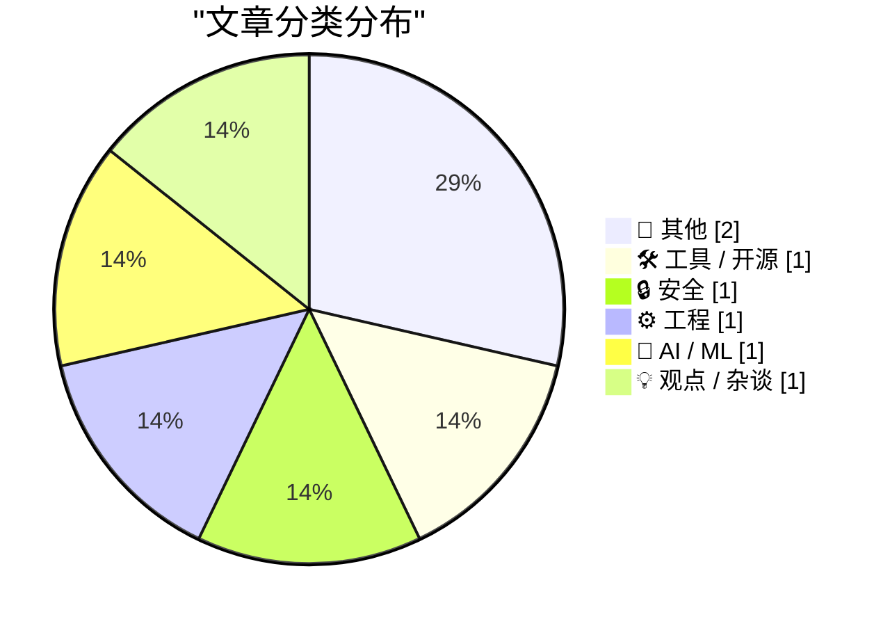
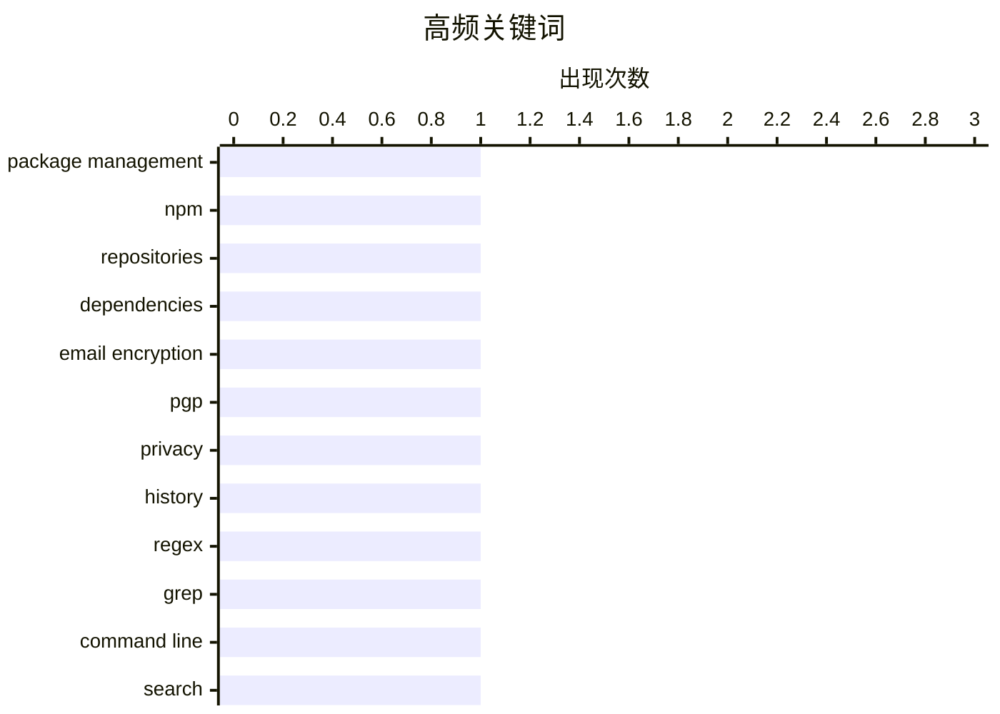

本周技术圈关注点集中在三个方面：AI领域持续火热，agent随机配额重置问题引发广泛讨论；安全话题依旧热门，邮件加密技术受关注；工程实践中，开发者对"先让它工作还是先让它更好"的平衡取舍展开思考，同时正则表达式等底层技术也保持热度。

<!--more-->


> 来自 Karpathy 推荐的 92 个顶级技术博客，AI 精选 Top 7

## 🏆 今日必读

🥇 **This Week in Package Management: 18 July 2026**

[This Week in Package Management: 18 July 2026](https://nesbitt.io/2026/07/18/this-week-in-package-management.html) — nesbitt.io · 1 天前 · 🛠 工具 / 开源

> This Week in Package Management: 18 July 2026

🏷️ package management, npm, repositories, dependencies

🥈 **email encryption**

[email encryption](https://computer.rip/2026-07-19-email-encryption.html) — computer.rip · 22 小时前 · 🔒 安全

> email encryption

🏷️ email encryption, PGP, privacy, history

🥉 **Fitting a regular expression to a list of words**

[Fitting a regular expression to a list of words](https://www.johndcook.com/blog/2026/07/19/fitting-a-regex/) — johndcook.com · 3 小时前 · ⚙️ 工程

> Fitting a regular expression to a list of words

🏷️ regex, grep, command line, search

---

## 📊 数据概览

| 扫描源 | 抓取文章 | 时间范围 | 精选 |
|:---:|:---:|:---:|:---:|
| 70/92 | 2073 篇 → 7 篇 | 48h | **7 篇** |

### 分类分布



### 高频关键词



<details>
<summary>📈 纯文本关键词图（终端友好）</summary>

```
package management │ ████████████████████ 1
npm                │ ████████████████████ 1
repositories       │ ████████████████████ 1
dependencies       │ ████████████████████ 1
email encryption   │ ████████████████████ 1
pgp                │ ████████████████████ 1
privacy            │ ████████████████████ 1
history            │ ████████████████████ 1
regex              │ ████████████████████ 1
grep               │ ████████████████████ 1
```

</details>

### 🏷️ 话题标签

**package management**(1) · **npm**(1) · **repositories**(1) · dependencies(1) · email encryption(1) · pgp(1) · privacy(1) · history(1) · regex(1) · grep(1) · command line(1) · search(1) · ai agents(1) · quota resets(1) · llm(1) · openai(1) · design(1) · development(1) · balance(1) · craftsmanship(1)

---

## 📝 其他

### 1. Reading List 07/18/26

[Reading List 07/18/26](https://www.construction-physics.com/p/reading-list-071826) — **construction-physics.com** · 1 天前 · ⭐ 17/30

> Reading List 07/18/26

🏷️ manufacturing, EV batteries, recycling, infrastructure

---

### 2. Sum of low squares

[Sum of low squares](https://www.johndcook.com/blog/2026/07/19/sum-of-low-squares/) — **johndcook.com** · 5 小时前 · ⭐ 15/30

> Sum of low squares

🏷️ math, prime, quadratic residues, number theory

---

## 🛠 工具 / 开源

### 3. This Week in Package Management: 18 July 2026

[This Week in Package Management: 18 July 2026](https://nesbitt.io/2026/07/18/this-week-in-package-management.html) — **nesbitt.io** · 1 天前 · ⭐ 23/30

> This Week in Package Management: 18 July 2026

🏷️ package management, npm, repositories, dependencies

---

## 🔒 安全

### 4. email encryption

[email encryption](https://computer.rip/2026-07-19-email-encryption.html) — **computer.rip** · 22 小时前 · ⭐ 22/30

> email encryption

🏷️ email encryption, PGP, privacy, history

---

## ⚙️ 工程

### 5. Fitting a regular expression to a list of words

[Fitting a regular expression to a list of words](https://www.johndcook.com/blog/2026/07/19/fitting-a-regex/) — **johndcook.com** · 3 小时前 · ⭐ 21/30

> Fitting a regular expression to a list of words

🏷️ regex, grep, command line, search

---

## 🤖 AI / ML

### 6. What's the deal with all the random weekly quota resets for agents lately?

[What's the deal with all the random weekly quota resets for agents lately?](https://minimaxir.com/2026/07/agent-quota-reset/) — **minimaxir.com** · 1 天前 · ⭐ 21/30

> What's the deal with all the random weekly quota resets for agents lately?

🏷️ AI agents, quota resets, LLM, OpenAI

---

## 💡 观点 / 杂谈

### 7. Make It Work vs. Make It Good

[Make It Work vs. Make It Good](https://blog.jim-nielsen.com/2026/make-it-work-make-it-good/) — **blog.jim-nielsen.com** · 1 天前 · ⭐ 20/30

> Make It Work vs. Make It Good

🏷️ design, development, balance, craftsmanship

---

*生成于 2026-07-20 22:34 | 扫描 70 源 → 获取 2073 篇 → 精选 7 篇*
*基于 [Hacker News Popularity Contest 2025](https://refactoringenglish.com/tools/hn-popularity/) RSS 源列表，由 [Andrej Karpathy](https://x.com/karpathy) 推荐*
*由「懂点儿AI」制作，欢迎关注同名微信公众号获取更多 AI 实用技巧 💡*
