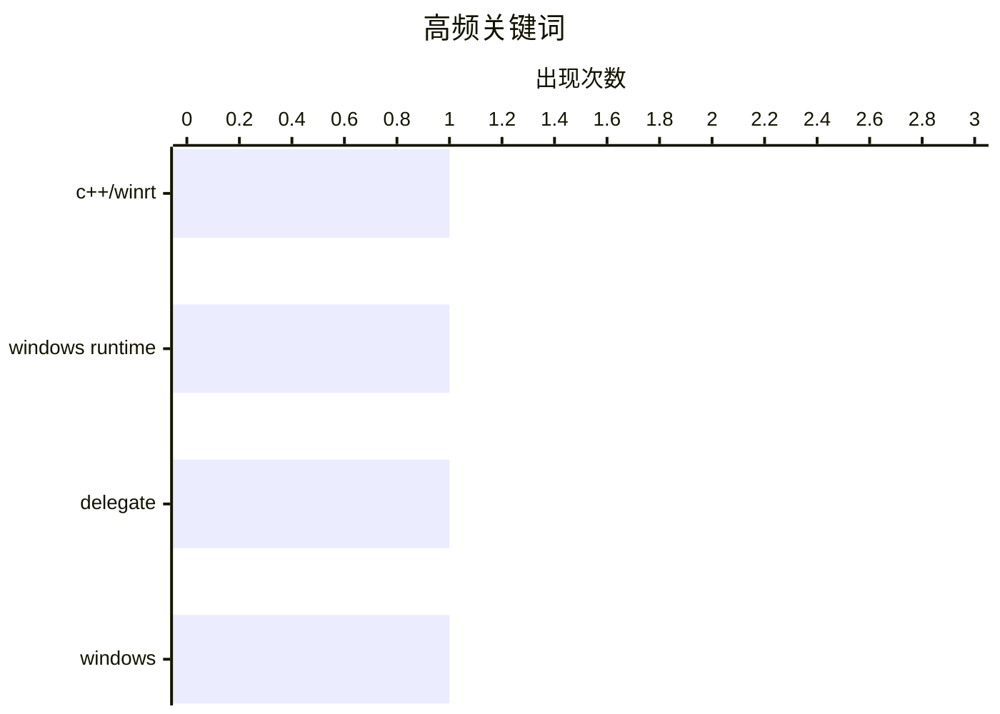

今日技术看点：Windows开发领域关注跨线程调用优化，C++/WinRT中实现敏捷委托成为解决线程安全问题的关键方案；随着多线程应用场景日益复杂，开发者对委托行为机制的理解需求不断增强；敏捷委托技术正成为提升Windows Runtime组件可移植性和性能的重要方向。

<!--more-->


> 来自 Karpathy 推荐的 92 个顶级技术博客，AI 精选 Top 1

## 📊 数据概览

| 扫描源 | 抓取文章 | 时间范围 | 精选 |
|:---:|:---:|:---:|:---:|
| 1/92 | 10 篇 → 1 篇 | 48h | **1 篇** |

### 分类分布


### 高频关键词



<details>
<summary>📈 纯文本关键词图（终端友好）</summary>

```
c++/winrt       │ ████████████████████ 1
windows runtime │ ████████████████████ 1
delegate        │ ████████████████████ 1
windows         │ ████████████████████ 1
```

</details>

### 🏷️ 话题标签

**c++/winrt**(1) · **windows runtime**(1) · **delegate**(1) · windows(1)

---

## ⚙️ 工程

### 1. 在C++/WinRT中创建Windows Runtime委托的敏捷版本（第1部分）

[Making an agile version of a Windows Runtime delegate in C++/WinRT, part 1](https://devblogs.microsoft.com/oldnewthing/20260720-00/?p=112545) — **devblogs.microsoft.com/oldnewthing** · 8 小时前 · ⭐ 18/30

> 文章探讨了在C++/WinRT中实现Windows Runtime委托的敏捷版本的技术方案。WinRT委托默认并非线程敏捷（agile），无法跨线程自由调用，这限制了其在多线程场景中的使用。作者首先介绍了"简单情况"的处理方法，并计划在后续部分深入讲解复杂场景。敏捷委托的核心在于能够在线程间安全传递和调用，而无需担心目标对象所在的单元（apartment）模型限制。对于需要在C++/WinRT项目中处理跨线程回调的开发者，这是理解委托行为机制的重要参考。

🏷️ C++/WinRT, Windows Runtime, delegate, Windows

---

*生成于 2026-07-21 22:21 | 扫描 1 源 → 获取 10 篇 → 精选 1 篇*
*基于 [Hacker News Popularity Contest 2025](https://refactoringenglish.com/tools/hn-popularity/) RSS 源列表，由 [Andrej Karpathy](https://x.com/karpathy) 推荐*
*由「懂点儿AI」制作，欢迎关注同名微信公众号获取更多 AI 实用技巧 💡*
