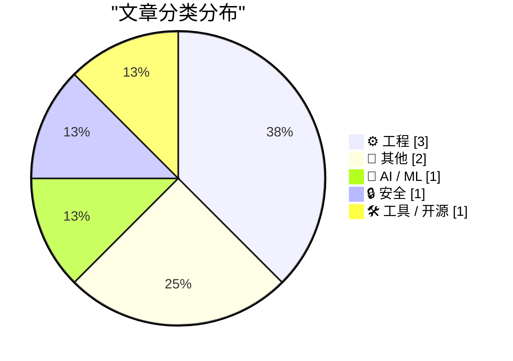
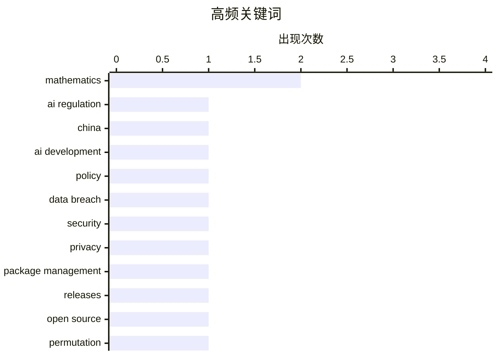

今日看点：AI领域的地缘政治竞争持续升温，最新分析指出中国AI实力增长主要源于市场规模、人才储备与政策支持，而非美国监管因素；澳大利亚能源公司Origin Energy数据泄露事件再次敲响企业数据安全警钟，暴露信息发布策略与实际风险间的矛盾；本周编程语言包管理器集中更新，npm、pip、Cargo等主流工具均发布安全补丁。

<!--more-->


> 来自 Karpathy 推荐的 92 个顶级技术博客，AI 精选 Top 8

## 🏆 今日必读

🥇 **致David Sacks的公开信**

[An open letter to David Sacks](https://garymarcus.substack.com/p/an-open-letter-to-david-sacks) — garymarcus.substack.com · 1 天前 · 🤖 AI / ML

> 中国在AI领域正在缩小与美国的差距，但这一进展并非源于美国AI监管过度。作者指出中国AI发展的主要原因是其庞大的市场规模、充足的人才储备以及强有力的政府支持，而非美国监管政策的限制。公开信还讨论了当前AI领域的地缘政治竞争态势，强调技术创新与政策支持之间的复杂关系。

💡 **为什么值得读**: 提供关于AI监管与创新关系的不同视角，帮助读者理解中国AI发展的真实驱动因素。

🏷️ AI regulation, China, AI development, policy

🥈 **每周更新514：本周数据泄露事件**

[Weekly Update 514: This Week in Data Breaches](https://www.troyhunt.com/weekly-update-514/) — troyhunt.com · 13 小时前 · 🔒 安全

> 澳大利亚能源公司Origin Energy发生数据泄露事件，引发广泛关注。泄露事件涉及多个层面，该公司首先安抚用户称信用卡信息未受影响，而黑客方面则披露了其他敏感数据。此次事件再次暴露了企业在数据保护方面的漏洞，以及数据泄露后各方信息发布策略的差异。

💡 **为什么值得读**: 了解最新数据安全威胁和企业应对策略，增强数据保护意识。

🏷️ data breach, security, privacy

🥉 **本周包管理动态：2026年7月25日**

[This Week in Package Management: 25 July 2026](https://nesbitt.io/2026/07/25/this-week-in-package-management.html) — nesbitt.io · 1 天前 · 🛠 工具 / 开源

> 本周包管理领域发布多个重要更新，包括主流编程语言包管理器的版本更新和安全公告。内容涵盖npm、pip、Cargo等常用包管理工具的最新动态，以及相关安全漏洞的修复情况。

💡 **为什么值得读**: 帮助开发者跟踪包管理生态系统的最新变化，及时更新依赖以确保项目安全。

🏷️ package management, releases, open source

---

## 📊 数据概览

| 扫描源 | 抓取文章 | 时间范围 | 精选 |
|:---:|:---:|:---:|:---:|
| 68/92 | 2060 篇 → 8 篇 | 48h | **8 篇** |

### 分类分布



### 高频关键词



<details>
<summary>📈 纯文本关键词图（终端友好）</summary>

```
mathematics        │ ████████████████████ 2
ai regulation      │ ██████████░░░░░░░░░░ 1
china              │ ██████████░░░░░░░░░░ 1
ai development     │ ██████████░░░░░░░░░░ 1
policy             │ ██████████░░░░░░░░░░ 1
data breach        │ ██████████░░░░░░░░░░ 1
security           │ ██████████░░░░░░░░░░ 1
privacy            │ ██████████░░░░░░░░░░ 1
package management │ ██████████░░░░░░░░░░ 1
releases           │ ██████████░░░░░░░░░░ 1
```

</details>

### 🏷️ 话题标签

**mathematics**(2) · **ai regulation**(1) · **china**(1) · ai development(1) · policy(1) · data breach(1) · security(1) · privacy(1) · package management(1) · releases(1) · open source(1) · permutation(1) · algorithm(1) · excel(1) · column numbering(1) · base-26(1) · exp_q(1) · power series(1) · reading list(1) · energy(1)

---

## ⚙️ 工程

### 1. Permutation roots

[Permutation roots](https://www.johndcook.com/blog/2026/07/26/permutation-roots/) — **johndcook.com** · 1 小时前 · ⭐ 15/30

> Let σ be a permutation on n elements. If there is a permutation τ such that applying τ twice has the same effect on the list of elements as applying σ once, we say σ = τ² and τ is a square root of σ. 

🏷️ permutation, mathematics, algorithm

---

### 2. Excel column numbering

[Excel column numbering](https://www.johndcook.com/blog/2026/07/25/excel-column-numbering/) — **johndcook.com** · 1 天前 · ⭐ 15/30

> I was working with a wide spreadsheet from a client the other day and I had to convert between Excel column labels and column numbers. I had never paid attention to how Excel labels columns and implic

🏷️ Excel, column numbering, base-26

---

### 3. ARCNET兴衰史

[What happened to ARCNET](https://dfarq.homeip.net/what-happened-to-arcnet/?utm_source=rss&#038;utm_medium=rss&#038;utm_campaign=what-happened-to-arcnet) — **dfarq.homeip.net** · 11 小时前 · ⭐ 12/30

> ARCNET是首个商业可用的局域网标准，比以太网和令牌环更早进入市场。它在概念上结合了两者的特点，因成本低、效率高而流行了约15年。文章探讨了这一早期网络技术从兴起到衰落的历史进程。

🏷️ ARCNET, networking, LAN, history

---

## 📝 其他

### 4. exp_q函数

[exp_q](https://www.johndcook.com/blog/2026/07/26/exp-q/) — **johndcook.com** · 4 小时前 · ⭐ 14/30

> expq(x)函数通过取exp(x)的幂级数，只保留指数为q的倍数的项来定义。例如exp2(x)只保留偶数项，等于cosh(x)。文章解释了这种截断级数在数学分析和数值计算中的应用。

🏷️ exp_q, power series, mathematics

---

### 5. 阅读清单：2026年7月25日

[Reading List 07/25/26](https://www.construction-physics.com/p/reading-list-072526) — **construction-physics.com** · 1 天前 · ⭐ 12/30

> 本期阅读清单涵盖多个领域：中国电动汽车补贴政策前景、空气动力学燃气轮机未来发展、美沙核能协议、缺陷道路护栏问题，以及其他工程技术领域的最新动态和分析。

🏷️ reading list, energy, infrastructure

---

## 🤖 AI / ML

### 6. 致David Sacks的公开信

[An open letter to David Sacks](https://garymarcus.substack.com/p/an-open-letter-to-david-sacks) — **garymarcus.substack.com** · 1 天前 · ⭐ 24/30

> 中国在AI领域正在缩小与美国的差距，但这一进展并非源于美国AI监管过度。作者指出中国AI发展的主要原因是其庞大的市场规模、充足的人才储备以及强有力的政府支持，而非美国监管政策的限制。公开信还讨论了当前AI领域的地缘政治竞争态势，强调技术创新与政策支持之间的复杂关系。

🏷️ AI regulation, China, AI development, policy

---

## 🔒 安全

### 7. 每周更新514：本周数据泄露事件

[Weekly Update 514: This Week in Data Breaches](https://www.troyhunt.com/weekly-update-514/) — **troyhunt.com** · 13 小时前 · ⭐ 24/30

> 澳大利亚能源公司Origin Energy发生数据泄露事件，引发广泛关注。泄露事件涉及多个层面，该公司首先安抚用户称信用卡信息未受影响，而黑客方面则披露了其他敏感数据。此次事件再次暴露了企业在数据保护方面的漏洞，以及数据泄露后各方信息发布策略的差异。

🏷️ data breach, security, privacy

---

## 🛠 工具 / 开源

### 8. 本周包管理动态：2026年7月25日

[This Week in Package Management: 25 July 2026](https://nesbitt.io/2026/07/25/this-week-in-package-management.html) — **nesbitt.io** · 1 天前 · ⭐ 22/30

> 本周包管理领域发布多个重要更新，包括主流编程语言包管理器的版本更新和安全公告。内容涵盖npm、pip、Cargo等常用包管理工具的最新动态，以及相关安全漏洞的修复情况。

🏷️ package management, releases, open source

---

*生成于 2026-07-27 22:24 | 扫描 68 源 → 获取 2060 篇 → 精选 8 篇*
*基于 [Hacker News Popularity Contest 2025](https://refactoringenglish.com/tools/hn-popularity/) RSS 源列表，由 [Andrej Karpathy](https://x.com/karpathy) 推荐*
*由「懂点儿AI」制作，欢迎关注同名微信公众号获取更多 AI 实用技巧 💡*
