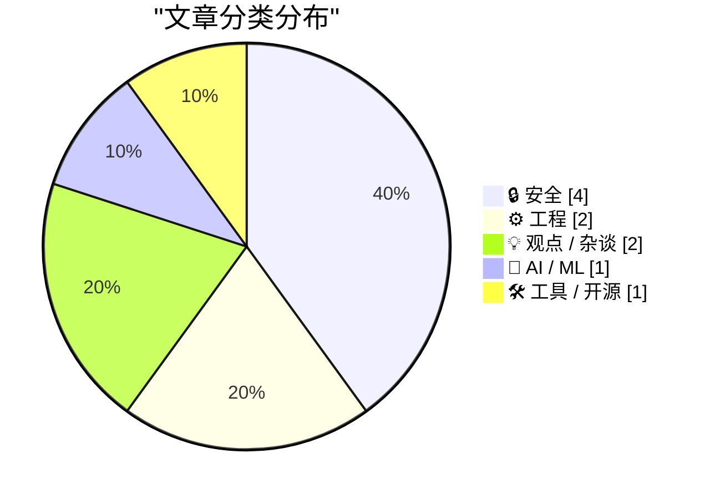
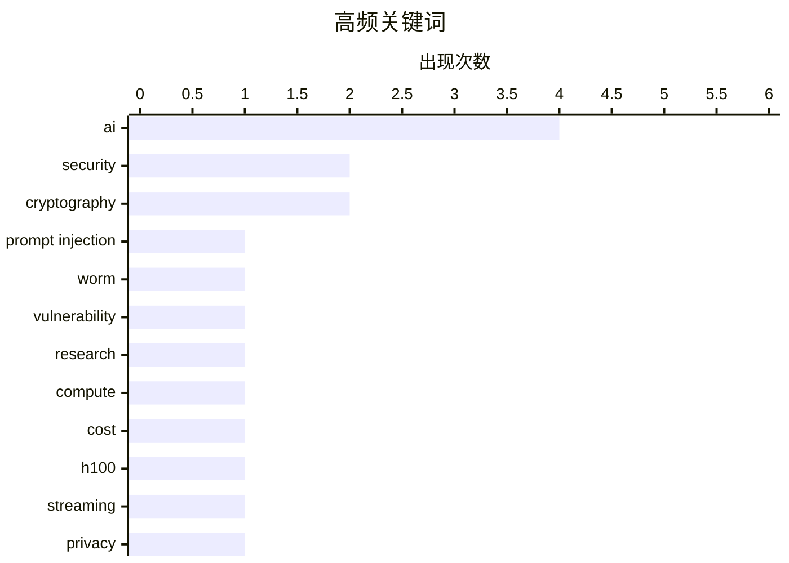

今日技术圈主要围绕AI安全与成本两大议题：AI驱动的安全威胁持续升级，从Word文档蠕虫式攻击到AI辅助密码分析，攻击手段日趋复杂；同时有研究指出若按人类软件工程师薪资估算，H100等高端计算资源年租金可能超过25万美元，成本将暴涨10倍以上。在专业领域，密码学家Matthew Green提醒AI恰逢后量子密码学转型期，而Bruce Schneier则警示AI正削弱写作等思维训练技能的价值。

<!--more-->


> 来自 Karpathy 推荐的 92 个顶级技术博客，AI 精选 Top 10

## 🏆 今日必读

🥇 **AI通过Word文档蠕虫式传播**

[AI Worming through Word](https://simonwillison.net/2026/Jul/29/ai-worming-through-word/#atom-everything) — simonwillison.net · 1 天前 · 🔒 安全

> 安全研究员Håkon Måløy发现了一种新型提示注入攻击，可将恶意指令嵌入Microsoft Word文档并升级为自我复制蠕虫。攻击利用Copilot for Word将隐藏指令解释为用户请求，导致AI操控正在编辑的文档并复制隐藏指令到新文档。即使攻击者原始文档已被删除，该蠕虫仍能在后续Copilot工作流中持续传播。

💡 **为什么值得读**: 这是首个展示AI助手间跨文档传播攻击能力的蠕虫案例，对企业Copilot安全有直接威胁。

🏷️ prompt injection, security, AI, worm

🥈 **使用Claude发现密码学弱点**

[Discovering cryptographic weaknesses with Claude](https://simonwillison.net/2026/Jul/28/discovering-cryptographic-weaknesses-with-claude/#atom-everything) — simonwillison.net · 1 天前 · 🔒 安全

> Anthropic研究人员使用Claude模型发现HAWK算法和弱版AES的数学缺陷（均无实际影响）。文章核心在于分享的提示词策略：模型倾向于认为问题无解而放弃尝试，需要精心设计的prompt引导。研究者通过反复强调"找到值得发表的新攻击"、"不要改变目标"等指令激发模型挑战已知算法。

💡 **为什么值得读**: 揭示了如何通过prompt engineering引导AI挑战密码学难题，对AI安全研究有方法论参考价值。

🏷️ cryptography, AI, vulnerability, research

🥉 **计算资源未来可能涨价10倍以上**

[Why compute might get 10x+ more expensive in coming years](https://www.dwarkesh.com/p/why-compute-might-get-10x-more-expensive) — dwarkesh.com · 1 天前 · 🤖 AI / ML

> 文章估算如果人类水平的软件工程师能在H100 equivalent上运行，按当前市场软件工程师薪资，H100年租金应超过25万美元。这个价格是当前H100 spot价格的15倍。作者由此推断计算成本将大幅上涨。

💡 **为什么值得读**: 从经济学角度推演AI算力成本趋势，对AI投资和部署决策有参考意义。

🏷️ compute, AI, cost, H100

---

## 📊 数据概览

| 扫描源 | 抓取文章 | 时间范围 | 精选 |
|:---:|:---:|:---:|:---:|
| 87/92 | 2584 篇 → 36 篇 | 48h | **10 篇** |

### 分类分布



### 高频关键词



<details>
<summary>📈 纯文本关键词图（终端友好）</summary>

```
ai               │ ████████████████████ 4
security         │ ██████████░░░░░░░░░░ 2
cryptography     │ ██████████░░░░░░░░░░ 2
prompt injection │ █████░░░░░░░░░░░░░░░ 1
worm             │ █████░░░░░░░░░░░░░░░ 1
vulnerability    │ █████░░░░░░░░░░░░░░░ 1
research         │ █████░░░░░░░░░░░░░░░ 1
compute          │ █████░░░░░░░░░░░░░░░ 1
cost             │ █████░░░░░░░░░░░░░░░ 1
h100             │ █████░░░░░░░░░░░░░░░ 1
```

</details>

### 🏷️ 话题标签

**ai**(4) · **security**(2) · **cryptography**(2) · prompt injection(1) · worm(1) · vulnerability(1) · research(1) · compute(1) · cost(1) · h100(1) · streaming(1) · privacy(1) · iot(1) · ios(1) · macos(1) · apple(1) · updates(1) · post-quantum(1) · pqc(1) · logic(1)

---

## 🔒 安全

### 1. AI通过Word文档蠕虫式传播

[AI Worming through Word](https://simonwillison.net/2026/Jul/29/ai-worming-through-word/#atom-everything) — **simonwillison.net** · 1 天前 · ⭐ 26/30

> 安全研究员Håkon Måløy发现了一种新型提示注入攻击，可将恶意指令嵌入Microsoft Word文档并升级为自我复制蠕虫。攻击利用Copilot for Word将隐藏指令解释为用户请求，导致AI操控正在编辑的文档并复制隐藏指令到新文档。即使攻击者原始文档已被删除，该蠕虫仍能在后续Copilot工作流中持续传播。

🏷️ prompt injection, security, AI, worm

---

### 2. 使用Claude发现密码学弱点

[Discovering cryptographic weaknesses with Claude](https://simonwillison.net/2026/Jul/28/discovering-cryptographic-weaknesses-with-claude/#atom-everything) — **simonwillison.net** · 1 天前 · ⭐ 25/30

> Anthropic研究人员使用Claude模型发现HAWK算法和弱版AES的数学缺陷（均无实际影响）。文章核心在于分享的提示词策略：模型倾向于认为问题无解而放弃尝试，需要精心设计的prompt引导。研究者通过反复强调"找到值得发表的新攻击"、"不要改变目标"等指令激发模型挑战已知算法。

🏷️ cryptography, AI, vulnerability, research

---

### 3. 购买电视串流棒前的安全警告

[Read This Before You Buy That TV Streaming Stick](https://krebsonsecurity.com/2026/07/read-this-before-you-buy-that-tv-streaming-stick/) — **krebsonsecurity.com** · 5 小时前 · ⭐ 24/30

> 安全专家多年警告的通用电视盒子存在双重风险：不仅秘密将用户网络出租给陌生人，还被发现冒充移动设备在AI生成的网站上自动点击广告，实施广告欺诈。这些设备以一次性付费无限内容为卖点，实际上参与大规模在线广告诈骗。

🏷️ streaming, security, privacy, IoT

---

### 4. Matthew Green谈后量子密码学与AI

[Quoting Matthew Green](https://simonwillison.net/2026/Jul/29/matthew-green/#atom-everything) — **simonwillison.net** · 1 天前 · ⭐ 23/30

> 密码学家Matthew Green指出当前正处于从传统EC/RSA公钥算法向后量子算法过渡的历史性阶段，HAWK等新算法正在被审议。AI作为新型密码分析能力的出现恰逢其时，除非AI能彻底瓦解所有密码学难题，否则这将是增强密码学安全的最佳时机，最好结果是增强对选定问题的信心。

🏷️ post-quantum, cryptography, PQC

---

## ⚙️ 工程

### 5. Apple发布iOS和macOS 26.6系统更新

[Apple Releases iOS and MacOS 26.6, MacOS 15.7.8, and More](https://arstechnica.com/gadgets/2026/07/ios-and-macos-26-6-arrive-today-paving-the-way-for-ios-and-macos-27/) — **daringfireball.net** · 1 小时前 · ⭐ 24/30

> Apple发布iOS 26.6、macOS 26.6等系统更新，可能是iOS 27/macOS 27发布前的最后更新。macOS 26.6包含超过150个安全修复，同时为旧设备推出macOS 14.8.8和15.7.8。iOS 26.6更新优化了Spotlight索引，为下月iOS 27的更强搜索功能做准备。

🏷️ iOS, macOS, Apple, updates

---

### 6. 《程序员的逻辑》正式发布1.0版本

[Logic for Programmers is Done](https://buttondown.com/hillelwayne/archive/logic-for-programmers-is-done/) — **buttondown.com/hillelwayne** · 1 天前 · ⭐ 23/30

> 《Logic for Programmers》历时五年完成，现已出版印刷。该项目汇聚六位书籍写作专家、十四位领域专家，历经十五次公开alpha测试。作者表示这是其做过最大且最耗精力的项目，仅被废弃草稿中的例子就足以写成第二本书。

🏷️ logic, programming, book, formal methods

---

## 💡 观点 / 杂谈

### 7. Bruce Schneier谈AI任务决策框架

[Quoting Bruce Schneier](https://simonwillison.net/2026/Jul/30/bruce-schneier/#atom-everything) — **simonwillison.net** · 3 小时前 · ⭐ 22/30

> Bruce Schneier提出用AI做任务的简单决策方式：写作任务是 gym tasks（健身训练）而非work tasks（工作）。布置写作任务的目的是通过写作过程中的思考、构思、修改来培养批判性思维，这种mental exercise对未来职业至关重要，而AI会削弱这些技能。雇主们已经注意到这一问题。

🏷️ AI, decision-making, productivity

---

### 8. Enshittification和Reverse Centaurs走向全球

[Pluralistic: Enshittification and Reverse Centaurs go global (29 Jul 2026)](https://pluralistic.net/2026/07/29/la-la-la-la-la/) — **pluralistic.net** · 1 天前 · ⭐ 22/30

> 作者Cory Doctorow宣布其关于平台"eshnittification"（平台恶化）和"Reverse Centaurs"（反向半人马）主题的书籍取得国际成功，过去两月获得Locus奖、登顶纽约时报畅销榜。文章还讨论了全球化、监管科技巨头等话题。

🏷️ platform, Big Tech, enshittification

---

## 🤖 AI / ML

### 9. 计算资源未来可能涨价10倍以上

[Why compute might get 10x+ more expensive in coming years](https://www.dwarkesh.com/p/why-compute-might-get-10x-more-expensive) — **dwarkesh.com** · 1 天前 · ⭐ 25/30

> 文章估算如果人类水平的软件工程师能在H100 equivalent上运行，按当前市场软件工程师薪资，H100年租金应超过25万美元。这个价格是当前H100 spot价格的15倍。作者由此推断计算成本将大幅上涨。

🏷️ compute, AI, cost, H100

---

## 🛠 工具 / 开源

### 10. 为Claude和ChatGPT添加自定义MCP服务器

[Adding a custom MCP server to Claude and ChatGPT](https://simonwillison.net/2026/Jul/29/mcp-in-claude-and-chatgpt/#atom-everything) — **simonwillison.net** · 1 天前 · ⭐ 22/30

> 文章介绍如何将自定义MCP（Model Context Protocol）服务器连接到Claude和ChatGPT的标准聊天界面。过程涉及多个步骤，需要配置服务器端点和认证机制。

🏷️ MCP, Claude, ChatGPT, integration

---

*生成于 2026-07-31 22:18 | 扫描 87 源 → 获取 2584 篇 → 精选 10 篇*
*基于 [Hacker News Popularity Contest 2025](https://refactoringenglish.com/tools/hn-popularity/) RSS 源列表，由 [Andrej Karpathy](https://x.com/karpathy) 推荐*
*由「懂点儿AI」制作，欢迎关注同名微信公众号获取更多 AI 实用技巧 💡*
