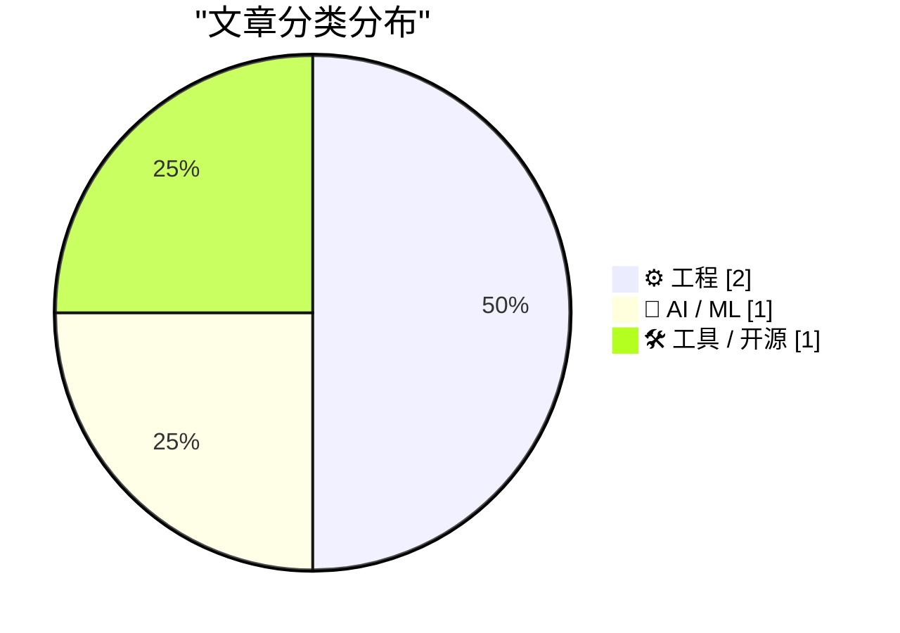
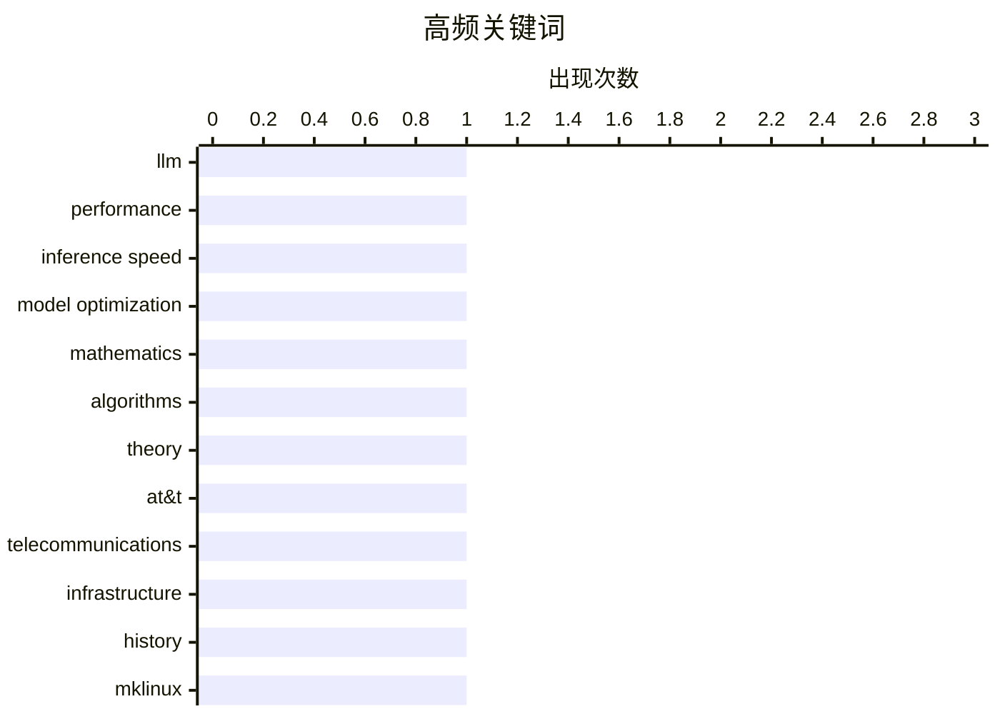

今日看点：AI模型选择标准正从“智能”转向“速度”，约100tok/s的处理速率或将成为用户体验的新临界点，大模型价格战一触即发。与此同时，AI时代对数学本质的追问引发热议——计算机能否脱离人类独立推进数学发展？而AT&T电话系统兴衰史则提供了另一种视角：曾被誉为“最大机器”的集中式架构，最终败给了强调独立接口的分布式网络思路。

<!--more-->


> 来自 Karpathy 推荐的 92 个顶级技术博客，AI 精选 Top 4

## 🏆 今日必读

🥇 **现在我（主要）根据速度而非智能来选择模型**

[I'm (mostly) picking models on speed now, not intelligence](https://martinalderson.com/posts/speed-vs-intelligence/?utm_source=rss&amp;utm_medium=rss&amp;utm_campaign=feed) — martinalderson.com · 1 天前 · 🤖 AI / ML

> 文章探讨了AI模型选择标准的转变：作者首次根据每秒处理的token数（tokens per second）而非模型原始智能来选择日常使用的模型。作者指出~100tok/s可能成为新的100ms延迟标准，成为用户体验的临界点。同时分析了速度收益递减的拐点，以及大模型领域即将到来的价格战将如何影响模型选择。作者认为当速度足够快时，更智能的模型反而成为负担。

💡 **为什么值得读**: 对于关注AI应用落地和模型选型的开发者、产品经理，这篇文章提供了关于「推理速度如何决定AI可用性」的实战洞察，帮助理解当前模型竞争的关键变量。

🏷️ LLM, performance, inference speed, model optimization

🥈 **没有数学家的数学**

[Mathematics Without Mathematicians](https://borretti.me/article/mathematics-without-mathematicians) — borretti.me · 1 天前 · ⚙️ 工程

> 文章探讨了一个深刻的问题：数学能否脱离数学家而存在？标题呼应了希尔伯特的名言「我们必须知道，我们将知道」，暗示对数学本质的哲学思考。文章讨论了数学知识的传承、形式化与人类创造力之间的关系，以及在AI时代计算机是否可以独立推进数学发展等议题。

💡 **为什么值得读**: 这是一篇关于数学哲学的深度思考文章，适合对数学本质、AI与数学关系感兴趣的技术人和哲学爱好者，能引发对知识本质的深层思考。

🏷️ mathematics, algorithms, theory

🥉 **夹缝中的电话机**

[telephones caught in between](https://computer.rip/2026-08-02-telephone-leasing.html) — computer.rip · 1 天前 · ⚙️ 工程

> 文章回顾了AT&T鼎盛时期电话网络的历史，将其称为「有史以来最大的机器」。讨论了电话系统作为单一设备的概念，以及「一个政策、一个系统、普遍服务」（One Policy, One System, Universal Service）这一口号的含义。作者指出「普遍服务」原则最终成为电话系统衰落的导火索，并探讨了计算机网络强调独立实现标准化接口的特点，与电话网络的集中式设计形成对比。

💡 **为什么值得读**: 对于对电信历史、网络架构演变和科技政策感兴趣的读者，这篇文章提供了独特的历史视角，帮助理解今天互联网与电信网络设计理念差异的根源。

🏷️ AT&T, telecommunications, infrastructure, history

---

## 📊 数据概览

| 扫描源 | 抓取文章 | 时间范围 | 精选 |
|:---:|:---:|:---:|:---:|
| 50/92 | 1691 篇 → 4 篇 | 48h | **4 篇** |

### 分类分布



### 高频关键词



<details>
<summary>📈 纯文本关键词图（终端友好）</summary>

```
llm                │ ████████████████████ 1
performance        │ ████████████████████ 1
inference speed    │ ████████████████████ 1
model optimization │ ████████████████████ 1
mathematics        │ ████████████████████ 1
algorithms         │ ████████████████████ 1
theory             │ ████████████████████ 1
at&t               │ ████████████████████ 1
telecommunications │ ████████████████████ 1
infrastructure     │ ████████████████████ 1
```

</details>

### 🏷️ 话题标签

**llm**(1) · **performance**(1) · **inference speed**(1) · model optimization(1) · mathematics(1) · algorithms(1) · theory(1) · at&t(1) · telecommunications(1) · infrastructure(1) · history(1) · mklinux(1) · linux(1) · apple(1) · retro computing(1)

---

## ⚙️ 工程

### 1. 没有数学家的数学

[Mathematics Without Mathematicians](https://borretti.me/article/mathematics-without-mathematicians) — **borretti.me** · 1 天前 · ⭐ 20/30

> 文章探讨了一个深刻的问题：数学能否脱离数学家而存在？标题呼应了希尔伯特的名言「我们必须知道，我们将知道」，暗示对数学本质的哲学思考。文章讨论了数学知识的传承、形式化与人类创造力之间的关系，以及在AI时代计算机是否可以独立推进数学发展等议题。

🏷️ mathematics, algorithms, theory

---

### 2. 夹缝中的电话机

[telephones caught in between](https://computer.rip/2026-08-02-telephone-leasing.html) — **computer.rip** · 1 天前 · ⭐ 18/30

> 文章回顾了AT&T鼎盛时期电话网络的历史，将其称为「有史以来最大的机器」。讨论了电话系统作为单一设备的概念，以及「一个政策、一个系统、普遍服务」（One Policy, One System, Universal Service）这一口号的含义。作者指出「普遍服务」原则最终成为电话系统衰落的导火索，并探讨了计算机网络强调独立实现标准化接口的特点，与电话网络的集中式设计形成对比。

🏷️ AT&T, telecommunications, infrastructure, history

---

## 🤖 AI / ML

### 3. 现在我（主要）根据速度而非智能来选择模型

[I'm (mostly) picking models on speed now, not intelligence](https://martinalderson.com/posts/speed-vs-intelligence/?utm_source=rss&amp;utm_medium=rss&amp;utm_campaign=feed) — **martinalderson.com** · 1 天前 · ⭐ 26/30

> 文章探讨了AI模型选择标准的转变：作者首次根据每秒处理的token数（tokens per second）而非模型原始智能来选择日常使用的模型。作者指出~100tok/s可能成为新的100ms延迟标准，成为用户体验的临界点。同时分析了速度收益递减的拐点，以及大模型领域即将到来的价格战将如何影响模型选择。作者认为当速度足够快时，更智能的模型反而成为负担。

🏷️ LLM, performance, inference speed, model optimization

---

## 🛠 工具 / 开源

### 4. MkLinux与改造版Apple Workgroup Server 9150

[MkLinux and the pimped-out Apple Workgroup Server 9150](https://oldvcr.blogspot.com/feeds/6941630207678889821/comments/default) — **oldvcr.blogspot.com** · 21 小时前 · ⭐ 13/30

> 这是一篇技术怀旧文章，记录了作者在一台老旧的Apple Workgroup Server 9150上安装和运行MkLinux（一个早期将Linux移植到PowerPC Mac的项目）的过程。作者描述了如何修复这台不稳定的服务器，并对其进行「改装」以适配MkLinux系统。

🏷️ MkLinux, Linux, Apple, retro computing

---

*生成于 2026-08-03 00:00 | 扫描 50 源 → 获取 1691 篇 → 精选 4 篇*
*基于 [Hacker News Popularity Contest 2025](https://refactoringenglish.com/tools/hn-popularity/) RSS 源列表，由 [Andrej Karpathy](https://x.com/karpathy) 推荐*
*由「懂点儿AI」制作，欢迎关注同名微信公众号获取更多 AI 实用技巧 💡*
