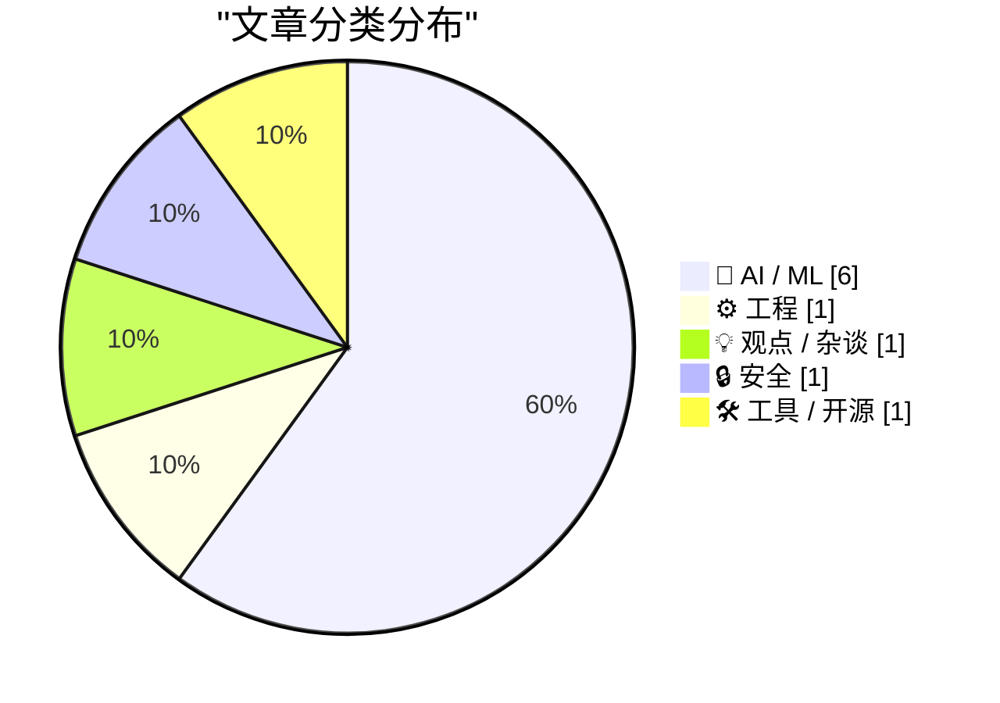
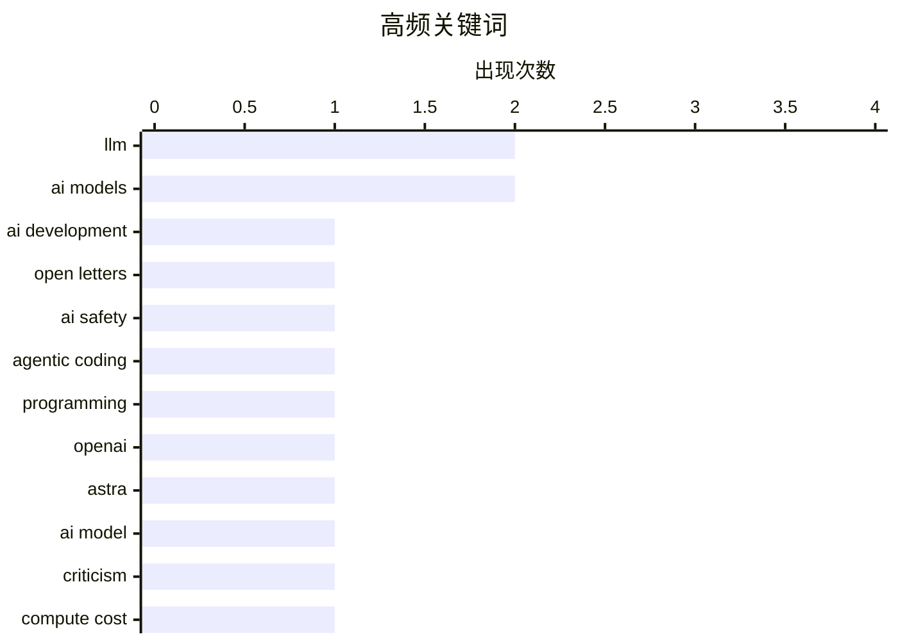

今日技术圈关注三大趋势：AI模型发展呈现速度与智能的取舍矛盾，更强大模型可能导致算力成本飙升10倍，引发对商业化路径的反思；开发者工具开源化成为热议，Claude Code尝试自重写彰显AI驱动开发的新可能；此外，AI安全治理持续升温，OpenAI等机构的公开倡议与Have I Been Pwned等安全平台的合作表明行业对负责任AI开发的共识正在加深。

<!--more-->


> 来自 Karpathy 推荐的 92 个顶级技术博客，AI 精选 Top 10

## 🏆 今日必读

🥇 **Open letters about AI development**

[Open letters about AI development](https://simonwillison.net/2026/Aug/2/open-letters/#atom-everything) — simonwillison.net · 1 天前 · 🤖 AI / ML

> Open letters about AI development

🏷️ AI development, open letters, AI safety

🥈 **Agentic coding techniques**

[Agentic coding techniques](https://micahflee.com/agentic-coding-techniques/) — micahflee.com · 6 小时前 · 🤖 AI / ML

> Agentic coding techniques

🏷️ LLM, agentic coding, programming

🥉 **OpenAI’s amazing — but vastly oversold — new model Astra**

[OpenAI’s amazing — but vastly oversold — new model Astra](https://garymarcus.substack.com/p/openais-amazing-but-vastly-oversold) — garymarcus.substack.com · 1 天前 · 🤖 AI / ML

> OpenAI’s amazing — but vastly oversold — new model Astra

🏷️ OpenAI, Astra, AI model, criticism

---

## 📊 数据概览

| 扫描源 | 抓取文章 | 时间范围 | 精选 |
|:---:|:---:|:---:|:---:|
| 87/92 | 2586 篇 → 33 篇 | 48h | **10 篇** |

### 分类分布



### 高频关键词



<details>
<summary>📈 纯文本关键词图（终端友好）</summary>

```
llm            │ ████████████████████ 2
ai models      │ ████████████████████ 2
ai development │ ██████████░░░░░░░░░░ 1
open letters   │ ██████████░░░░░░░░░░ 1
ai safety      │ ██████████░░░░░░░░░░ 1
agentic coding │ ██████████░░░░░░░░░░ 1
programming    │ ██████████░░░░░░░░░░ 1
openai         │ ██████████░░░░░░░░░░ 1
astra          │ ██████████░░░░░░░░░░ 1
ai model       │ ██████████░░░░░░░░░░ 1
```

</details>

### 🏷️ 话题标签

**llm**(2) · **ai models**(2) · **ai development**(1) · open letters(1) · ai safety(1) · agentic coding(1) · programming(1) · openai(1) · astra(1) · ai model(1) · criticism(1) · compute cost(1) · infrastructure(1) · open source(1) · devtools(1) · development(1) · credit(1) · big tech(1) · engineering culture(1) · claude code(1)

---

## 🤖 AI / ML

### 1. Open letters about AI development

[Open letters about AI development](https://simonwillison.net/2026/Aug/2/open-letters/#atom-everything) — **simonwillison.net** · 1 天前 · ⭐ 26/30

> Open letters about AI development

🏷️ AI development, open letters, AI safety

---

### 2. Agentic coding techniques

[Agentic coding techniques](https://micahflee.com/agentic-coding-techniques/) — **micahflee.com** · 6 小时前 · ⭐ 25/30

> Agentic coding techniques

🏷️ LLM, agentic coding, programming

---

### 3. OpenAI’s amazing — but vastly oversold — new model Astra

[OpenAI’s amazing — but vastly oversold — new model Astra](https://garymarcus.substack.com/p/openais-amazing-but-vastly-oversold) — **garymarcus.substack.com** · 1 天前 · ⭐ 24/30

> OpenAI’s amazing — but vastly oversold — new model Astra

🏷️ OpenAI, Astra, AI model, criticism

---

### 4. Why smarter AI models could drive up compute prices 10x

[Why smarter AI models could drive up compute prices 10x](https://www.dwarkesh.com/p/why-compute-might-get-10x-more-expensive-video) — **dwarkesh.com** · 4 小时前 · ⭐ 24/30

> Why smarter AI models could drive up compute prices 10x

🏷️ AI models, compute cost, infrastructure

---

### 5. Boris Cherny on Trying to Get Claude Code to Rewrite the Claude App

[Boris Cherny on Trying to Get Claude Code to Rewrite the Claude App](https://www.ycrootaccess.com/p/boris-cherny-building-claude-code) — **daringfireball.net** · 1 天前 · ⭐ 23/30

> Boris Cherny on Trying to Get Claude Code to Rewrite the Claude App

🏷️ Claude Code, Anthropic, AI coding

---

### 6. I'm (mostly) picking models on speed now, not intelligence

[I'm (mostly) picking models on speed now, not intelligence](https://martinalderson.com/posts/speed-vs-intelligence/?utm_source=rss&amp;utm_medium=rss&amp;utm_campaign=feed) — **martinalderson.com** · 1 天前 · ⭐ 23/30

> I'm (mostly) picking models on speed now, not intelligence

🏷️ LLM, inference speed, tokens per second, AI models

---

## ⚙️ 工程

### 7. Devtools must be open source (exe.dev)

[Devtools must be open source (exe.dev)](https://simonwillison.net/2026/Aug/3/devtools-must-be-open-source-exedev/#atom-everything) — **simonwillison.net** · 6 小时前 · ⭐ 23/30

> Devtools must be open source (exe.dev)

🏷️ open source, devtools, development

---

## 💡 观点 / 杂谈

### 8. Giving and taking credit in big tech companies

[Giving and taking credit in big tech companies](https://seangoedecke.com/giving-and-taking-credit/) — **seangoedecke.com** · 1 天前 · ⭐ 23/30

> Giving and taking credit in big tech companies

🏷️ credit, big tech, engineering culture

---

## 🔒 安全

### 9. Welcoming the Nepalese Government to Have I Been Pwned

[Welcoming the Nepalese Government to Have I Been Pwned](https://www.troyhunt.com/welcoming-the-nepalese-government-to-have-i-been-pwned/) — **troyhunt.com** · 15 小时前 · ⭐ 23/30

> Welcoming the Nepalese Government to Have I Been Pwned

🏷️ HIBP, Nepal, government, cybersecurity

---

## 🛠 工具 / 开源

### 10. condense-json 1.0

[condense-json 1.0](https://simonwillison.net/2026/Aug/2/condense-json/#atom-everything) — **simonwillison.net** · 1 天前 · ⭐ 22/30

> condense-json 1.0

🏷️ JSON, library, release

---

*生成于 2026-08-04 22:20 | 扫描 87 源 → 获取 2586 篇 → 精选 10 篇*
*基于 [Hacker News Popularity Contest 2025](https://refactoringenglish.com/tools/hn-popularity/) RSS 源列表，由 [Andrej Karpathy](https://x.com/karpathy) 推荐*
*由「懂点儿AI」制作，欢迎关注同名微信公众号获取更多 AI 实用技巧 💡*
