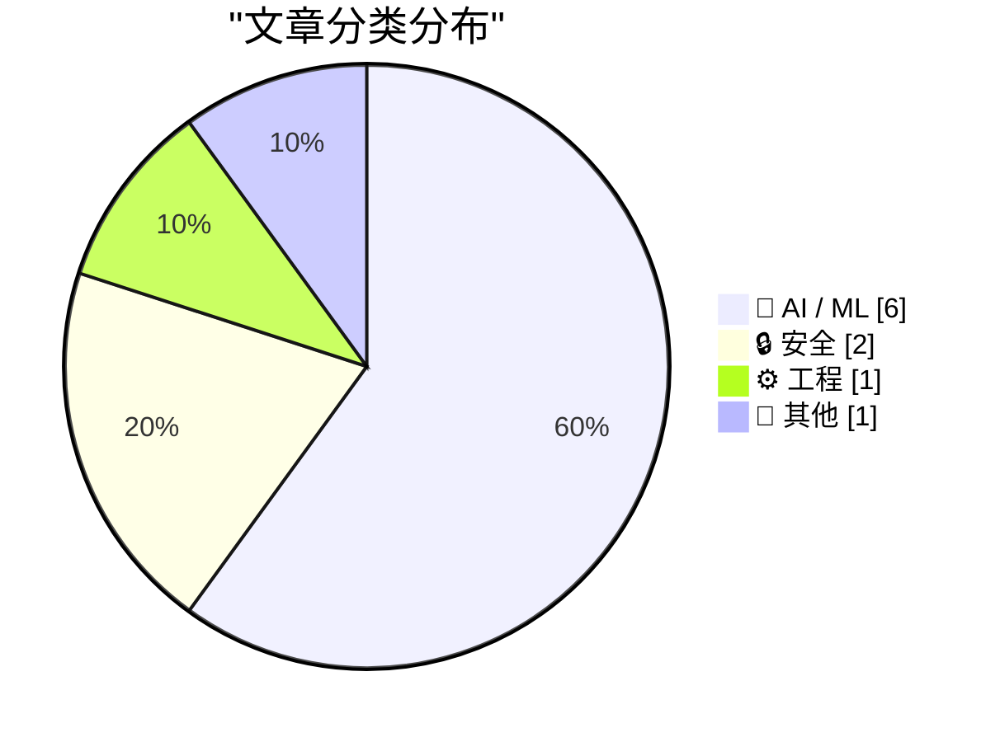
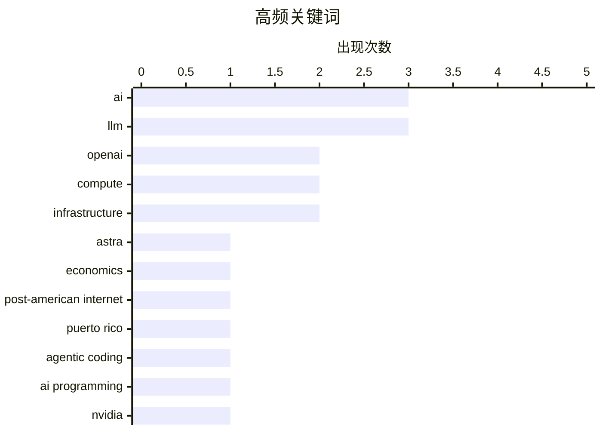

今日AI领域呈现三大趋势：一是算力成本问题引发关注，更智能的AI模型可能使计算费用上涨10倍，Astra被质疑宣传过度，AI需求泡沫论调再起；二是AI代理技术走向务实，MCP协议厘清代理与API的层级关系，代理编码在实际工程中展现价值；三是AI安全与监管收紧，苹果对OpenAI前员工发起诉讼，非美国地区开始探讨数字主权与独立计算基础设施。商业层面，Bending Spoons以约13亿美元收购Airtable，成为后者上市后首笔交易。

<!--more-->


> 来自 Karpathy 推荐的 92 个顶级技术博客，AI 精选 Top 10

## 🏆 今日必读

🥇 **关于 Astra 和数学的两个关键更新**

[Two critical updates re: Astra and mathematics](https://garymarcus.substack.com/p/two-critical-updates-re-astra-and) — garymarcus.substack.com · 1 天前 · 🤖 AI / ML

> 本文针对 OpenAI 昨日发布的 Astra 进行深入分析，质疑其是否真的是所谓的突破性产品。作者认为 Astra 可能并非 OpenAI 想让公众相信的那样具有革命性意义，同时对数学相关的能力更新进行了讨论。

💡 **为什么值得读**: Gary Marcus 是知名 AI 研究者，其对 OpenAI 产品的批判性分析有助于公众理性看待 AI 公司的营销宣传。

🏷️ OpenAI, Astra, AI, LLM

🥈 **为什么更智能的 AI 模型可能导致计算成本上涨 10 倍**

[Why smarter AI models could drive up compute prices 10x](https://www.dwarkesh.com/p/why-compute-might-get-10x-more-expensive-video) — dwarkesh.com · 1 天前 · 🤖 AI / ML

> 文章探讨了更聪明的 AI 模型可能带来的计算成本问题。随着模型智能程度提升，对算力的需求急剧增加，可能导致计算资源变得更加昂贵，行业可能迎来"廉价计算"时代的终结。

💡 **为什么值得读**: 对于 AI 从业者和投资者理清算力成本趋势、了解行业发展经济规律具有重要参考价值。

🏷️ AI, compute, infrastructure, economics

🥉 **后美国计算与后美国互联网**

[Pluralistic: Post-American compute for a post-American Internet (04 Aug 2026)](https://pluralistic.net/2026/08/04/technology-freedom-cooperative/) — pluralistic.net · 11 小时前 · 🤖 AI / ML

> 文章讨论了非美国地区的数字主权问题，指出特朗普政府有手段、动机和机会要求美国科技公司切断任何不满意的公共官员、大型企业或个人的服务。作者提出在波多黎各、欧盟、加拿大和墨西哥建立合作性人权计算基础设施的倡议。

💡 **为什么值得读**: 当前地缘政治环境下，理解数字主权风险和构建替代性基础设施对全球开发者具有前瞻性意义。

🏷️ infrastructure, compute, post-American Internet, Puerto Rico

---

## 📊 数据概览

| 扫描源 | 抓取文章 | 时间范围 | 精选 |
|:---:|:---:|:---:|:---:|
| 87/92 | 2586 篇 → 37 篇 | 48h | **10 篇** |

### 分类分布



### 高频关键词



<details>
<summary>📈 纯文本关键词图（终端友好）</summary>

```
ai                     │ ████████████████████ 3
llm                    │ ████████████████████ 3
openai                 │ █████████████░░░░░░░ 2
compute                │ █████████████░░░░░░░ 2
infrastructure         │ █████████████░░░░░░░ 2
astra                  │ ███████░░░░░░░░░░░░░ 1
economics              │ ███████░░░░░░░░░░░░░ 1
post-american internet │ ███████░░░░░░░░░░░░░ 1
puerto rico            │ ███████░░░░░░░░░░░░░ 1
agentic coding         │ ███████░░░░░░░░░░░░░ 1
```

</details>

### 🏷️ 话题标签

**ai**(3) · **llm**(3) · **openai**(2) · compute(2) · infrastructure(2) · astra(1) · economics(1) · post-american internet(1) · puerto rico(1) · agentic coding(1) · ai programming(1) · nvidia(1) · anthropic(1) · bubble(1) · minimax-h3(1) · multimodal(1) · generative ai(1) · apple(1) · trade secrets(1) · lawsuit(1)

---

## 🤖 AI / ML

### 1. 关于 Astra 和数学的两个关键更新

[Two critical updates re: Astra and mathematics](https://garymarcus.substack.com/p/two-critical-updates-re-astra-and) — **garymarcus.substack.com** · 1 天前 · ⭐ 26/30

> 本文针对 OpenAI 昨日发布的 Astra 进行深入分析，质疑其是否真的是所谓的突破性产品。作者认为 Astra 可能并非 OpenAI 想让公众相信的那样具有革命性意义，同时对数学相关的能力更新进行了讨论。

🏷️ OpenAI, Astra, AI, LLM

---

### 2. 为什么更智能的 AI 模型可能导致计算成本上涨 10 倍

[Why smarter AI models could drive up compute prices 10x](https://www.dwarkesh.com/p/why-compute-might-get-10x-more-expensive-video) — **dwarkesh.com** · 1 天前 · ⭐ 26/30

> 文章探讨了更聪明的 AI 模型可能带来的计算成本问题。随着模型智能程度提升，对算力的需求急剧增加，可能导致计算资源变得更加昂贵，行业可能迎来"廉价计算"时代的终结。

🏷️ AI, compute, infrastructure, economics

---

### 3. 后美国计算与后美国互联网

[Pluralistic: Post-American compute for a post-American Internet (04 Aug 2026)](https://pluralistic.net/2026/08/04/technology-freedom-cooperative/) — **pluralistic.net** · 11 小时前 · ⭐ 25/30

> 文章讨论了非美国地区的数字主权问题，指出特朗普政府有手段、动机和机会要求美国科技公司切断任何不满意的公共官员、大型企业或个人的服务。作者提出在波多黎各、欧盟、加拿大和墨西哥建立合作性人权计算基础设施的倡议。

🏷️ infrastructure, compute, post-American Internet, Puerto Rico

---

### 4. 代理编码技术

[Agentic coding techniques](https://micahflee.com/agentic-coding-techniques/) — **micahflee.com** · 1 天前 · ⭐ 25/30

> 作者分享了使用 LLM 进行代理编码的经验。与将 AI 塞入每个应用、用聊天机器人取代客服、生成无休止的垃圾内容不同，代理编码实际上很有用，关键在于由懂行且会审查代码的人正确使用。

🏷️ LLM, agentic coding, AI programming

---

### 5. AI 需求泡沫

[The AI Demand Bubble](https://www.wheresyoured.at/the-ai-demand-bubble/) — **wheresyoured.at** · 6 小时前 · ⭐ 25/30

> 这是一篇付费订阅文章，介绍作者每周发送的 5000-18000 字深度分析简报，涵盖 NVIDIA、Anthropic 等公司的详细研究。

🏷️ AI, NVIDIA, Anthropic, bubble

---

### 6. 在 Apple Silicon 上运行 MiniMax-H3

[PipeNetwork/minimax-h3-mlx](https://simonwillison.net/2026/Aug/4/minimax-h3-mlx/#atom-everything) — **simonwillison.net** · 3 小时前 · ⭐ 24/30

> MiniMax 发布了 MiniMax-H3，描述为"通用多模态生成系统"，支持文本、图像、音频和视频输入，可生成最长 15 秒带音频的视频。开发者已将其移植到 MLX 框架，可在 Apple Silicon Mac 上运行。作者在 M5 Max MacBook Pro 上成功运行了模型。

🏷️ MiniMax-H3, multimodal, LLM, generative AI

---

## 🔒 安全

### 7. 苹果寻求对 OpenAI 实施临时禁令

[Apple Seeks Preliminary Injunction Against OpenAI in Trade Secrets Case](https://www.reuters.com/legal/litigation/apple-seeks-preliminary-injunction-against-openai-trade-secrets-case-2026-08-04/) — **daringfireball.net** · 6 小时前 · ⭐ 24/30

> 苹果公司向法官申请临时禁令，禁止两名前员工和 OpenAI 获取、使用或披露涉嫌保密的信息。苹果同时提出加速取证动议，要求约谈两名前员工 Tang Yew Tan、Chang Liu 以及 OpenAI 员工 Yu-Ting Peng 和一名匿名员工。文章建议阅读苹果实际动议原文以了解细节。

🏷️ Apple, OpenAI, trade secrets, lawsuit

---

### 8. 欢迎尼泊尔政府加入 Have I Been Pwned

[Welcoming the Nepalese Government to Have I Been Pwned](https://www.troyhunt.com/welcoming-the-nepalese-government-to-have-i-been-pwned/) — **troyhunt.com** · 1 天前 · ⭐ 24/30

> Have I Been Pwned 迎来第 47 个政府客户——尼泊尔。尼泊尔国家网络安全中心现可免费访问 HIBP 服务，监控尼泊尔政府域名下的政府电子邮件地址，识别数据泄露暴露情况。

🏷️ HIBP, Nepal, government, data breach

---

## ⚙️ 工程

### 9. MCP vs REST：连接代理与 API 的正确方式

[[Sponsor] MCP vs. REST: The Right Way to Connect Agents to Your API](https://workos.com/blog/mcp-vs-rest?utm_source=daringfireball&amp;utm_medium=newsletter&amp;utm_campaign=q32026) — **daringfireball.net** · 23 小时前 · ⭐ 24/30

> 文章阐述 REST 和 MCP 的定位不同：REST 面向开发者，MCP 面向代理。两者并非竞争关系而是层级关系，大多数 MCP 服务器内部调用 REST 完成实际工作。最佳实践不是将每个端点转换为工具，而是围绕代理目标进行设计，同时需要配套 OAuth 2.1 和作用域令牌。

🏷️ MCP, REST, API, agents

---

## 📝 其他

### 10. Bending Spoons 以 13 亿美元收购 Airtable

[Bending Spoons to Buy Airtable for $1.3 Billion](https://techcrunch.com/2026/08/04/bending-spoons-to-buy-airtable-for-1-28b/) — **daringfireball.net** · 7 小时前 · ⭐ 23/30

> Bending Spoons 宣布以 12.8 亿美元现金收购 Airtable，这是其上市后首笔收购。Airtable 成立于 2013 年，融资超 14 亿美元，2021 年估值曾超 110 亿美元，目前年收入 4.8 亿美元，同比增长 20%。文章指出 110 亿美元估值过高，现估值约 22.5 亿美元。

🏷️ Airtable, acquisition, Bending Spoons

---

*生成于 2026-08-05 22:19 | 扫描 87 源 → 获取 2586 篇 → 精选 10 篇*
*基于 [Hacker News Popularity Contest 2025](https://refactoringenglish.com/tools/hn-popularity/) RSS 源列表，由 [Andrej Karpathy](https://x.com/karpathy) 推荐*
*由「懂点儿AI」制作，欢迎关注同名微信公众号获取更多 AI 实用技巧 💡*
