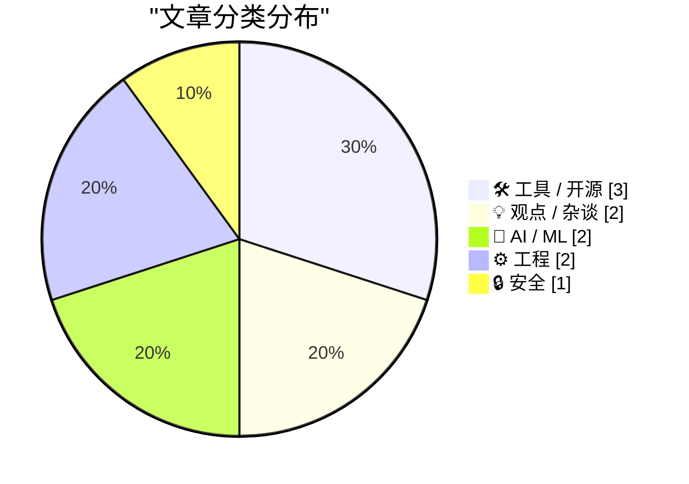
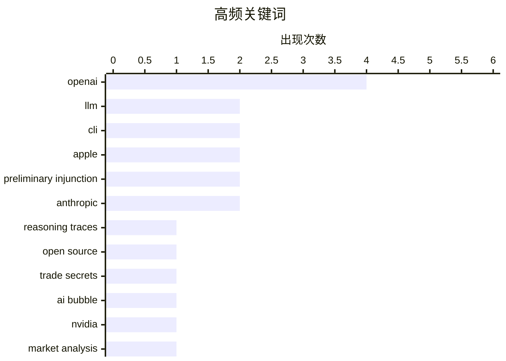

今日技术圈聚焦三大动向：LLM工具链迎来重要迭代，LLM 0.32版本引入推理痕迹可视化、服务器端工具和SQLite日志系统重设计，同时llm-anthropic插件新增多款Claude 5模型支持，AI开发工具生态持续深化；科技巨头间的AI竞合局势升温，微软文件披露OpenAI占据其FY26 AI营收约70%，而苹果与OpenAI的法律纠纷升级，苹果寻求对OpenAI实施临时禁令，后者则以博客强硬回应；工程领域，Proxmox正式支持64位ARM架构，MCP与REST的技术对比则揭示了智能体连接API的新范式。

<!--more-->


> 来自 Karpathy 推荐的 92 个顶级技术博客，AI 精选 Top 10

## 🏆 今日必读

🥇 **LLM 0.32 发布：支持推理痕迹、OpenAI Responses、服务器端工具和智能日志**

[New release of LLM adds support for reasoning traces, OpenAI Responses, server-side tools, and smarter logging](https://simonwillison.net/2026/Aug/4/new-release-of-llm/#atom-everything) — simonwillison.net · 22 小时前 · 🛠 工具 / 开源

> LLM CLI 工具发布 0.32 版本，被作者称为自项目启动以来最重要的版本。新增对推理模型的可视化推理痕迹显示（输出到标准错误流），并可通过 -R/--hide-reasoning 关闭；同时引入了服务器端 provider 工具、重新设计的内容寻址 SQLite 日志系统。此外还支持 OpenAI Responses API，扩展了日志功能和模型支持。

💡 **为什么值得读**: 对于使用 LLM CLI 进行 AI 开发或提示工程的开发者，这个版本显著提升了调试体验和工具能力，值得升级尝试。

🏷️ LLM, CLI, reasoning traces, OpenAI

🥈 **LLM 0.32 版本发布**

[llm 0.32](https://simonwillison.net/2026/Aug/4/llm/#atom-everything) — simonwillison.net · 1 天前 · 🛠 工具 / 开源

> LLM 0.32 正式发布，这是该项目自启动以来最重要的版本更新。包含推理痕迹显示、服务器端工具、重新设计的 SQLite 日志、新模型支持以及 OpenAI Responses API 集成等核心功能。

💡 **为什么值得读**: 这是 LLM 工具的重大更新公告，所有 LLM 用户都应关注。

🏷️ LLM, open source, CLI

🥉 **苹果寻求对 OpenAI 实施临时禁令**

[Apple Seeks Preliminary Injunction Against OpenAI in Trade Secrets Case](https://www.reuters.com/legal/litigation/apple-seeks-preliminary-injunction-against-openai-trade-secrets-case-2026-08-04/) — daringfireball.net · 1 天前 · 🔒 安全

> 苹果公司向美国法官申请临时禁令，禁止两名前员工和 OpenAI 访问、获取、使用或披露被指控的机密信息，推进其商业秘密诉讼案件。同时苹果提交了加速取证动议，要求法院命令两名前苹果员工刘畅（音译）和 Tang Yot Tan 以及 OpenAI 员工彭玉婷（音译）和一名匿名 OpenAI 前苹果员工接受庭外取证。

💡 **为什么值得读**: 这是苹果与 OpenAI 之间的重大法律纠纷，涉及商业秘密和人才竞争，对 AI 行业有重要影响。

🏷️ Apple, OpenAI, preliminary injunction, trade secrets

---

## 📊 数据概览

| 扫描源 | 抓取文章 | 时间范围 | 精选 |
|:---:|:---:|:---:|:---:|
| 87/92 | 2586 篇 → 40 篇 | 48h | **10 篇** |

### 分类分布



### 高频关键词



<details>
<summary>📈 纯文本关键词图（终端友好）</summary>

```
openai                 │ ████████████████████ 4
llm                    │ ██████████░░░░░░░░░░ 2
cli                    │ ██████████░░░░░░░░░░ 2
apple                  │ ██████████░░░░░░░░░░ 2
preliminary injunction │ ██████████░░░░░░░░░░ 2
anthropic              │ ██████████░░░░░░░░░░ 2
reasoning traces       │ █████░░░░░░░░░░░░░░░ 1
open source            │ █████░░░░░░░░░░░░░░░ 1
trade secrets          │ █████░░░░░░░░░░░░░░░ 1
ai bubble              │ █████░░░░░░░░░░░░░░░ 1
```

</details>

### 🏷️ 话题标签

**openai**(4) · **llm**(2) · **cli**(2) · apple(2) · preliminary injunction(2) · anthropic(2) · reasoning traces(1) · open source(1) · trade secrets(1) · ai bubble(1) · nvidia(1) · market analysis(1) · llm-anthropic(1) · claude(1) · microsoft(1) · ai revenue(1) · business(1) · ai(1) · prompting(1) · critical thinking(1)

---

## 🛠 工具 / 开源

### 1. LLM 0.32 发布：支持推理痕迹、OpenAI Responses、服务器端工具和智能日志

[New release of LLM adds support for reasoning traces, OpenAI Responses, server-side tools, and smarter logging](https://simonwillison.net/2026/Aug/4/new-release-of-llm/#atom-everything) — **simonwillison.net** · 22 小时前 · ⭐ 27/30

> LLM CLI 工具发布 0.32 版本，被作者称为自项目启动以来最重要的版本。新增对推理模型的可视化推理痕迹显示（输出到标准错误流），并可通过 -R/--hide-reasoning 关闭；同时引入了服务器端 provider 工具、重新设计的内容寻址 SQLite 日志系统。此外还支持 OpenAI Responses API，扩展了日志功能和模型支持。

🏷️ LLM, CLI, reasoning traces, OpenAI

---

### 2. LLM 0.32 版本发布

[llm 0.32](https://simonwillison.net/2026/Aug/4/llm/#atom-everything) — **simonwillison.net** · 1 天前 · ⭐ 27/30

> LLM 0.32 正式发布，这是该项目自启动以来最重要的版本更新。包含推理痕迹显示、服务器端工具、重新设计的 SQLite 日志、新模型支持以及 OpenAI Responses API 集成等核心功能。

🏷️ LLM, open source, CLI

---

### 3. llm-anthropic 0.26 发布

[llm-anthropic 0.26](https://simonwillison.net/2026/Aug/4/llm-anthropic/#atom-everything) — **simonwillison.net** · 1 天前 · ⭐ 24/30

> llm-anthropic 插件发布 0.26 版本，新增 Claude Fable 5、Sonnet 5 和 Opus 5 模型支持。引入了服务器端工具，包括 WebSearch、WebFetch、CodeExecution 和 AnthropicMCP，可通过 -T 接口或 Python tools= 参数使用。原有的 -o web_search* 选项已被移除，并升级支持 LLM 0.32 的推理痕迹功能。

🏷️ llm-anthropic, Anthropic, Claude

---

## 💡 观点 / 杂谈

### 4. AI 需求泡沫

[The AI Demand Bubble](https://www.wheresyoured.at/the-ai-demand-bubble/) — **wheresyoured.at** · 1 天前 · ⭐ 25/30

> 作者分析了 AI 领域可能存在的需求泡沫现象。订阅费为每年 70 美元或每月 7 美元，作者将提供每周 5000 到 18000 字的深度分析，内容涉及 NVIDIA、Anthropic 等公司的详细研究。

🏷️ AI bubble, NVIDIA, Anthropic, market analysis

---

### 5. 不要做「肉代理」

[Don't be a meat proxy](https://simonwillison.net/2026/Aug/3/dont-be-a-meat-proxy/#atom-everything) — **simonwillison.net** · 1 天前 · ⭐ 23/30

> Niklas Gruhn 提出了一个新术语「肉代理」（meat proxy），指那些盲目复制粘贴 AI 系统输出来传递给同伴的人。作者建议可以向 AI 提问，但不应仅仅转发输出，而应该阅读、理解、验证后用自己的话写出回复，这是一个有价值的增值过程。

🏷️ AI, prompting, critical thinking

---

## 🤖 AI / ML

### 6. 微软披露显示 OpenAI 销售占据 FY26 AI 营收约 70%

[News: Microsoft Disclosures Suggest OpenAI Sales Account For Around 70% Of FY26 AI Revenue, more than 7% of FY26 Revenue](https://www.wheresyoured.at/news-microsoft-disclosures-suggest-openai-sales-account-for-around-70-of-fy26-ai-revenue-more-than-7-of-fy26-revenue/) — **wheresyoured.at** · 3 小时前 · ⭐ 24/30

> 微软披露文件和彭博社分析显示，OpenAI 的计算支出和营收份额占微软 FY26 AI 营收的 70% 或以上，占微软 FY26 总营收的 7% 以上。自 FY24 以来，微软已累计投入 2613 亿美元资本支出。

🏷️ Microsoft, OpenAI, AI revenue, business

---

### 7. OpenAI 回应苹果诉讼：「苹果搞错了」

[★ OpenAI Responds to Apple’s Lawsuit and Motion for Preliminary Injunction: ‘Apple Is Getting This Wrong’](https://daringfireball.net/2026/08/openai_apple_is_getting_this_wrong) — **daringfireball.net** · 23 小时前 · ⭐ 23/30

> OpenAI 以博客文章的形式回应了苹果的诉讼和临时禁令申请，称「苹果搞错了」。这种以博客文章回应重大诉讼的方式并不常见，凸显了 OpenAI 作为一家不寻常公司的行事风格。

🏷️ OpenAI, Apple, lawsuit, preliminary injunction

---

## ⚙️ 工程

### 8. Proxmox 正式支持 ARM（附注意事项）

[Proxmox officially supports Arm, with some caveats](https://www.jeffgeerling.com/blog/2026/proxmox-ve-arm-official/) — **jeffgeerling.com** · 5 小时前 · ⭐ 23/30

> Proxmox 今日宣布其虚拟环境正式支持 64 位 ARM 架构。作者在其 Ampere Altra 开发平台上进行了测试，安装过程很顺利，因为该平台使用 UEFI/ACPI 硬件标准，无需 Proxmox 定制 ISO。

🏷️ Proxmox, ARM, virtualization

---

### 9. MCP vs REST：连接智能体到 API 的正确方式

[[Sponsor] MCP vs. REST: The Right Way to Connect Agents to Your API](https://workos.com/blog/mcp-vs-rest?utm_source=daringfireball&amp;utm_medium=newsletter&amp;utm_campaign=q32026) — **daringfireball.net** · 1 天前 · ⭐ 23/30

> REST 服务于构建 API 的开发者，MCP 则服务于尝试使用 API 的智能体。大多数团队将这两者视为竞争标准，但实际上它们是层级关系——多数 MCP 服务器内部调用 REST 完成实际工作。最佳的 MCP 服务器不是简单将每个端点转换为工具，而是围绕智能体的目标进行设计。发布 MCP 服务器还需同时发布 OAuth 2.1 和作用域令牌，WorkOS AuthKit 已支持该规范。

🏷️ MCP, REST, API, agents

---

## 🔒 安全

### 10. 苹果寻求对 OpenAI 实施临时禁令

[Apple Seeks Preliminary Injunction Against OpenAI in Trade Secrets Case](https://www.reuters.com/legal/litigation/apple-seeks-preliminary-injunction-against-openai-trade-secrets-case-2026-08-04/) — **daringfireball.net** · 1 天前 · ⭐ 25/30

> 苹果公司向美国法官申请临时禁令，禁止两名前员工和 OpenAI 访问、获取、使用或披露被指控的机密信息，推进其商业秘密诉讼案件。同时苹果提交了加速取证动议，要求法院命令两名前苹果员工刘畅（音译）和 Tang Yot Tan 以及 OpenAI 员工彭玉婷（音译）和一名匿名 OpenAI 前苹果员工接受庭外取证。

🏷️ Apple, OpenAI, preliminary injunction, trade secrets

---

*生成于 2026-08-06 22:18 | 扫描 87 源 → 获取 2586 篇 → 精选 10 篇*
*基于 [Hacker News Popularity Contest 2025](https://refactoringenglish.com/tools/hn-popularity/) RSS 源列表，由 [Andrej Karpathy](https://x.com/karpathy) 推荐*
*由「懂点儿AI」制作，欢迎关注同名微信公众号获取更多 AI 实用技巧 💡*
