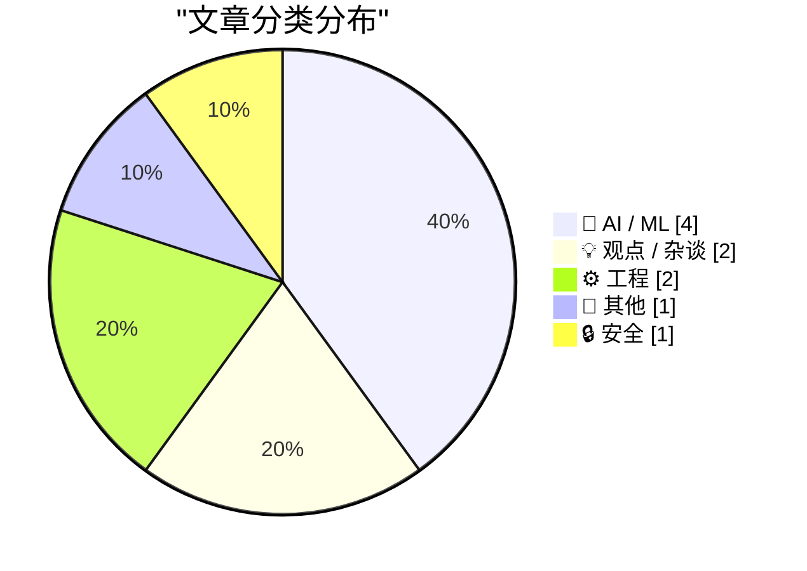
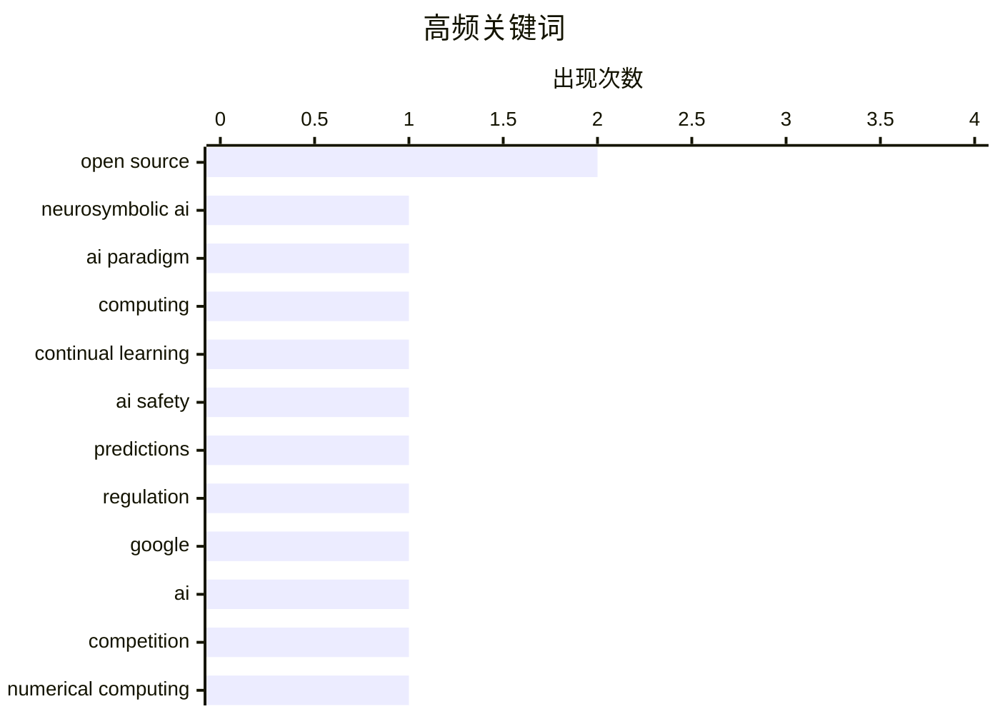

今日AI领域仍最受关注，神经符号AI、持续学习等新技术正在探索AI能力边界，同时围绕NVIDIA硬件优势与谷歌竞争力的讨论持续升温；零知识证明等隐私计算技术也在安全方向取得新进展。

<!--more-->


> 来自 Karpathy 推荐的 92 个顶级技术博客，AI 精选 Top 10

## 🏆 今日必读

🥇 **CPUs and the rise of neurosymbolic AI**

[CPUs and the rise of neurosymbolic AI](https://garymarcus.substack.com/p/cpus-and-the-rise-of-neurosymbolic) — garymarcus.substack.com · 4 小时前 · 🤖 AI / ML

> CPUs and the rise of neurosymbolic AI

🏷️ neurosymbolic AI, AI paradigm, computing

🥈 **8 Predictions for the Era of Continual Learning**

[8 Predictions for the Era of Continual Learning](https://www.dwarkesh.com/p/era-of-continual-learning) — dwarkesh.com · 5 小时前 · 🤖 AI / ML

> 8 Predictions for the Era of Continual Learning

🏷️ continual learning, AI safety, predictions, regulation

🥉 **Seven reasons I wouldn’t count Google out**

[Seven reasons I wouldn’t count Google out](https://garymarcus.substack.com/p/seven-reasons-i-wouldnt-count-google) — garymarcus.substack.com · 1 天前 · 💡 观点 / 杂谈

> Seven reasons I wouldn’t count Google out

🏷️ Google, AI, competition

---

## 📊 数据概览

| 扫描源 | 抓取文章 | 时间范围 | 精选 |
|:---:|:---:|:---:|:---:|
| 69/92 | 2074 篇 → 18 篇 | 48h | **10 篇** |

### 分类分布



### 高频关键词



<details>
<summary>📈 纯文本关键词图（终端友好）</summary>

```
open source        │ ████████████████████ 2
neurosymbolic ai   │ ██████████░░░░░░░░░░ 1
ai paradigm        │ ██████████░░░░░░░░░░ 1
computing          │ ██████████░░░░░░░░░░ 1
continual learning │ ██████████░░░░░░░░░░ 1
ai safety          │ ██████████░░░░░░░░░░ 1
predictions        │ ██████████░░░░░░░░░░ 1
regulation         │ ██████████░░░░░░░░░░ 1
google             │ ██████████░░░░░░░░░░ 1
ai                 │ ██████████░░░░░░░░░░ 1
```

</details>

### 🏷️ 话题标签

**open source**(2) · **neurosymbolic ai**(1) · **ai paradigm**(1) · computing(1) · continual learning(1) · ai safety(1) · predictions(1) · regulation(1) · google(1) · ai(1) · competition(1) · numerical computing(1) · trigonometry(1) · algorithms(1) · zig(1) · concurrency(1) · io(1) · research(1) · sustainability(1) · ai disclosure(1)

---

## 🤖 AI / ML

### 1. CPUs and the rise of neurosymbolic AI

[CPUs and the rise of neurosymbolic AI](https://garymarcus.substack.com/p/cpus-and-the-rise-of-neurosymbolic) — **garymarcus.substack.com** · 4 小时前 · ⭐ 24/30

> CPUs and the rise of neurosymbolic AI

🏷️ neurosymbolic AI, AI paradigm, computing

---

### 2. 8 Predictions for the Era of Continual Learning

[8 Predictions for the Era of Continual Learning](https://www.dwarkesh.com/p/era-of-continual-learning) — **dwarkesh.com** · 5 小时前 · ⭐ 24/30

> 8 Predictions for the Era of Continual Learning

🏷️ continual learning, AI safety, predictions, regulation

---

### 3. A year of AI disclosure in critical packages

[A year of AI disclosure in critical packages](https://nesbitt.io/2026/08/06/a-year-of-ai-disclosure-in-critical-packages.html) — **nesbitt.io** · 1 天前 · ⭐ 21/30

> A year of AI disclosure in critical packages

🏷️ AI disclosure, open source, packages

---

### 4. A quick(ish) Chinchilla check

[A quick(ish) Chinchilla check](https://www.gilesthomas.com/2026/08/chinchilla-check) — **gilesthomas.com** · 3 小时前 · ⭐ 20/30

> A quick(ish) Chinchilla check

🏷️ GPT-2, Chinchilla, model training

---

## 💡 观点 / 杂谈

### 5. Seven reasons I wouldn’t count Google out

[Seven reasons I wouldn’t count Google out](https://garymarcus.substack.com/p/seven-reasons-i-wouldnt-count-google) — **garymarcus.substack.com** · 1 天前 · ⭐ 21/30

> Seven reasons I wouldn’t count Google out

🏷️ Google, AI, competition

---

### 6. Premium: The Hater's Guide To NVIDIA (Part 2)

[Premium: The Hater's Guide To NVIDIA (Part 2)](https://www.wheresyoured.at/premium-the-haters-guide-to-nvidia-part-2/) — **wheresyoured.at** · 5 小时前 · ⭐ 21/30

> Premium: The Hater's Guide To NVIDIA (Part 2)

🏷️ NVIDIA, stock, Enron, semiconductors

---

## ⚙️ 工程

### 7. How not to calculate cosine

[How not to calculate cosine](https://www.johndcook.com/blog/2026/08/07/how-not-to-calculate-cos/) — **johndcook.com** · 7 小时前 · ⭐ 21/30

> How not to calculate cosine

🏷️ numerical computing, trigonometry, algorithms

---

### 8. Zig's Io.Threaded is Neat

[Zig's Io.Threaded is Neat](https://matklad.github.io/2026/08/06/neat-io-threaded.html) — **matklad.github.io** · 1 天前 · ⭐ 21/30

> Zig's Io.Threaded is Neat

🏷️ Zig, concurrency, Io

---

## 📝 其他

### 9. The Software Stewardship Lab

[The Software Stewardship Lab](https://nesbitt.io/2026/08/07/the-software-stewardship-lab.html) — **nesbitt.io** · 12 小时前 · ⭐ 21/30

> The Software Stewardship Lab

🏷️ open source, research, sustainability

---

## 🔒 安全

### 10. A quick look at zero-knowledge proofs

[A quick look at zero-knowledge proofs](https://bernsteinbear.com/blog/zkp/?utm_source=rss) — **bernsteinbear.com** · 22 小时前 · ⭐ 21/30

> A quick look at zero-knowledge proofs

🏷️ zero-knowledge proofs, cryptography, implementation

---

*生成于 2026-08-08 22:34 | 扫描 69 源 → 获取 2074 篇 → 精选 10 篇*
*基于 [Hacker News Popularity Contest 2025](https://refactoringenglish.com/tools/hn-popularity/) RSS 源列表，由 [Andrej Karpathy](https://x.com/karpathy) 推荐*
*由「懂点儿AI」制作，欢迎关注同名微信公众号获取更多 AI 实用技巧 💡*
