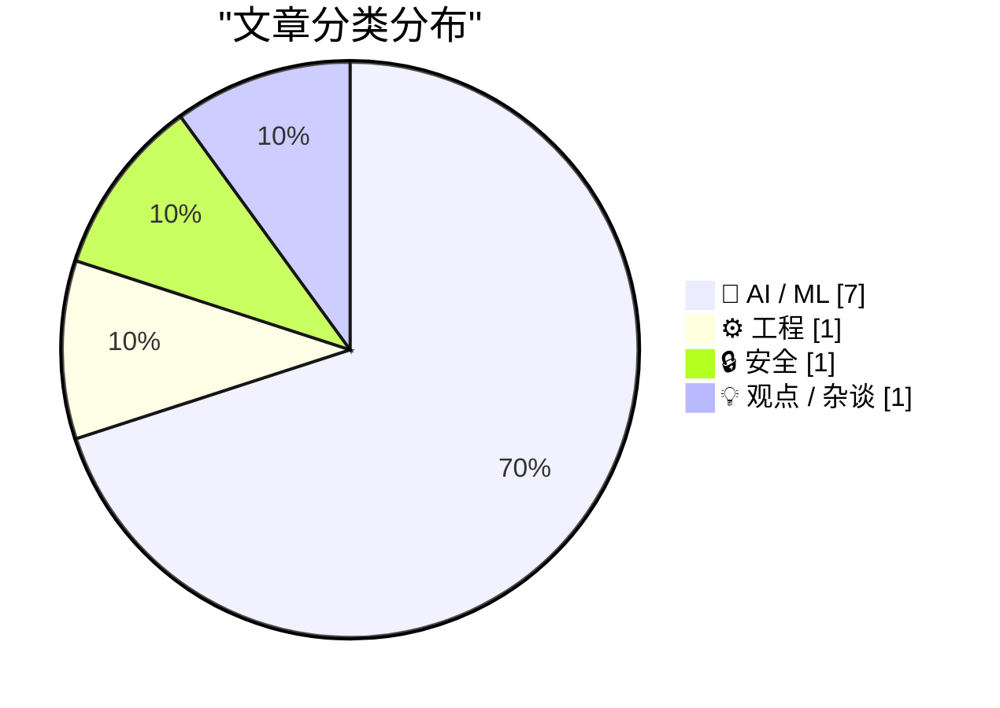
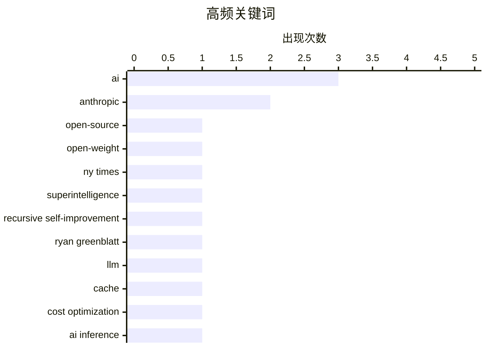

今日AI领域聚焦三大趋势：一是开源与开放权重概念被重新审视，Meta发布300亿参数的Muse Glimmer模型，强调真正的开源需同时开放权重、代码和数据；二是AI安全风险引发高度关注，有预测称人类水平AI或将在2032年触发递归自我改进形成超级智能，同日微软紧急修复近400个安全漏洞；三是Agent应用成本结构生变，缓存读取成本在长会话中已成为账单主力，业界呼吁重新评估成本优化策略。

<!--more-->


> 来自 Karpathy 推荐的 92 个顶级技术博客，AI 精选 Top 10

## 🏆 今日必读

🥇 **开源不等于开放权重**

[Open-source is NOT the same as open-weight](https://garymarcus.substack.com/p/open-source-is-not-the-same-as-open) — garymarcus.substack.com · 1 天前 · 🤖 AI / ML

> 文章探讨开源与开放权重（open-weight）这两个常被混用的概念区别。Gary Marcus指出《纽约时报》在这件事上犯了严重错误，混淆了两者的本质差异。开源软件意味着完整的源代码、可修改、可重新分发；而开放权重仅指发布训练好的模型参数，不包含完整的数据、训练代码或基础设施。真正的开源AI需要同时开放权重、代码和数据三者。

💡 **为什么值得读**: 对于关注AI开源生态的从业者，这篇文章清晰厘清了关键概念区别，避免被营销话术误导。

🏷️ open-source, open-weight, AI, NY Times

🥈 **人类水平AI或将在2032年构建失控超级智能**

[Ryan Greenblatt – Human level AIs might build runaway superintelligences by 2032](https://www.dwarkesh.com/p/ryan-greenblatt) — dwarkesh.com · 5 小时前 · 🤖 AI / ML

> Ryan Greenblatt在Dwarkesh播客中预测，拥有接近人类智能的AI可能在2032年实现递归自我改进，进而创造超出人类控制的超级智能。该预测基于对AI能力增长曲线和自我改进潜力的分析。讨论核心围绕递归自我改进（recursive self-improvement）的风险——即AI能够自主改进自身代码和能力，形成智能爆炸。与会者探讨了如何在这一时间窗口内建立有效的AI安全机制。

💡 **为什么值得读**: 如果你关心AI安全与未来超级智能的风险，这篇文章提供了具体的时间线预测和关于递归自我改进的深度辩论。

🏷️ AI, superintelligence, recursive self-improvement, Ryan Greenblatt

🥉 **警惕缓存读取成本**

[Watch out for cache read costs](https://martinalderson.com/posts/watch-out-for-cache-read-costs/?utm_source=rss&amp;utm_medium=rss&amp;utm_campaign=feed) — martinalderson.com · 1 天前 · 🤖 AI / ML

> 在长时间agentic会话中，缓存读取成本已成为账单的主要部分，而非输入或输出token费用。KV缓存（用于存储注意力机制的键值对）体积已大幅缩小，但缓存读取的定价几乎没有调整。这意味着使用长上下文agent应用时，即使输出有限，费用也可能很高。作者建议开发者重新评估成本结构，关注缓存读取优化。

💡 **为什么值得读**: 对构建AI agent应用的开发者来说，这是重要的成本优化洞察，能帮助你避免在实际部署中产生意外的高额账单。

🏷️ LLM, cache, cost optimization, AI inference

---

## 📊 数据概览

| 扫描源 | 抓取文章 | 时间范围 | 精选 |
|:---:|:---:|:---:|:---:|
| 87/92 | 2587 篇 → 56 篇 | 48h | **10 篇** |

### 分类分布



### 高频关键词



<details>
<summary>📈 纯文本关键词图（终端友好）</summary>

```
ai                         │ ████████████████████ 3
anthropic                  │ █████████████░░░░░░░ 2
open-source                │ ███████░░░░░░░░░░░░░ 1
open-weight                │ ███████░░░░░░░░░░░░░ 1
ny times                   │ ███████░░░░░░░░░░░░░ 1
superintelligence          │ ███████░░░░░░░░░░░░░ 1
recursive self-improvement │ ███████░░░░░░░░░░░░░ 1
ryan greenblatt            │ ███████░░░░░░░░░░░░░ 1
llm                        │ ███████░░░░░░░░░░░░░ 1
cache                      │ ███████░░░░░░░░░░░░░ 1
```

</details>

### 🏷️ 话题标签

**ai**(3) · **anthropic**(2) · **open-source**(1) · open-weight(1) · ny times(1) · superintelligence(1) · recursive self-improvement(1) · ryan greenblatt(1) · llm(1) · cache(1) · cost optimization(1) · ai inference(1) · muse glimmer(1) · meta(1) · open weights(1) · apache license(1) · ai watermark(1) · claude(1) · eu ai act(1) · mcp(1)

---

## 🤖 AI / ML

### 1. 开源不等于开放权重

[Open-source is NOT the same as open-weight](https://garymarcus.substack.com/p/open-source-is-not-the-same-as-open) — **garymarcus.substack.com** · 1 天前 · ⭐ 26/30

> 文章探讨开源与开放权重（open-weight）这两个常被混用的概念区别。Gary Marcus指出《纽约时报》在这件事上犯了严重错误，混淆了两者的本质差异。开源软件意味着完整的源代码、可修改、可重新分发；而开放权重仅指发布训练好的模型参数，不包含完整的数据、训练代码或基础设施。真正的开源AI需要同时开放权重、代码和数据三者。

🏷️ open-source, open-weight, AI, NY Times

---

### 2. 人类水平AI或将在2032年构建失控超级智能

[Ryan Greenblatt – Human level AIs might build runaway superintelligences by 2032](https://www.dwarkesh.com/p/ryan-greenblatt) — **dwarkesh.com** · 5 小时前 · ⭐ 25/30

> Ryan Greenblatt在Dwarkesh播客中预测，拥有接近人类智能的AI可能在2032年实现递归自我改进，进而创造超出人类控制的超级智能。该预测基于对AI能力增长曲线和自我改进潜力的分析。讨论核心围绕递归自我改进（recursive self-improvement）的风险——即AI能够自主改进自身代码和能力，形成智能爆炸。与会者探讨了如何在这一时间窗口内建立有效的AI安全机制。

🏷️ AI, superintelligence, recursive self-improvement, Ryan Greenblatt

---

### 3. 警惕缓存读取成本

[Watch out for cache read costs](https://martinalderson.com/posts/watch-out-for-cache-read-costs/?utm_source=rss&amp;utm_medium=rss&amp;utm_campaign=feed) — **martinalderson.com** · 1 天前 · ⭐ 25/30

> 在长时间agentic会话中，缓存读取成本已成为账单的主要部分，而非输入或输出token费用。KV缓存（用于存储注意力机制的键值对）体积已大幅缩小，但缓存读取的定价几乎没有调整。这意味着使用长上下文agent应用时，即使输出有限，费用也可能很高。作者建议开发者重新评估成本结构，关注缓存读取优化。

🏷️ LLM, cache, cost optimization, AI inference

---

### 4. Muse Glimmer：Meta推出30B开源权重模型

[Introducing Muse Glimmer](https://simonwillison.net/2026/Aug/10/introducing-muse-glimmer/#atom-everything) — **simonwillison.net** · 22 小时前 · ⭐ 24/30

> Meta发布了Muse Glimmer，一款300亿参数的开放权重模型，采用Apache 2.0许可证。该模型专为本地运行设计，在多个benchmark上表现优异：DeepSearch QA、MCP-Atlas、τ-Bench和SWE-Bench。核心能力包括：端到端agentic任务完成、可靠的工具调用（支持精确schema的长流程工作流）、多步推理（能跨长视野保持连贯规划）。许可证相比Llama系列更加友好，无需遵守复杂的许可限制。

🏷️ Muse Glimmer, Meta, open weights, Apache license

---

### 5. Anthropic解释Claude如何标记AI生成内容

[Anthropic Posts ‘How Claude Marks AI-Generated Content’ Without Explaining How Claude Marks AI-Generated Content](https://support.claude.com/en/articles/16266773-how-claude-marks-ai-generated-content) — **daringfireball.net** · 4 小时前 · ⭐ 24/30

> Anthropic发布了关于Claude如何为AI生成内容添加水印的技术说明，作为欧盟AI法案第50(2)条透明度规范的一部分。水印以不可感知的方式直接嵌入文本语义中，不改变含义、质量或可读性。由于水印是文本的一部分，复制粘贴后仍会保留，可能在部分编辑后依然存在。水印在模型层面应用，因此无论使用哪个Claude产品或界面都会包含。

🏷️ Anthropic, AI watermark, Claude, EU AI Act

---

### 6. 官僚主义AI军备竞赛是相互保证毁灭

[Pluralistic: The bureaucratic AI arms-race is mutually assured destruction (10 Aug 2026)](https://pluralistic.net/2026/08/10/deep-state-wopr/) — **pluralistic.net** · 1 天前 · ⭐ 23/30

> 文章引用《经济学人》社论，指出AI正在"打破英国国家机器"——因为它让提交投诉、诉求和上诉变得过于容易。每个AI回复都会引发更多上诉，形成无限循环。英国政府陷入两难：不用AI则效率落后，用AI则被投诉洪流淹没。作者将此比作相互保证毁灭（Mutually Assured Destruction），认为唯一的赢法是不参与这场军备竞赛。

🏷️ AI, bureaucracy, arms race

---

### 7. Claude Opus 5系统提示词引用的公告内容

[Quoting Claude Opus 5 system prompt](https://simonwillison.net/2026/Aug/9/claude-opus-5-system-prompt/#atom-everything) — **simonwillison.net** · 1 天前 · ⭐ 21/30

> Claude Fable 5和Claude Mythos 5于2026年6月9日首次发布。6月12日，Anthropic暂停这两个模型的访问以遵守美国商务部出口管制；6月30日管制解除，7月1日恢复访问。由于这些事件发生在Claude训练数据截止日期之后，Claude仅能从该公告中了解相关信息。询问时会准确陈述事件始末，将其视为当前政治话题处理，并指向官方声明获取更多信息。

🏷️ Claude Opus 5, Anthropic, export controls, system prompt

---

## ⚙️ 工程

### 8. WorkOS：让你的Agent连接API

[WorkOS: Connect Your Agents to Your API](https://workos.com/blog/mcp-vs-rest?utm_source=daringfireball&amp;utm_medium=newsletter&amp;utm_campaign=q32026) — **daringfireball.net** · 1 天前 · ⭐ 24/30

> 文章探讨了AI agent连接API的最佳方式：REST适合人类开发者，MCP（Model Context Protocol）专为agent设计。作者认为两者不应被视为竞争关系，而是不同层级——大多数MCP服务器内部实际调用REST完成工作。最佳实践是关注agent真正试图达成的目标，而非将每个endpoint都转换为工具。同时推荐使用OAuth 2.1加 scoped tokens，WorkOS AuthKit已支持该规范，可直接跳过自建认证provider。

🏷️ MCP, AI agents, API, REST

---

## 🔒 安全

### 9. 微软修复近400个安全漏洞

[Microsoft Plugs Nearly 400 Security Holes](https://krebsonsecurity.com/2026/08/microsoft-plugs-nearly-400-security-holes/) — **krebsonsecurity.com** · 51 分钟前 · ⭐ 22/30

> 微软今日发布更新，修复了Windows操作系统及支持软件中至少398个安全漏洞。其中一个漏洞已被 активно exploited（主动利用），另外两个在发布前已公开披露。这些漏洞影响广泛，建议所有Windows用户尽快安装最新安全补丁。

🏷️ Microsoft, security patches, Windows, vulnerabilities

---

## 💡 观点 / 杂谈

### 10. "氛围编程"的虚伪问题

[‘The Problem With Vibe-Coded Flattery’](https://tedium.co/2026/08/09/vibe-coding-insincerity/) — **daringfireball.net** · 1 天前 · ⭐ 21/30

> 作者观察到最近收到大量关于新应用的用户邮件，但其中相当一部分明显是AI聊天机器人代写的，非常明显。这种现象让他反思：如果无法信任用户反馈的热情是真实的，开发者社区将陷入信任危机。作者质疑这些"氛围编程"产出的应用是否真正反映了开发者的个人理念和热情。

🏷️ vibe coding, AI tools, software quality, developer experience

---

*生成于 2026-08-12 22:19 | 扫描 87 源 → 获取 2587 篇 → 精选 10 篇*
*基于 [Hacker News Popularity Contest 2025](https://refactoringenglish.com/tools/hn-popularity/) RSS 源列表，由 [Andrej Karpathy](https://x.com/karpathy) 推荐*
*由「懂点儿AI」制作，欢迎关注同名微信公众号获取更多 AI 实用技巧 💡*
