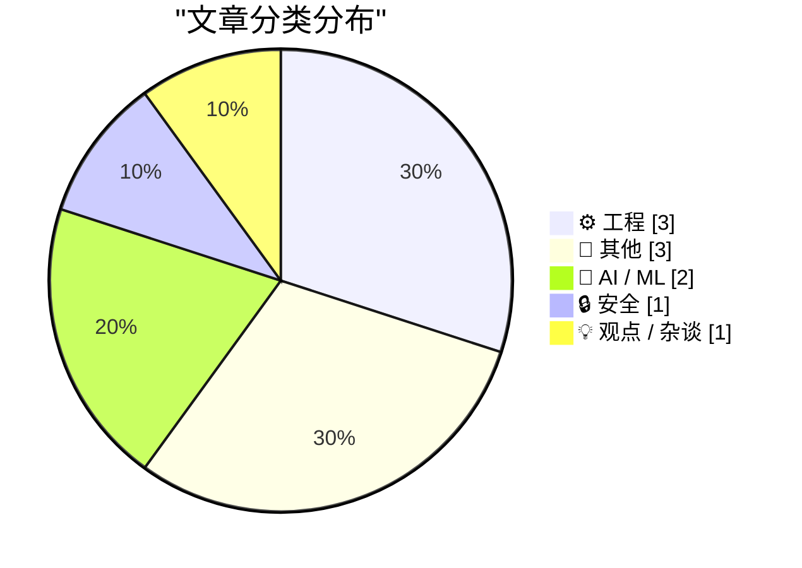
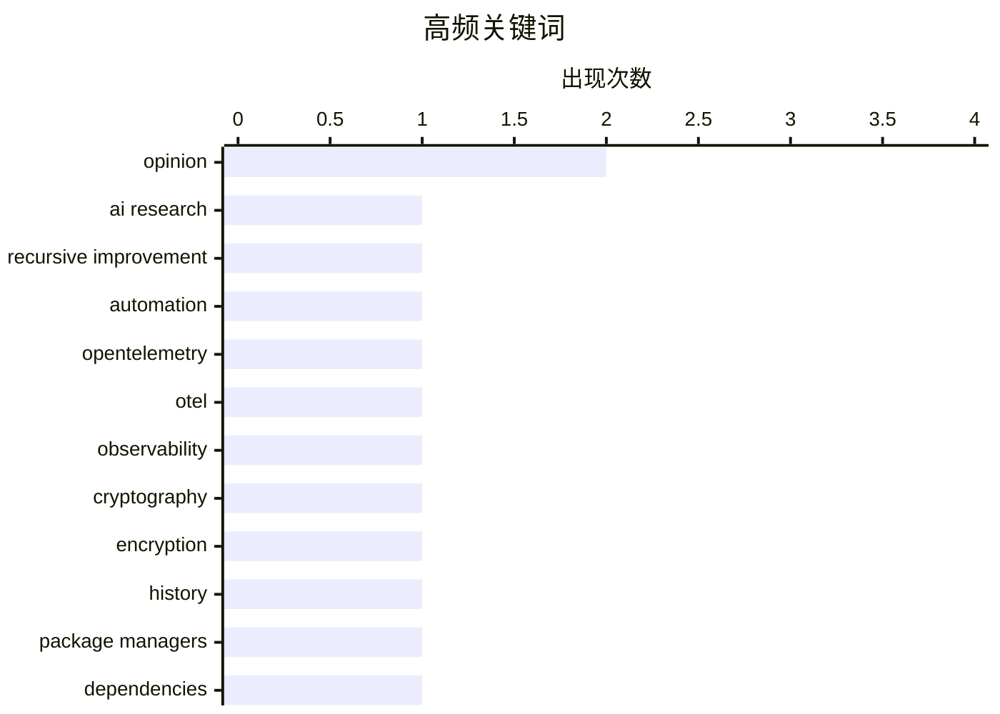

今日技术圈聚焦三大趋势：一是AI发展进入新阶段，从自动化研究到工具便利性带来的"草率"问题，业界开始反思AI对科研和工作的深层影响；二是工程实践面临落地挑战，OpenTelemetry虽被寄予厚望但在采用中困难重重，暴露出技术标准化与实用性之间的差距；三是密码学的局限被重新审视，研究揭示现代加密算法对计算工具的高度依赖，在缺乏计算机辅助时其"不可破解性"将大打折扣。

<!--more-->


> 来自 Karpathy 推荐的 92 个顶级技术博客，AI 精选 Top 10

## 🏆 今日必读

🥇 **当AI能自动化AI研究时会发生什么？**

[Ryan Greenblatt – What happens once AI can automate AI research?](https://www.dwarkesh.com/p/ryan-greenblatt) — dwarkesh.com · 1 天前 · 🤖 AI / ML

> 文章探讨了AI自动化AI研究后可能出现的递归自我改进情景。Ryan Greenblatt与主持人讨论了AI在科研领域达到人类水平后的潜在发展路径，包括AI能否自我迭代提升、可能出现的技术奇点问题，以及对人类未来的影响。文章还涉及了AI对齐问题和如何确保AI发展符合人类利益的讨论。

💡 **为什么值得读**: 对AI未来发展和递归自我改进感兴趣的人必读，提供了关于AI研究自动化的深度思考。

🏷️ AI research, recursive improvement, automation

🥈 **OpenTelemetry发展不顺（附电子表格为证）**

[OTel Isn't Going Well (And I Made A Spreadsheet About It)](https://matduggan.com/otel-isnt-going-well-and-i-made-a-spreadsheet-about-it/) — matduggan.com · 11 小时前 · ⚙️ 工程

> 文章指出OpenTelemetry（OTel）在实际采用中遇到困难，多个开发团队反映OTel似乎“还没完成”。作者制作了一个电子表格详细记录了OTel的各类问题，包括稳定性不足、API变更频繁、厂商锁定问题依然存在等。相比厂商专有SDK，OTel在易用性和功能完整性上仍有差距，导致团队不愿从现有方案迁移。

💡 **为什么值得读**: 对可观测性技术选型或正在评估OTel的工程师有帮助，提供了真实的采用痛点分析。

🏷️ OpenTelemetry, OTel, observability

🥉 **手动破解不了的密码学**

[Manually unbreakable cryptography](https://www.johndcook.com/blog/2026/08/11/manually-unbreakable-cryptography/) — johndcook.com · 1 天前 · 🔒 安全

> 文章设想回到计算机发明前的时代，探讨现代密码学（如RSA）在那个时期是否仍然无法破解。作者指出，虽然现代加密算法在数学上牢不可破，但如果用户只能手动操作（无计算机辅助），实际使用这些加密方法会极其困难——手动执行RSA的大数模运算工作量巨大，几乎不切实际。这揭示了密码学实用性依赖于计算工具的局限。

💡 **为什么值得读**: 对密码学历史和原理感兴趣的读者可以获得独特视角，理解计算机对现代加密的关键作用。

🏷️ cryptography, encryption, history

---

## 📊 数据概览

| 扫描源 | 抓取文章 | 时间范围 | 精选 |
|:---:|:---:|:---:|:---:|
| 69/92 | 2075 篇 → 15 篇 | 48h | **10 篇** |

### 分类分布



### 高频关键词



<details>
<summary>📈 纯文本关键词图（终端友好）</summary>

```
opinion               │ ████████████████████ 2
ai research           │ ██████████░░░░░░░░░░ 1
recursive improvement │ ██████████░░░░░░░░░░ 1
automation            │ ██████████░░░░░░░░░░ 1
opentelemetry         │ ██████████░░░░░░░░░░ 1
otel                  │ ██████████░░░░░░░░░░ 1
observability         │ ██████████░░░░░░░░░░ 1
cryptography          │ ██████████░░░░░░░░░░ 1
encryption            │ ██████████░░░░░░░░░░ 1
history               │ ██████████░░░░░░░░░░ 1
```

</details>

### 🏷️ 话题标签

**opinion**(2) · **ai research**(1) · **recursive improvement**(1) · automation(1) · opentelemetry(1) · otel(1) · observability(1) · cryptography(1) · encryption(1) · history(1) · package managers(1) · dependencies(1) · code sharing(1) · financing(1) · investment(1) · startups(1) · ai(1) · claude(1) · bash(1) · command line(1)

---

## ⚙️ 工程

### 1. OpenTelemetry发展不顺（附电子表格为证）

[OTel Isn't Going Well (And I Made A Spreadsheet About It)](https://matduggan.com/otel-isnt-going-well-and-i-made-a-spreadsheet-about-it/) — **matduggan.com** · 11 小时前 · ⭐ 22/30

> 文章指出OpenTelemetry（OTel）在实际采用中遇到困难，多个开发团队反映OTel似乎“还没完成”。作者制作了一个电子表格详细记录了OTel的各类问题，包括稳定性不足、API变更频繁、厂商锁定问题依然存在等。相比厂商专有SDK，OTel在易用性和功能完整性上仍有差距，导致团队不愿从现有方案迁移。

🏷️ OpenTelemetry, OTel, observability

---

### 2. 包管理器之间的代码共享

[Shared Code Between Package Managers](https://nesbitt.io/2026/08/11/package-manager-library-reuse.html) — **nesbitt.io** · 1 天前 · ⭐ 19/30

> 文章分析了20个不同包管理器之间共享代码库的情况。研究显示，许多包管理器在依赖解析、版本比较、文件解压等核心功能上存在代码复用关系。文章列举了哪些包管理器引用了哪些库，揭示了包管理生态系统中代码重用的模式和哪些库成为事实标准。

🏷️ package managers, dependencies, code sharing

---

### 3. 神秘但一致：bash命令的学习曲线

[Cryptic but consistent](https://www.johndcook.com/blog/2026/08/12/cryptic-but-consistent/) — **johndcook.com** · 9 小时前 · ⭐ 17/30

> 文章分析为何bash shell中的快捷命令（如!$代表上一条命令的最后一个参数）难以记住。原因有两个：一是学习者当下没有使用需求，动力不足；二是这类命令虽然“一致”（符合某种模式），但本身缺乏语义意义，难以形成记忆关联。作者建议学习命令行应该带着实际问题去学，而不是预先系统学习。

🏷️ bash, command line, shell

---

## 📝 其他

### 4. 突破：循环融资达到新高度

[BREAKING: Circular financing reaches new heights](https://garymarcus.substack.com/p/breaking-circular-financing-reaches) — **garymarcus.substack.com** · 1 天前 · ⭐ 18/30

> 文章讨论了加密货币或科技领域循环融资问题的新发展。Gary Marcus指出，如果这种融资模式崩溃，情况可能变得非常糟糕。循环融资通常指资金在不同实体间循环流转，创造虚假流动性，一旦链条断裂可能引发连锁反应。文章未提供具体数据或公司名称，但暗示了当前市场存在的风险。

🏷️ financing, investment, startups

---

### 5. 统一美国公众的唯一议题

[The one issue unifying the American public](https://garymarcus.substack.com/p/the-one-issue-unifying-the-american) — **garymarcus.substack.com** · 1 天前 · ⭐ 14/30

> 文章报道了一项新的民意调查结果，揭示了美国公众在一个特定议题上达成共识。尽管标题暗示这是“统一”美国公众的议题，但给定内容仅提及这是“短暂但重要的新闻”，未提供具体议题内容或调查结果。

🏷️ poll, American public, opinion

---

### 6. 狗与肥尾

[Dogs and fat tails](https://www.johndcook.com/blog/2026/08/11/dogs-and-fat-tails/) — **johndcook.com** · 1 天前 · ⭐ 14/30

> 文章作者浏览了NYC狗名数据集，发现狗名分布呈长尾（fat tails）特征——少数名字非常流行，而大多数名字只出现一次。与直觉相反，最常见的狗名并非如想象般普通。作者借此探讨了长尾分布在现实数据中的表现，以及为何这类分布如此普遍。

🏷️ dogs, data analysis, statistics

---

## 🤖 AI / ML

### 7. 当AI能自动化AI研究时会发生什么？

[Ryan Greenblatt – What happens once AI can automate AI research?](https://www.dwarkesh.com/p/ryan-greenblatt) — **dwarkesh.com** · 1 天前 · ⭐ 24/30

> 文章探讨了AI自动化AI研究后可能出现的递归自我改进情景。Ryan Greenblatt与主持人讨论了AI在科研领域达到人类水平后的潜在发展路径，包括AI能否自我迭代提升、可能出现的技术奇点问题，以及对人类未来的影响。文章还涉及了AI对齐问题和如何确保AI发展符合人类利益的讨论。

🏷️ AI research, recursive improvement, automation

---

### 8. AI的果实

[The Fruits of AI](https://blog.jim-nielsen.com/2026/fruit-of-ai/) — **blog.jim-nielsen.com** · 1 天前 · ⭐ 18/30

> 文章讨论了AI工具默认鼓励“草率”的特性。引用Terry Godier的反省文章，说明依赖AI而“不做工作去理解”导致的问题。作者认为AI的“ grain”（特性）就是让人变得草率，这是工具默认带来的便利性所导致的。没有持续警惕和主动参与，用户会默认产出草率的结果，而人类天生不擅长保持持续警惕。

🏷️ AI, Claude, opinion

---

## 🔒 安全

### 9. 手动破解不了的密码学

[Manually unbreakable cryptography](https://www.johndcook.com/blog/2026/08/11/manually-unbreakable-cryptography/) — **johndcook.com** · 1 天前 · ⭐ 19/30

> 文章设想回到计算机发明前的时代，探讨现代密码学（如RSA）在那个时期是否仍然无法破解。作者指出，虽然现代加密算法在数学上牢不可破，但如果用户只能手动操作（无计算机辅助），实际使用这些加密方法会极其困难——手动执行RSA的大数模运算工作量巨大，几乎不切实际。这揭示了密码学实用性依赖于计算工具的局限。

🏷️ cryptography, encryption, history

---

## 💡 观点 / 杂谈

### 10. 不要抬头

[Don't Look Up](https://www.wheresyoured.at/dont-look-up/) — **wheresyoured.at** · 1 天前 · ⭐ 16/30

> 

🏷️ newsletter, NVIDIA, Anthropic

---

*生成于 2026-08-13 22:19 | 扫描 69 源 → 获取 2075 篇 → 精选 10 篇*
*基于 [Hacker News Popularity Contest 2025](https://refactoringenglish.com/tools/hn-popularity/) RSS 源列表，由 [Andrej Karpathy](https://x.com/karpathy) 推荐*
*由「懂点儿AI」制作，欢迎关注同名微信公众号获取更多 AI 实用技巧 💡*
