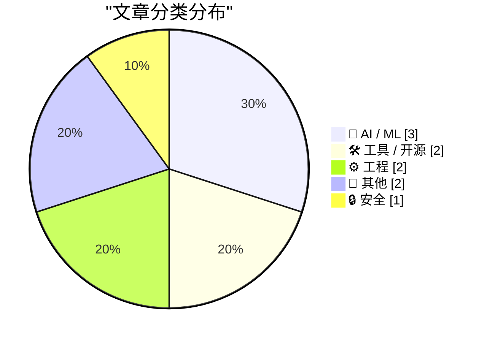
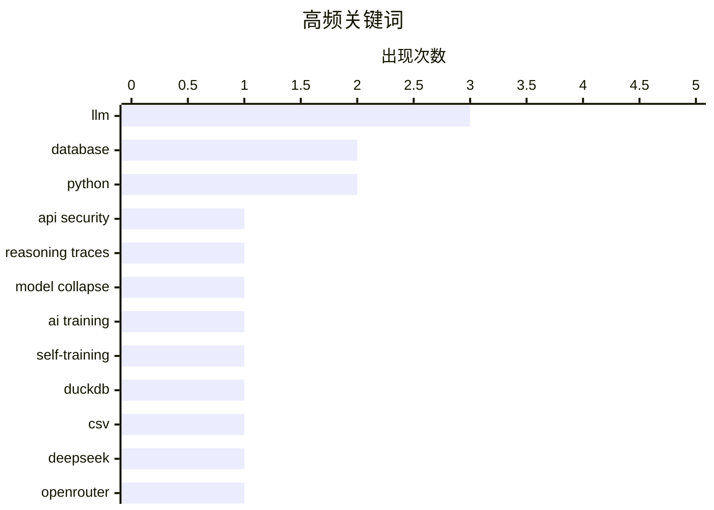

今日AI安全领域曝出重要漏洞，研究发现可从Anthropic、OpenAI和Google的API中窃取思维链痕迹，实现跨会话重放并突破安全限制；同时“模型崩溃”问题再次引发关注，警示大模型用自身生成数据训练的潜在风险。工程实践方面，OpenTelemetry在实际采用中困难重重，开发者对工具成熟度存疑；AI辅助写作的责任边界也引发讨论，工程师需对AI生成内容全权负责。

<!--more-->


> 来自 Karpathy 推荐的 92 个顶级技术博客，AI 精选 Top 10

## 🏆 今日必读

🥇 **从专有LLM API窃取推理痕迹**

[Stealing Reasoning Traces from Proprietary LLM APIs](https://simonwillison.net/2026/Aug/11/stealing-reasoning-traces/) — simonwillison.net · 1 天前 · 🔒 安全

> 一篇新论文揭示了从 Anthropic、OpenAI 和 Google 的 API 中窃取加密思维链（CoT）的方法。研究发现这些厂商返回的思维链块可跨会话、用户和模型重放。攻击者可用前沿模型生成的痕迹重放到较弱模型上，突破较弱模型的安全限制，最终以明文形式恢复更强模型的隐藏推理。

💡 **为什么值得读**: 对于关注AI安全和隐私问题的研究者来说，这篇论文揭示了主流LLM API的潜在安全漏洞，提供了全新的攻击向量和防御思路。

🏷️ LLM, API security, reasoning traces

🥈 **模型崩溃：生活在自我训练的世界中**

[Pluralistic: Model collapse (12 Aug 2026)](https://pluralistic.net/2026/08/12/insurance-value-of-biodiversity/) — pluralistic.net · 1 天前 · 🤖 AI / ML

> 本文探讨AI领域的「模型崩溃」现象——当模型越来越多地用自身生成的内容进行训练时可能发生的退化问题。作者采用「连接」和「分解」两种分析方法：将看似无关的概念联系起来，揭示其共同本质；将看似矛盾的概念拆解为两个不同的事物。

💡 **为什么值得读**: 对于关注AI长期发展和潜在风险的读者，本文提供了独特的分析视角，帮助理解AI系统可能面临的根本性挑战。

🏷️ model collapse, AI training, LLM, self-training

🥉 **alchemy-utils 0.1a1 发布**

[alchemy-utils 0.1a1](https://simonwillison.net/2026/Aug/13/alchemy-utils/) — simonwillison.net · 19 小时前 · 🛠 工具 / 开源

> alchemy-utils 0.1a1 版本发布，带来 DuckDB 导出和 CSV 导入的性能提升。这是作者计划构建的数据库无关版本的 sqlite-utils 工具库。

💡 **为什么值得读**: 如果你是数据工程师或经常处理数据库导出导入，这个版本能直接提升你的工作效率。

🏷️ DuckDB, CSV, database, Python

---

## 📊 数据概览

| 扫描源 | 抓取文章 | 时间范围 | 精选 |
|:---:|:---:|:---:|:---:|
| 87/92 | 2586 篇 → 40 篇 | 48h | **10 篇** |

### 分类分布



### 高频关键词



<details>
<summary>📈 纯文本关键词图（终端友好）</summary>

```
llm              │ ████████████████████ 3
database         │ █████████████░░░░░░░ 2
python           │ █████████████░░░░░░░ 2
api security     │ ███████░░░░░░░░░░░░░ 1
reasoning traces │ ███████░░░░░░░░░░░░░ 1
model collapse   │ ███████░░░░░░░░░░░░░ 1
ai training      │ ███████░░░░░░░░░░░░░ 1
self-training    │ ███████░░░░░░░░░░░░░ 1
duckdb           │ ███████░░░░░░░░░░░░░ 1
csv              │ ███████░░░░░░░░░░░░░ 1
```

</details>

### 🏷️ 话题标签

**llm**(3) · **database**(2) · **python**(2) · api security(1) · reasoning traces(1) · model collapse(1) · ai training(1) · self-training(1) · duckdb(1) · csv(1) · deepseek(1) · openrouter(1) · ai writing(1) · nlp(1) · policy(1) · opentelemetry(1) · observability(1) · otel(1) · vendor lock-in(1) · google pixel 11(1)

---

## 🤖 AI / ML

### 1. 模型崩溃：生活在自我训练的世界中

[Pluralistic: Model collapse (12 Aug 2026)](https://pluralistic.net/2026/08/12/insurance-value-of-biodiversity/) — **pluralistic.net** · 1 天前 · ⭐ 25/30

> 本文探讨AI领域的「模型崩溃」现象——当模型越来越多地用自身生成的内容进行训练时可能发生的退化问题。作者采用「连接」和「分解」两种分析方法：将看似无关的概念联系起来，揭示其共同本质；将看似矛盾的概念拆解为两个不同的事物。

🏷️ model collapse, AI training, LLM, self-training

---

### 2. DeepSeek V4 Pro 0813 (OpenRouter)

[DeepSeek V4 Pro 0813 (on OpenRouter)](https://simonwillison.net/2026/Aug/12/deepseek-v4-pro-0813/) — **simonwillison.net** · 22 小时前 · ⭐ 22/30

> DeepSeek 最新 Pro 模型现已在 OpenRouter 上线，目前仅通过 API 提供。Hugging Face 已同步发布模型权重，参数规模为 1.7T，权重文件大小 893 GB。

🏷️ DeepSeek, LLM, OpenRouter

---

### 3. 自然语言文本不存在无损转换

[There are no lossless transformations of natural-language text](https://simonwillison.net/2026/Aug/11/there-are-no-lossless-transformations-of-natural-language-text/) — **simonwillison.net** · 1 天前 · ⭐ 22/30

> Sophie Alpert 分享了她关于工程师使用 AI 写作的内部政策：必须对文档中的每个想法和每个句子负责。如果审查者问「这句话是什么意思」，不能回答「抱歉，AI 写的，请忽略」。使用 AI 辅助写作时，整个文档必须真实代表你自己的思考。

🏷️ AI writing, NLP, policy

---

## 🛠 工具 / 开源

### 4. alchemy-utils 0.1a1 发布

[alchemy-utils 0.1a1](https://simonwillison.net/2026/Aug/13/alchemy-utils/) — **simonwillison.net** · 19 小时前 · ⭐ 22/30

> alchemy-utils 0.1a1 版本发布，带来 DuckDB 导出和 CSV 导入的性能提升。这是作者计划构建的数据库无关版本的 sqlite-utils 工具库。

🏷️ DuckDB, CSV, database, Python

---

### 5. alchemy-utils 0.1a0 发布

[alchemy-utils 0.1a0](https://simonwillison.net/2026/Aug/12/alchemy-utils/) — **simonwillison.net** · 1 天前 · ⭐ 19/30

> 作者尝试使用 Codex 和 GPT-5.6 Sol Ultra 构建一个数据库无关版本的 sqlite-utils，原型基于 SQLAlchemy，可支持 PostgreSQL、SQLite 和 DuckDB。

🏷️ alchemy-utils, database, Python

---

## ⚙️ 工程

### 6. OTel 发展不顺利（附电子表格分析）

[OTel Isn't Going Well (And I Made A Spreadsheet About It)](https://matduggan.com/otel-isnt-going-well-and-i-made-a-spreadsheet-about-it/) — **matduggan.com** · 1 天前 · ⭐ 22/30

> 作者多年来尝试说服团队从厂商特定 SDK 迁移到 OpenTelemetry 时，最常听到的抱怨是「这好像还没完成？」本文分析了 OpenTelemetry 在实际采用中遇到的困难，并提供了详细的电子表格对比数据。

🏷️ OpenTelemetry, observability, OTel, vendor lock-in

---

### 7. 代码注释与 PR 描述的区别

[The comments that go into code versus those that go into the pull request description](https://devblogs.microsoft.com/oldnewthing/20260812-00/?p=112607) — **devblogs.microsoft.com/oldnewthing** · 1 天前 · ⭐ 21/30

> 探讨代码中的注释应该写什么、pull request 描述应该写什么，分析两者的不同用途和写作规范。

🏷️ code comments, pull request, documentation

---

## 📝 其他

### 8. TechCrunch 评谷歌 Pixel 11 系列

[TechCrunch on Google’s Pixel 11 Lineup](https://techcrunch.com/2026/08/12/pixel-11-has-few-hardware-changes-and-more-gemini/) — **daringfireball.net** · 1 天前 · ⭐ 21/30

> 谷歌 Pixel 11 系列今年更加注重代理式 AI，Gemini 可帮助美国用户下单杂货、叫车、买咖啡，还能代表用户打电话预约餐厅或挂号。合作应用包括 OpenTable、Ticketmaster、Zocdoc 等，但多数仅限英国地区可用。

🏷️ Google Pixel 11, Gemini AI, smartphone, AI assistant

---

### 9. 谷歌 Pixel 11 Pro Fold 上手体验

[Hands-On With Google Pixel 11 Pro Fold](https://www.engadget.com/2235294/google-pixel-11-pro-fold-hands-on/) — **daringfireball.net** · 1 天前 · ⭐ 21/30

> Pixel 11 Pro Fold 仍保持 IP68 防水防尘等级，采用新型玻璃纤维背板材料，号称几乎不可能摔碎。但机身重量和厚度相比上代没有改善，作者批评 Google 未能解决便携性问题。

🏷️ Pixel 11 Pro Fold, foldable phone, hardware review

---

## 🔒 安全

### 10. 从专有LLM API窃取推理痕迹

[Stealing Reasoning Traces from Proprietary LLM APIs](https://simonwillison.net/2026/Aug/11/stealing-reasoning-traces/) — **simonwillison.net** · 1 天前 · ⭐ 25/30

> 一篇新论文揭示了从 Anthropic、OpenAI 和 Google 的 API 中窃取加密思维链（CoT）的方法。研究发现这些厂商返回的思维链块可跨会话、用户和模型重放。攻击者可用前沿模型生成的痕迹重放到较弱模型上，突破较弱模型的安全限制，最终以明文形式恢复更强模型的隐藏推理。

🏷️ LLM, API security, reasoning traces

---

*生成于 2026-08-14 22:18 | 扫描 87 源 → 获取 2586 篇 → 精选 10 篇*
*基于 [Hacker News Popularity Contest 2025](https://refactoringenglish.com/tools/hn-popularity/) RSS 源列表，由 [Andrej Karpathy](https://x.com/karpathy) 推荐*
*由「懂点儿AI」制作，欢迎关注同名微信公众号获取更多 AI 实用技巧 💡*
