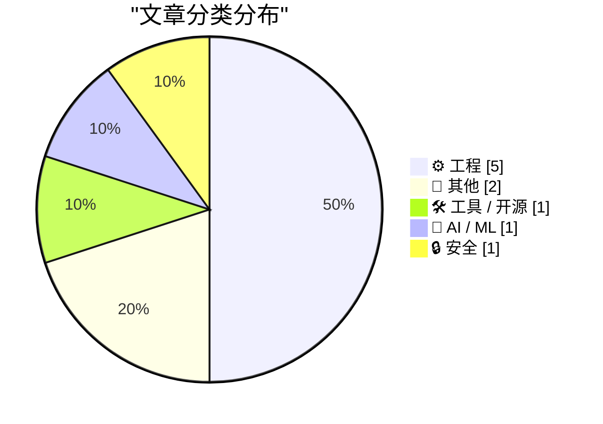
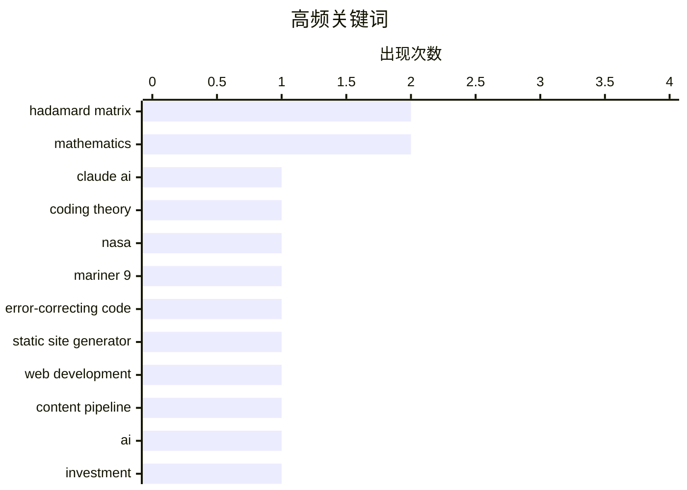

今日技术圈聚焦三大趋势：一是Hadamard矩阵研究持续升温，从James Sylvester的经典构造到NASA水手9号任务的实际应用，再到AI辅助发现新型矩阵，该领域正迎来新的研究热潮；二是AI发展所需的巨额资金投入成为行业焦点，引发关于技术发展经济模型的讨论；三是技术内容创作与工程实践持续受到关注，从高性能博客架构解析到Ruby编译器优化技巧，技术社区在工具链与工程方法上不断深耕。

<!--more-->


> 来自 Karpathy 推荐的 92 个顶级技术博客，AI 精选 Top 10

## 🏆 今日必读

🥇 **Hadamard码与球面填充**

[Hadamard Codes and Sphere Packing](https://www.johndcook.com/blog/2026/08/13/hadamard-sphere-packing/) — johndcook.com · 20 小时前 · ⚙️ 工程

> Hadamard矩阵是一种元素仅为1或-1的正交矩阵，在通信和编码领域有重要应用。文章介绍了Levent Alpöge及其团队利用Claude AI发现新型Hadamard矩阵的进展，并提及这些矩阵在NASA任务中的应用背景。Hadamard矩阵与球面填充问题存在数学上的关联，两者在编码理论中均有重要价值。

💡 **为什么值得读**: 适合对编码理论、数学和AI辅助发现感兴趣的读者，可了解Hadamard矩阵的实际应用背景。

🏷️ Hadamard matrix, Claude AI, mathematics, coding theory

🥈 **NASA水手9号探测器如何编码图像**

[How NASA’s Mariner 9 probe encoded images](https://www.johndcook.com/blog/2026/08/13/mariner-hadamard/) — johndcook.com · 22 小时前 · ⚙️ 工程

> 1971年NASA发射水手9号探测器拍摄火星，图像传输时需要使用纠错码否则会严重失真。水手9号采用基于Hadamard矩阵的编码方案，具体为(32,6,16)Hadamard码。这种编码方式利用Hadamard矩阵的正交特性实现高效纠错，在当时技术条件下成功将火星图像传回地球。

💡 **为什么值得读**: 技术史爱好者必读，展示了上世纪70年代如何用数学方法解决深空通信难题。

🏷️ NASA, Mariner 9, error-correcting code

🥉 **本博客的技术架构解析**

[How This Blog Is Built](https://nesbitt.io/2026/08/14/how-this-blog-is-built.html) — nesbitt.io · 12 小时前 · 🛠 工具 / 开源

> 文章详细介绍了nesbitt.io博客的完整技术栈，包括自定义静态站点生成器、内容处理管道以及边缘部署方案。作者逐步讲解了从内容创作到最终上线的整个流程，展示了一个高性能技术博客的构建思路。

💡 **为什么值得读**: 适合想了解现代博客架构或自行搭建技术博客的开发者参考。

🏷️ static site generator, web development, content pipeline

---

## 📊 数据概览

| 扫描源 | 抓取文章 | 时间范围 | 精选 |
|:---:|:---:|:---:|:---:|
| 68/92 | 2049 篇 → 13 篇 | 48h | **10 篇** |

### 分类分布



### 高频关键词



<details>
<summary>📈 纯文本关键词图（终端友好）</summary>

```
hadamard matrix       │ ████████████████████ 2
mathematics           │ ████████████████████ 2
claude ai             │ ██████████░░░░░░░░░░ 1
coding theory         │ ██████████░░░░░░░░░░ 1
nasa                  │ ██████████░░░░░░░░░░ 1
mariner 9             │ ██████████░░░░░░░░░░ 1
error-correcting code │ ██████████░░░░░░░░░░ 1
static site generator │ ██████████░░░░░░░░░░ 1
web development       │ ██████████░░░░░░░░░░ 1
content pipeline      │ ██████████░░░░░░░░░░ 1
```

</details>

### 🏷️ 话题标签

**hadamard matrix**(2) · **mathematics**(2) · **claude ai**(1) · coding theory(1) · nasa(1) · mariner 9(1) · error-correcting code(1) · static site generator(1) · web development(1) · content pipeline(1) · ai(1) · investment(1) · funding(1) · business(1) · jit(1) · compiler(1) · ssi(1) · optimization(1) · sylvester(1) · programming(1)

---

## ⚙️ 工程

### 1. Hadamard码与球面填充

[Hadamard Codes and Sphere Packing](https://www.johndcook.com/blog/2026/08/13/hadamard-sphere-packing/) — **johndcook.com** · 20 小时前 · ⭐ 24/30

> Hadamard矩阵是一种元素仅为1或-1的正交矩阵，在通信和编码领域有重要应用。文章介绍了Levent Alpöge及其团队利用Claude AI发现新型Hadamard矩阵的进展，并提及这些矩阵在NASA任务中的应用背景。Hadamard矩阵与球面填充问题存在数学上的关联，两者在编码理论中均有重要价值。

🏷️ Hadamard matrix, Claude AI, mathematics, coding theory

---

### 2. NASA水手9号探测器如何编码图像

[How NASA’s Mariner 9 probe encoded images](https://www.johndcook.com/blog/2026/08/13/mariner-hadamard/) — **johndcook.com** · 22 小时前 · ⭐ 20/30

> 1971年NASA发射水手9号探测器拍摄火星，图像传输时需要使用纠错码否则会严重失真。水手9号采用基于Hadamard矩阵的编码方案，具体为(32,6,16)Hadamard码。这种编码方式利用Hadamard矩阵的正交特性实现高效纠错，在当时技术条件下成功将火星图像传回地球。

🏷️ NASA, Mariner 9, error-correcting code

---

### 3. 利用canonicalize实现局部SSI技巧

[Another partial SSI trick with canonicalize](https://bernsteinbear.com/blog/more-partial-ssi/?utm_source=rss) — **bernsteinbear.com** · 1 天前 · ⭐ 20/30

> 作者在Chris Fallin的aegraph文章启发下，与ZJIT贡献者dak2合作，在Ruby项目中实现了块级局部canonicalize函数。该函数通过reverse_post_order遍历代码块，逐块进行指令重写，为Ruby编译器的优化提供了新的技术方案。

🏷️ JIT, compiler, SSI, optimization

---

### 4. Hadamard矩阵的构造方法

[Constructing Hadamard matrices](https://www.johndcook.com/blog/2026/08/13/constructing-hadamard-matrices/) — **johndcook.com** · 1 天前 · ⭐ 19/30

> Hadamard矩阵是元素仅为1或-1的正交矩阵，James Joseph Sylvester在Hadamard之前就研究了这类矩阵并发现了构造方法。文章介绍了如何从简单的2阶例子 bootstrapping 出更高阶的Hadamard矩阵，展示了 Sylvester 的递推构造技巧。

🏷️ Hadamard matrix, Sylvester, mathematics

---

### 5. 列表打印技巧

[Printing Lists](https://matklad.github.io/2026/08/14/printing-lists.html) — **matklad.github.io** · 22 小时前 · ⭐ 17/30

> 文章介绍了一种简洁的逗号分隔列表打印习惯用法：先打印逗号再打印元素，比传统的先判断是否为首个元素更加简洁直观。这种技巧在多种编程语言中都可应用。

🏷️ programming, printing, lists

---

## 📝 其他

### 6. 21世纪ROAD to Housing法案如何影响住房供应？（下）

[How Will the 21st Century ROAD to Housing Act Affect Housing Supply? Part II](https://www.construction-physics.com/p/how-will-the-21st-century-road-to) — **construction-physics.com** · 10 小时前 · ⭐ 15/30

> 这是作者对21世纪ROAD to Housing法案的第二期深度分析，延续上期继续拆解法案中各项条款的具体内容和实际影响。作者试图分析这些政策对住房供应可能产生的真实效果。

🏷️ housing policy, ROAD to Housing Act, regulation

---

### 7. 本周 analog 古董商

[This Week on The Analog Antiquarian](https://www.filfre.net/2026/08/this-week-on-the-analog-antiquarian/) — **filfre.net** · 6 小时前 · ⭐ 13/30

> 本周Analog Antiquarian专栏内容，Richard去电影院看电影。这是关于复古计算和科技历史的每周专栏。

🏷️ analog technology, historical, computing

---

## 🛠 工具 / 开源

### 8. 本博客的技术架构解析

[How This Blog Is Built](https://nesbitt.io/2026/08/14/how-this-blog-is-built.html) — **nesbitt.io** · 12 小时前 · ⭐ 20/30

> 文章详细介绍了nesbitt.io博客的完整技术栈，包括自定义静态站点生成器、内容处理管道以及边缘部署方案。作者逐步讲解了从内容创作到最终上线的整个流程，展示了一个高性能技术博客的构建思路。

🏷️ static site generator, web development, content pipeline

---

## 🤖 AI / ML

### 9. Premium：AI需要多少钱？

[Premium: How Much Money Does AI Need?](https://www.wheresyoured.at/premium-how-much-money-does-ai-need/) — **wheresyoured.at** · 6 小时前 · ⭐ 20/30

> 作者针对读者认为文章过长的反馈进行回应，表示长文是其论证风格的必要手段。文章探讨了AI领域的经济投入问题，分析AI发展所需资金的规模及其影响。

🏷️ AI, investment, funding, business

---

## 🔒 安全

### 10. 供应商安全问卷

[Supplier Security Questionnaire](https://nesbitt.io/2026/08/13/supplier-security-questionnaire.html) — **nesbitt.io** · 1 天前 · ⭐ 16/30

> 这是一份供应商安全问卷，帮助企业评估供应商的安全能力。完成问卷预计需要20分钟，用于评估供应链安全风险。

🏷️ security, questionnaire, supplier

---

*生成于 2026-08-15 22:18 | 扫描 68 源 → 获取 2049 篇 → 精选 10 篇*
*基于 [Hacker News Popularity Contest 2025](https://refactoringenglish.com/tools/hn-popularity/) RSS 源列表，由 [Andrej Karpathy](https://x.com/karpathy) 推荐*
*由「懂点儿AI」制作，欢迎关注同名微信公众号获取更多 AI 实用技巧 💡*
