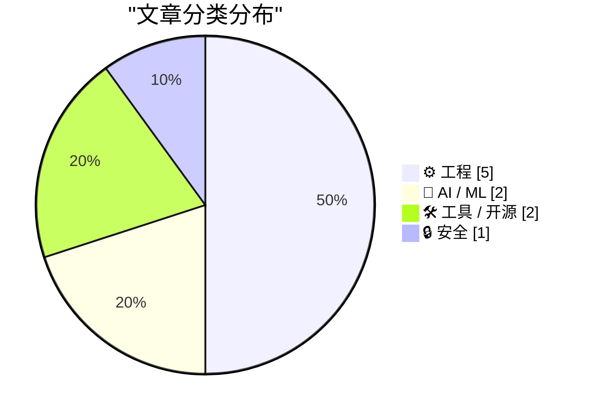
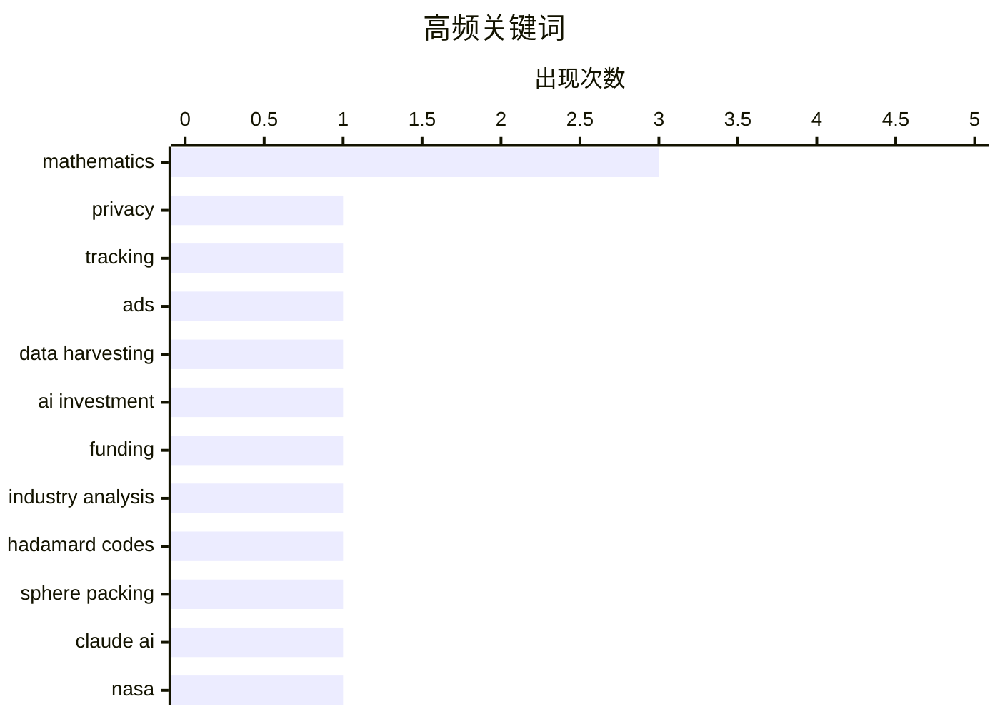

今日技术圈聚焦三大趋势：AI投资成本引发热议，如何衡量大模型投入产出成为业界焦点；编码理论与信息论持续发酵，Hadamard矩阵、纠错概率等经典议题在现代工程中焕发新意；隐私安全仍是重要议题，在线追踪防护需求日益增长。

<!--more-->


> 来自 Karpathy 推荐的 92 个顶级技术博客，AI 精选 Top 10

## 🏆 今日必读

🥇 **Who’s Tracking You? Use This New Service to Find Out**

[Who’s Tracking You? Use This New Service to Find Out](https://krebsonsecurity.com/2026/08/whos-tracking-you-use-this-new-service-to-find-out/) — krebsonsecurity.com · 1 天前 · 🔒 安全

> Who’s Tracking You? Use This New Service to Find Out

🏷️ privacy, tracking, ads, data harvesting

🥈 **Premium: How Much Money Does AI Need?**

[Premium: How Much Money Does AI Need?](https://www.wheresyoured.at/premium-how-much-money-does-ai-need/) — wheresyoured.at · 1 天前 · 🤖 AI / ML

> Premium: How Much Money Does AI Need?

🏷️ AI investment, funding, industry analysis

🥉 **Hadamard Codes and Sphere Packing**

[Hadamard Codes and Sphere Packing](https://www.johndcook.com/blog/2026/08/13/hadamard-sphere-packing/) — johndcook.com · 1 天前 · ⚙️ 工程

> Hadamard Codes and Sphere Packing

🏷️ Hadamard codes, sphere packing, Claude AI, mathematics

---

## 📊 数据概览

| 扫描源 | 抓取文章 | 时间范围 | 精选 |
|:---:|:---:|:---:|:---:|
| 87/92 | 2587 篇 → 30 篇 | 48h | **10 篇** |

### 分类分布



### 高频关键词



<details>
<summary>📈 纯文本关键词图（终端友好）</summary>

```
mathematics       │ ████████████████████ 3
privacy           │ ███████░░░░░░░░░░░░░ 1
tracking          │ ███████░░░░░░░░░░░░░ 1
ads               │ ███████░░░░░░░░░░░░░ 1
data harvesting   │ ███████░░░░░░░░░░░░░ 1
ai investment     │ ███████░░░░░░░░░░░░░ 1
funding           │ ███████░░░░░░░░░░░░░ 1
industry analysis │ ███████░░░░░░░░░░░░░ 1
hadamard codes    │ ███████░░░░░░░░░░░░░ 1
sphere packing    │ ███████░░░░░░░░░░░░░ 1
```

</details>

### 🏷️ 话题标签

**mathematics**(3) · **privacy**(1) · **tracking**(1) · ads(1) · data harvesting(1) · ai investment(1) · funding(1) · industry analysis(1) · hadamard codes(1) · sphere packing(1) · claude ai(1) · nasa(1) · mariner 9(1) · image encoding(1) · error correction(1) · hadamard matrix(1) · compression(1) · algorithm(1) · rust(1) · concurrent servers(1)

---

## ⚙️ 工程

### 1. Hadamard Codes and Sphere Packing

[Hadamard Codes and Sphere Packing](https://www.johndcook.com/blog/2026/08/13/hadamard-sphere-packing/) — **johndcook.com** · 1 天前 · ⭐ 23/30

> Hadamard Codes and Sphere Packing

🏷️ Hadamard codes, sphere packing, Claude AI, mathematics

---

### 2. How NASA’s Mariner 9 probe encoded images

[How NASA’s Mariner 9 probe encoded images](https://www.johndcook.com/blog/2026/08/13/mariner-hadamard/) — **johndcook.com** · 1 天前 · ⭐ 23/30

> How NASA’s Mariner 9 probe encoded images

🏷️ NASA, Mariner 9, image encoding, error correction

---

### 3. Compressing a Hadamard matrix

[Compressing a Hadamard matrix](https://www.johndcook.com/blog/2026/08/15/compressing-a-hadamard-matrix/) — **johndcook.com** · 6 小时前 · ⭐ 22/30

> Compressing a Hadamard matrix

🏷️ Hadamard matrix, compression, mathematics, algorithm

---

### 4. Concurrent Servers: Part 7 - Rust

[Concurrent Servers: Part 7 - Rust](https://eli.thegreenplace.net/2026/concurrent-servers-part-7-rust/) — **eli.thegreenplace.net** · 5 小时前 · ⭐ 22/30

> Concurrent Servers: Part 7 - Rust

🏷️ Rust, concurrent servers, network programming

---

### 5. Probability of correcting errors

[Probability of correcting errors](https://www.johndcook.com/blog/2026/08/15/probability-of-correcting-errors/) — **johndcook.com** · 5 小时前 · ⭐ 21/30

> Probability of correcting errors

🏷️ error correcting, code, Hadamard, mathematics

---

## 🤖 AI / ML

### 6. Premium: How Much Money Does AI Need?

[Premium: How Much Money Does AI Need?](https://www.wheresyoured.at/premium-how-much-money-does-ai-need/) — **wheresyoured.at** · 1 天前 · ⭐ 24/30

> Premium: How Much Money Does AI Need?

🏷️ AI investment, funding, industry analysis

---

### 7. Training a Reinforcement Learning Model to Play Bonk.io

[Training a Reinforcement Learning Model to Play Bonk.io](https://blog.pixelmelt.dev/training-a-reinforcement-learning-model-to-play-bonk-io/) — **blog.pixelmelt.dev** · 19 小时前 · ⭐ 22/30

> Training a Reinforcement Learning Model to Play Bonk.io

🏷️ reinforcement learning, game AI, neural network

---

## 🛠 工具 / 开源

### 8. sqlite-utils 4.2.1

[sqlite-utils 4.2.1](https://simonwillison.net/2026/Aug/13/sqlite-utils-2/) — **simonwillison.net** · 1 天前 · ⭐ 21/30

> sqlite-utils 4.2.1

🏷️ sqlite-utils, bug fix, Python, release

---

### 9. This Week in Package Management: 15 August 2026

[This Week in Package Management: 15 August 2026](https://nesbitt.io/2026/08/15/this-week-in-package-management.html) — **nesbitt.io** · 12 小时前 · ⭐ 21/30

> This Week in Package Management: 15 August 2026

🏷️ package management, npm, releases, advisories

---

## 🔒 安全

### 10. Who’s Tracking You? Use This New Service to Find Out

[Who’s Tracking You? Use This New Service to Find Out](https://krebsonsecurity.com/2026/08/whos-tracking-you-use-this-new-service-to-find-out/) — **krebsonsecurity.com** · 1 天前 · ⭐ 24/30

> Who’s Tracking You? Use This New Service to Find Out

🏷️ privacy, tracking, ads, data harvesting

---

*生成于 2026-08-16 22:19 | 扫描 87 源 → 获取 2587 篇 → 精选 10 篇*
*基于 [Hacker News Popularity Contest 2025](https://refactoringenglish.com/tools/hn-popularity/) RSS 源列表，由 [Andrej Karpathy](https://x.com/karpathy) 推荐*
*由「懂点儿AI」制作，欢迎关注同名微信公众号获取更多 AI 实用技巧 💡*
