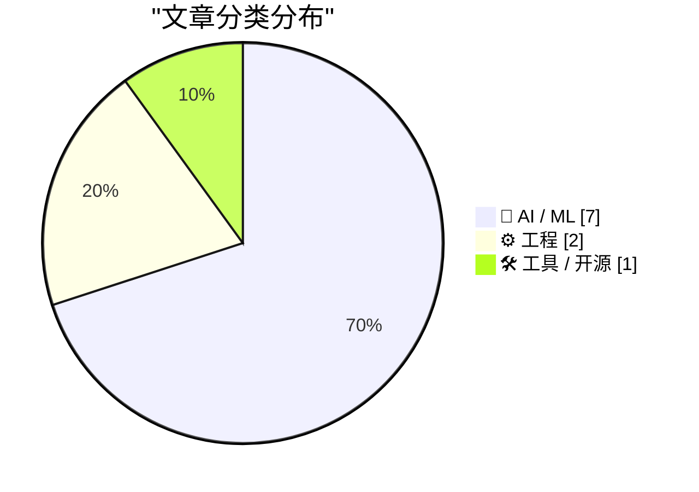
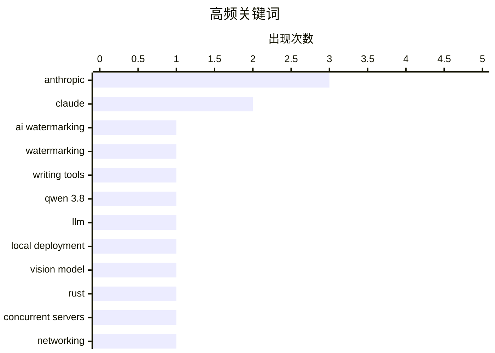

今日AI圈焦点集中于监管博弈：Anthropic在Claude中嵌入隐藏水印的做法引发广泛争议，多方观点碰撞激烈，反对者认为这违背了写作工具的用户价值，支持者则称争议被过度炒作。开源模型持续迭代，阿里Qwen发布27B参数新模型，性能超越前代但默认配置存在过度思考问题。与此同时，AI成本优化成为实用焦点，业界开始系统性地审视Token消耗与工作流程效率。

<!--more-->


> 来自 Karpathy 推荐的 92 个顶级技术博客，AI 精选 Top 10

## 🏆 今日必读

🥇 **AI文本水印不是什么大问题**

[AI text watermarking is not a big deal](https://seangoedecke.com/ai-text-watermarking-is-not-a-big-deal/) — seangoedecke.com · 22 小时前 · 🤖 AI / ML

> Anthropic计划在Claude模型输出中嵌入隐藏水印以满足监管要求，引发用户不满。文章指出水印文本与普通文本在质量上无明显差异，水印不会显著提升AI输出检测率，不侵犯用户隐私，且到2027年所有AI公司都将采用水印技术。作者认为这场争议被过度炒作了。

💡 **为什么值得读**: 如果你在关注AI监管和水印技术争议，这篇文章提供了理性且技术性的分析视角，帮你判断这场争议的实质影响。

🏷️ AI watermarking, Anthropic, Claude

🥈 **Anthropic在Claude中的水印是对写作的歪曲**

[★ Anthropic’s ‘Watermark’ Text Adulteration in Claude Is a Perversion of Writing](https://daringfireball.net/2026/08/anthropics_watermark_text_adulteration_in_claude_is_a_perversion_of_writing) — daringfireball.net · 2 小时前 · 🤖 AI / ML

> 作者严厉批评Anthropic在Claude输出中嵌入隐藏水印的做法，认为这违背了写作工具的核心价值。文章强调，任何为了追踪文本来源而牺牲清晰度、连贯性、意义或质量的企图都是不可接受的——用户付费获取的文本应当完全服务于用户需求，而非厂商的合规需求。

💡 **为什么值得读**: 这篇观点鲜明的评论代表了创意工作者对AI水印的核心质疑，适合想了解技术伦理争议另一方观点的读者。

🏷️ watermarking, Claude, writing tools

🥉 **Qwen 3.8 27B表现出色，但默认过度思考**

[Qwen 3.8 27B is excellent, but it defaults to wildly overthinking things](https://simonwillison.net/2026/Aug/16/qwen-38-27b/) — simonwillison.net · 18 分钟前 · 🤖 AI / ML

> 阿里Qwen实验室发布了Qwen 3.8 27B，这是一款支持视觉的27B参数开源大模型，Apache 2许可证授权。该模型在自测基准上超越前代Qwen 3.6 27B和闭源的Qwen 3.7-Plus，27B参数是普通笔记本运行的理想规模。作者在实际测试中发现模型默认配置存在过度思考问题。

💡 **为什么值得读**: 对于想在自己的设备上运行大模型的开发者，这篇评测提供了关键的性能参考和实际使用注意事项。

🏷️ Qwen 3.8, LLM, local deployment, vision model

---

## 📊 数据概览

| 扫描源 | 抓取文章 | 时间范围 | 精选 |
|:---:|:---:|:---:|:---:|
| 87/92 | 2588 篇 → 23 篇 | 48h | **10 篇** |

### 分类分布



### 高频关键词



<details>
<summary>📈 纯文本关键词图（终端友好）</summary>

```
anthropic        │ ████████████████████ 3
claude           │ █████████████░░░░░░░ 2
ai watermarking  │ ███████░░░░░░░░░░░░░ 1
watermarking     │ ███████░░░░░░░░░░░░░ 1
writing tools    │ ███████░░░░░░░░░░░░░ 1
qwen 3.8         │ ███████░░░░░░░░░░░░░ 1
llm              │ ███████░░░░░░░░░░░░░ 1
local deployment │ ███████░░░░░░░░░░░░░ 1
vision model     │ ███████░░░░░░░░░░░░░ 1
rust             │ ███████░░░░░░░░░░░░░ 1
```

</details>

### 🏷️ 话题标签

**anthropic**(3) · **claude**(2) · **ai watermarking**(1) · watermarking(1) · writing tools(1) · qwen 3.8(1) · llm(1) · local deployment(1) · vision model(1) · rust(1) · concurrent servers(1) · networking(1) · systems programming(1) · ai costs(1) · llm optimization(1) · token efficiency(1) · inference cost(1) · cors(1) · testing tool(1) · lm studio(1)

---

## 🤖 AI / ML

### 1. AI文本水印不是什么大问题

[AI text watermarking is not a big deal](https://seangoedecke.com/ai-text-watermarking-is-not-a-big-deal/) — **seangoedecke.com** · 22 小时前 · ⭐ 25/30

> Anthropic计划在Claude模型输出中嵌入隐藏水印以满足监管要求，引发用户不满。文章指出水印文本与普通文本在质量上无明显差异，水印不会显著提升AI输出检测率，不侵犯用户隐私，且到2027年所有AI公司都将采用水印技术。作者认为这场争议被过度炒作了。

🏷️ AI watermarking, Anthropic, Claude

---

### 2. Anthropic在Claude中的水印是对写作的歪曲

[★ Anthropic’s ‘Watermark’ Text Adulteration in Claude Is a Perversion of Writing](https://daringfireball.net/2026/08/anthropics_watermark_text_adulteration_in_claude_is_a_perversion_of_writing) — **daringfireball.net** · 2 小时前 · ⭐ 25/30

> 作者严厉批评Anthropic在Claude输出中嵌入隐藏水印的做法，认为这违背了写作工具的核心价值。文章强调，任何为了追踪文本来源而牺牲清晰度、连贯性、意义或质量的企图都是不可接受的——用户付费获取的文本应当完全服务于用户需求，而非厂商的合规需求。

🏷️ watermarking, Claude, writing tools

---

### 3. Qwen 3.8 27B表现出色，但默认过度思考

[Qwen 3.8 27B is excellent, but it defaults to wildly overthinking things](https://simonwillison.net/2026/Aug/16/qwen-38-27b/) — **simonwillison.net** · 18 分钟前 · ⭐ 24/30

> 阿里Qwen实验室发布了Qwen 3.8 27B，这是一款支持视觉的27B参数开源大模型，Apache 2许可证授权。该模型在自测基准上超越前代Qwen 3.6 27B和闭源的Qwen 3.7-Plus，27B参数是普通笔记本运行的理想规模。作者在实际测试中发现模型默认配置存在过度思考问题。

🏷️ Qwen 3.8, LLM, local deployment, vision model

---

### 4. 我如何思考降低AI成本

[How I think about reducing AI costs](https://martinalderson.com/posts/how-i-think-about-reducing-ai-costs/?utm_source=rss&amp;utm_medium=rss&amp;utm_campaign=feed) — **martinalderson.com** · 22 小时前 · ⭐ 24/30

> 文章提出了一套降低AI成本的实用框架：审计Token支出以识别浪费源头、淘汰遗留旧模型、迁移到开源权重提供商、以及修复Agent和工具中悄悄消耗Token的效率问题。作者强调成本优化需要系统性地审视整个AI工作流程。

🏷️ AI costs, LLM optimization, token efficiency, inference cost

---

### 5. 对Anthropic IPO炒作的思考

[The hyping of Anthropic’s IPO](https://garymarcus.substack.com/p/the-hyping-of-anthropics-ipo) — **garymarcus.substack.com** · 2 小时前 · ⭐ 23/30

> Gary Marcus对当前围绕Anthropic IPO的过度乐观预期进行了分析和解构，质疑一些过于激进的声称，并从商业和技术角度审视了这家AI公司面临的真实挑战。

🏷️ Anthropic, IPO, AI industry

---

### 6. Anthropic的弱水印是在迎合弱法律

[‘Anthropic’s Weak Watermarks Appease a Weak Law’](https://blog.j11y.io/2026-08-12_Anthropics-weak-watermarks-appease-a-weak-law/) — **daringfireball.net** · 4 小时前 · ⭐ 22/30

> 文章分析了Anthropic为遵守欧盟法规在Claude中实现的水印功能，指出该实现比法律最低要求更宽泛，水印信号既广泛到可能误伤普通辅助使用，又脆弱到可被有动机的用户通过改写轻易去除。这是一种便利的合规工程，但牺牲了法律原本试图保留的精细区分。

🏷️ watermarks, EU regulation, Anthropic

---

### 7. Dario Amodei的观点引用

[Quoting Dario Amodei](https://simonwillison.net/2026/Aug/16/dario-amodei/) — **simonwillison.net** · 7 小时前 · ⭐ 21/30

> Anthropic CEO Dario Amodei认为公众对AI的负面看法主要源于信任危机，而非AI领袖的风险警告。他表示浮华的营销宣传无法重建信任，真正能赢回信任的是“真正治愈癌症”——即兑现AI的大承诺。

🏷️ AI perception, Dario Amodei, AI risks

---

## ⚙️ 工程

### 8. 并发服务器系列第七部分：Rust

[Concurrent Servers: Part 7 - Rust](https://eli.thegreenplace.net/2026/concurrent-servers-part-7-rust/) — **eli.thegreenplace.net** · 1 天前 · ⭐ 24/30

> 这是关于编写并发网络服务器系列文章的第七部分，重点探讨Rust语言如何应对前几部分所述的并发挑战。Rust凭借所有权系统和内存安全特性，为构建高并发服务器提供了独特的解决方案，平衡了安全性和性能。

🏷️ Rust, concurrent servers, networking, systems programming

---

### 9. 纠错概率

[Probability of correcting errors](https://www.johndcook.com/blog/2026/08/15/probability-of-correcting-errors/) — **johndcook.com** · 1 天前 · ⭐ 21/30

> 文章介绍了纠错码的基本原理，以NASA探测器使用的Hadamard码为例说明：每个6位像素被编码为32位码字，可确保在最多7位出错时仍能恢复原始数据。讨论了纠错能力与码率之间的权衡。

🏷️ error correction, Hadamard code, encoding

---

## 🛠 工具 / 开源

### 10. CORS Chat

[CORS Chat](https://simonwillison.net/2026/Aug/15/cors-chat/) — **simonwillison.net** · 1 天前 · ⭐ 23/30

> 作者开发了一个基于Web的聊天工具用于测试Qwen 3.8 27B模型，支持通过LM Studio（带--cors选项）或OpenRouter调用OpenAI-Responses兼容接口。对话保存在浏览器中可导出JSON，还能实时流式渲染生成的SVG图像。

🏷️ CORS, testing tool, LM Studio

---

*生成于 2026-08-17 22:19 | 扫描 87 源 → 获取 2588 篇 → 精选 10 篇*
*基于 [Hacker News Popularity Contest 2025](https://refactoringenglish.com/tools/hn-popularity/) RSS 源列表，由 [Andrej Karpathy](https://x.com/karpathy) 推荐*
*由「懂点儿AI」制作，欢迎关注同名微信公众号获取更多 AI 实用技巧 💡*
