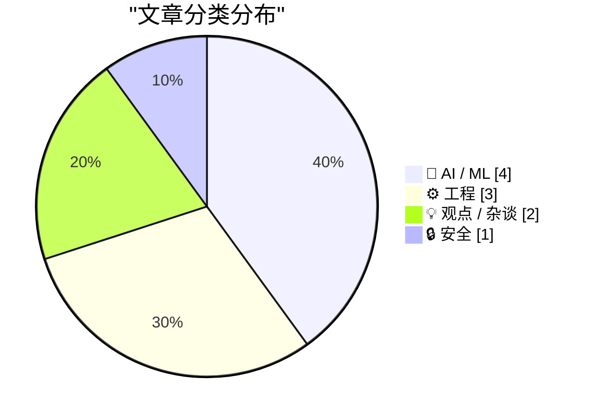
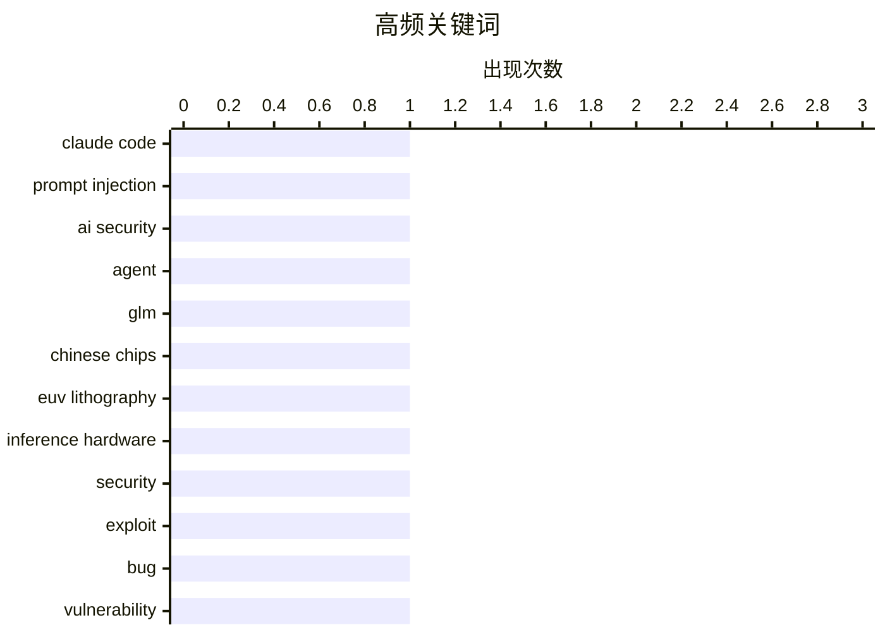

今日AI领域消息密集：Claude Code Opus 5 Auto Mode重磅发布，GLM-5.3 Flash在中国硬件上实现运行，展现大模型落地的最新进展；美国法官阻止国防部对Anthropic的封禁，AI监管博弈进一步升温。安全层面，仅凭漏洞谣言即可被利用攻击的现状，凸显AI安全形势严峻。技术媒体Anandtech的突然关闭，则为行业留下一声叹息。

<!--more-->


> 来自 Karpathy 推荐的 92 个顶级技术博客，AI 精选 Top 10

## 🏆 今日必读

🥇 **Breaking Claude Code Opus 5 Auto Mode**

[Breaking Claude Code Opus 5 Auto Mode](https://simonwillison.net/2026/Aug/27/breaking-claude-code-opus-5-auto-mode/) — simonwillison.net · 1 天前 · 🤖 AI / ML

> Breaking Claude Code Opus 5 Auto Mode

🏷️ Claude Code, prompt injection, AI security, agent

🥈 **What GLM-5.3 Flash running on Chinese hardware actually means**

[What GLM-5.3 Flash running on Chinese hardware actually means](https://martinalderson.com/posts/glm-5-3-flash-chinese-hardware/?utm_source=rss&amp;utm_medium=rss&amp;utm_campaign=feed) — martinalderson.com · 22 小时前 · ⚙️ 工程

> What GLM-5.3 Flash running on Chinese hardware actually means

🏷️ GLM, Chinese chips, EUV lithography, inference hardware

🥉 **Just a rumour of a bug is enough to find a security exploit these days**

[Just a rumour of a bug is enough to find a security exploit these days](https://simonwillison.net/2026/Aug/28/just-a-rumour-of-a-bug/) — simonwillison.net · 1 天前 · 🔒 安全

> Just a rumour of a bug is enough to find a security exploit these days

🏷️ security, exploit, bug, vulnerability

---

## 📊 数据概览

| 扫描源 | 抓取文章 | 时间范围 | 精选 |
|:---:|:---:|:---:|:---:|
| 87/92 | 2610 篇 → 31 篇 | 48h | **10 篇** |

### 分类分布



### 高频关键词



<details>
<summary>📈 纯文本关键词图（终端友好）</summary>

```
claude code        │ ████████████████████ 1
prompt injection   │ ████████████████████ 1
ai security        │ ████████████████████ 1
agent              │ ████████████████████ 1
glm                │ ████████████████████ 1
chinese chips      │ ████████████████████ 1
euv lithography    │ ████████████████████ 1
inference hardware │ ████████████████████ 1
security           │ ████████████████████ 1
exploit            │ ████████████████████ 1
```

</details>

### 🏷️ 话题标签

**claude code**(1) · **prompt injection**(1) · **ai security**(1) · agent(1) · glm(1) · chinese chips(1) · euv lithography(1) · inference hardware(1) · security(1) · exploit(1) · bug(1) · vulnerability(1) · anthropic(1) · pentagon(1) · ai(1) · lawsuit(1) · nvidia(1) · ai investment(1) · gpu(1) · silicon valley(1)

---

## 🤖 AI / ML

### 1. Breaking Claude Code Opus 5 Auto Mode

[Breaking Claude Code Opus 5 Auto Mode](https://simonwillison.net/2026/Aug/27/breaking-claude-code-opus-5-auto-mode/) — **simonwillison.net** · 1 天前 · ⭐ 26/30

> Breaking Claude Code Opus 5 Auto Mode

🏷️ Claude Code, prompt injection, AI security, agent

---

### 2. U.S. Judge Blocks Trump Defense Department’s Anthropic Blacklisting

[U.S. Judge Blocks Trump Defense Department’s Anthropic Blacklisting](https://www.reuters.com/legal/government/us-judge-blocks-pentagons-anthropic-blacklisting-2026-08-28/) — **daringfireball.net** · 1 天前 · ⭐ 23/30

> U.S. Judge Blocks Trump Defense Department’s Anthropic Blacklisting

🏷️ Anthropic, Pentagon, AI, lawsuit

---

### 3. Premium: The Hater's Guide To Circular Financing (Part One)

[Premium: The Hater's Guide To Circular Financing (Part One)](https://www.wheresyoured.at/premium-the-haters-guide-to-circular-financing-part-one/) — **wheresyoured.at** · 1 天前 · ⭐ 22/30

> Premium: The Hater's Guide To Circular Financing (Part One)

🏷️ NVIDIA, AI investment, GPU, Silicon Valley

---

### 4. 5 lessons from the OpenAI / Hugging Face incident

[5 lessons from the OpenAI / Hugging Face incident](https://garymarcus.substack.com/p/5-lessons-from-the-openai-hugging) — **garymarcus.substack.com** · 1 天前 · ⭐ 21/30

> 5 lessons from the OpenAI / Hugging Face incident

🏷️ OpenAI, Hugging Face, AI industry

---

## ⚙️ 工程

### 5. What GLM-5.3 Flash running on Chinese hardware actually means

[What GLM-5.3 Flash running on Chinese hardware actually means](https://martinalderson.com/posts/glm-5-3-flash-chinese-hardware/?utm_source=rss&amp;utm_medium=rss&amp;utm_campaign=feed) — **martinalderson.com** · 22 小时前 · ⭐ 24/30

> What GLM-5.3 Flash running on Chinese hardware actually means

🏷️ GLM, Chinese chips, EUV lithography, inference hardware

---

### 6. How big are factorials?

[How big are factorials?](https://eli.thegreenplace.net/2026/how-big-are-factorials/) — **eli.thegreenplace.net** · 1 天前 · ⭐ 19/30

> How big are factorials?

🏷️ factorials, mathematics, algorithm, programming

---

### 7. Building a mini Homelab that fits in my carry-on

[Building a mini Homelab that fits in my carry-on](https://www.jeffgeerling.com/blog/2026/mini-homelab-network-fits-in-carry-on/) — **jeffgeerling.com** · 1 天前 · ⭐ 17/30

> Building a mini Homelab that fits in my carry-on

🏷️ homelab, NTP, vintage, hardware

---

## 💡 观点 / 杂谈

### 8. Anandtech shut down abruptly, August 30, 2024

[Anandtech shut down abruptly, August 30, 2024](https://dfarq.homeip.net/anandtech-shut-down-abruptly-august-30-2024/?utm_source=rss&#038;utm_medium=rss&#038;utm_campaign=anandtech-shut-down-abruptly-august-30-2024) — **dfarq.homeip.net** · 1 天前 · ⭐ 21/30

> Anandtech shut down abruptly, August 30, 2024

🏷️ AnandTech, tech media, industry news, computer hardware

---

### 9. Selling out

[Selling out](https://seangoedecke.com/selling-out/) — **seangoedecke.com** · 1 天前 · ⭐ 17/30

> Selling out

🏷️ engineering, sales, career, skills

---

## 🔒 安全

### 10. Just a rumour of a bug is enough to find a security exploit these days

[Just a rumour of a bug is enough to find a security exploit these days](https://simonwillison.net/2026/Aug/28/just-a-rumour-of-a-bug/) — **simonwillison.net** · 1 天前 · ⭐ 23/30

> Just a rumour of a bug is enough to find a security exploit these days

🏷️ security, exploit, bug, vulnerability

---

*生成于 2026-08-30 22:19 | 扫描 87 源 → 获取 2610 篇 → 精选 10 篇*
*基于 [Hacker News Popularity Contest 2025](https://refactoringenglish.com/tools/hn-popularity/) RSS 源列表，由 [Andrej Karpathy](https://x.com/karpathy) 推荐*
*由「懂点儿AI」制作，欢迎关注同名微信公众号获取更多 AI 实用技巧 💡*
