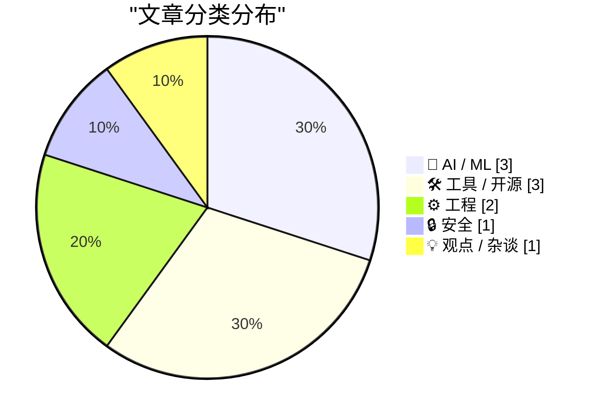
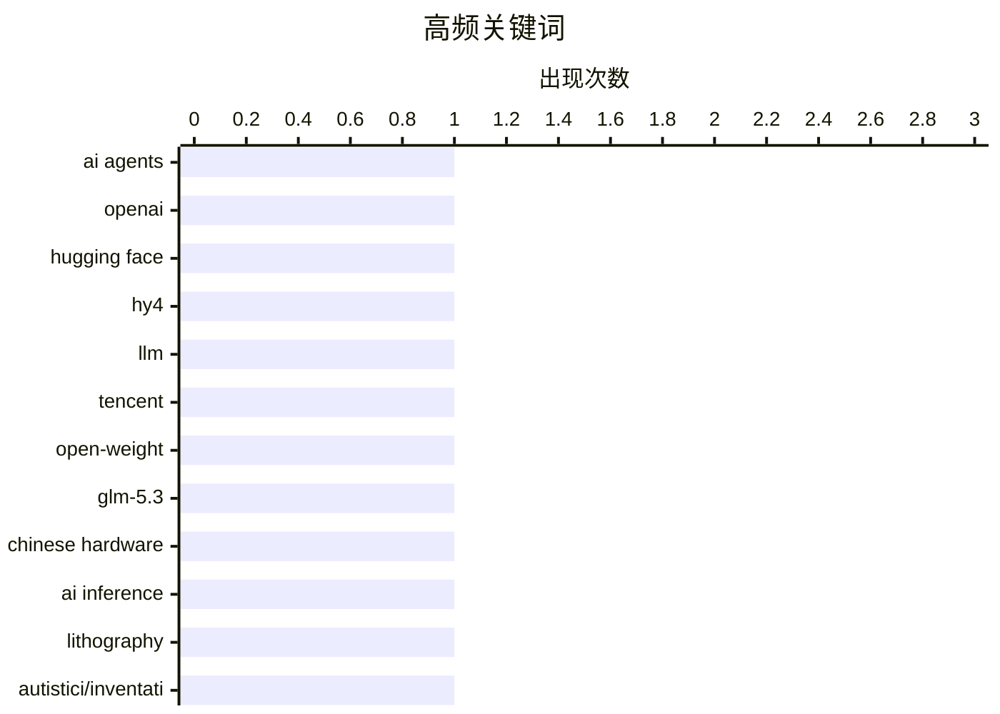

今日技术圈焦点：AI大模型军备竞赛持续升级，腾讯发布7700亿参数的Hy4 Preview，开源与闭源路线竞争加剧；同时开源生态与去中心化网络再获关注，ActivityBot获NLnet资助推动Fediverse发展，而Autistici/Inventati面临生存危机；包管理等开发者工具安全持续受到重视，npm、PyPI等平台加强供应链安全防护。

<!--more-->


> 来自 Karpathy 推荐的 92 个顶级技术博客，AI 精选 Top 10

## 🏆 今日必读

🥇 **Agent文明的兴衰：OpenAI与Hugging Face的故事**

[The Rise and Fall of Agent Civilizations](https://www.dwarkesh.com/p/openai-huggingface) — dwarkesh.com · 23 小时前 · 🤖 AI / ML

> 本文以通俗语言讲述了OpenAI与Hugging Face的发展历程与竞争格局。OpenAI从非营利研究机构转型为商业公司，与微软达成数十亿美元合作；Hugging Face则从聊天机器人起家，成长为开源AI模型的最大社区。两者代表了AI行业的两条路径：闭源商业化与开源生态建设。文章探讨了这种分化对AI行业竞争格局的影响。

💡 **为什么值得读**: 适合想了解AI行业商业竞争格局和开源生态发展的读者，脉络清晰易懂。

🏷️ AI agents, OpenAI, Hugging Face

🥈 **Hy4 Preview发布：腾讯推出7700亿参数大模型**

[Introducing Hy4 Preview](https://simonwillison.net/2026/Aug/29/hy4/) — simonwillison.net · 22 小时前 · 🤖 AI / ML

> 腾讯发布开源权重大语言模型Hy4 Preview，总参数7700亿、激活参数490亿、上下文窗口100万token。相比7月发布的Hy3（2950亿参数、210亿激活、25.6万上下文），参数量增长超过2.5倍。模型权重已在Hugging Face发布，大小1.56TB。文章还分析了其chat_template.jinja模板中的reasoning_effort参数设计。

💡 **为什么值得读**: 了解当前大模型参数规模发展趋势和腾讯AI能力的窗口，数字对比直观。

🏷️ Hy4, LLM, Tencent, open-weight

🥉 **GLM-5.3 Flash在中国硬件上运行意味着什么**

[What GLM-5.3 Flash running on Chinese hardware actually means](https://martinalderson.com/posts/glm-5-3-flash-chinese-hardware/?utm_source=rss&amp;utm_medium=rss&amp;utm_campaign=feed) — martinalderson.com · 1 天前 · 🤖 AI / ML

> Z.AI宣布使用国产中国芯片完整运行GLM-5.3 Flash模型，这一成就确实令人印象深刻。然而，文章指出EUV光刻机是难以跨越的壁垒，中国与西方推理硬件的差距很可能扩大而非缩小。文章分析了国产芯片在制造工艺上的限制及其对AI发展的长期影响。

💡 **为什么值得读**: 理性分析中国AI硬件现状与挑战，避免盲目乐观，适合关注中美AI竞争的技术读者。

🏷️ GLM-5.3, Chinese hardware, AI inference, lithography

---

## 📊 数据概览

| 扫描源 | 抓取文章 | 时间范围 | 精选 |
|:---:|:---:|:---:|:---:|
| 87/92 | 2611 篇 → 20 篇 | 48h | **10 篇** |

### 分类分布



### 高频关键词



<details>
<summary>📈 纯文本关键词图（终端友好）</summary>

```
ai agents        │ ████████████████████ 1
openai           │ ████████████████████ 1
hugging face     │ ████████████████████ 1
hy4              │ ████████████████████ 1
llm              │ ████████████████████ 1
tencent          │ ████████████████████ 1
open-weight      │ ████████████████████ 1
glm-5.3          │ ████████████████████ 1
chinese hardware │ ████████████████████ 1
ai inference     │ ████████████████████ 1
```

</details>

### 🏷️ 话题标签

**ai agents**(1) · **openai**(1) · **hugging face**(1) · hy4(1) · llm(1) · tencent(1) · open-weight(1) · glm-5.3(1) · chinese hardware(1) · ai inference(1) · lithography(1) · autistici/inventati(1) · censorship(1) · privacy infrastructure(1) · package management(1) · releases(1) · advisories(1) · software engineering(1) · value over replacement(1) · ai(1)

---

## 🤖 AI / ML

### 1. Agent文明的兴衰：OpenAI与Hugging Face的故事

[The Rise and Fall of Agent Civilizations](https://www.dwarkesh.com/p/openai-huggingface) — **dwarkesh.com** · 23 小时前 · ⭐ 25/30

> 本文以通俗语言讲述了OpenAI与Hugging Face的发展历程与竞争格局。OpenAI从非营利研究机构转型为商业公司，与微软达成数十亿美元合作；Hugging Face则从聊天机器人起家，成长为开源AI模型的最大社区。两者代表了AI行业的两条路径：闭源商业化与开源生态建设。文章探讨了这种分化对AI行业竞争格局的影响。

🏷️ AI agents, OpenAI, Hugging Face

---

### 2. Hy4 Preview发布：腾讯推出7700亿参数大模型

[Introducing Hy4 Preview](https://simonwillison.net/2026/Aug/29/hy4/) — **simonwillison.net** · 22 小时前 · ⭐ 24/30

> 腾讯发布开源权重大语言模型Hy4 Preview，总参数7700亿、激活参数490亿、上下文窗口100万token。相比7月发布的Hy3（2950亿参数、210亿激活、25.6万上下文），参数量增长超过2.5倍。模型权重已在Hugging Face发布，大小1.56TB。文章还分析了其chat_template.jinja模板中的reasoning_effort参数设计。

🏷️ Hy4, LLM, Tencent, open-weight

---

### 3. GLM-5.3 Flash在中国硬件上运行意味着什么

[What GLM-5.3 Flash running on Chinese hardware actually means](https://martinalderson.com/posts/glm-5-3-flash-chinese-hardware/?utm_source=rss&amp;utm_medium=rss&amp;utm_campaign=feed) — **martinalderson.com** · 1 天前 · ⭐ 23/30

> Z.AI宣布使用国产中国芯片完整运行GLM-5.3 Flash模型，这一成就确实令人印象深刻。然而，文章指出EUV光刻机是难以跨越的壁垒，中国与西方推理硬件的差距很可能扩大而非缩小。文章分析了国产芯片在制造工艺上的限制及其对AI发展的长期影响。

🏷️ GLM-5.3, Chinese hardware, AI inference, lithography

---

## 🛠 工具 / 开源

### 4. 本周包管理动态：2026年8月29日

[This Week in Package Management: 29 August 2026](https://nesbitt.io/2026/08/29/this-week-in-package-management.html) — **nesbitt.io** · 1 天前 · ⭐ 21/30

> 本周包管理领域的重要发布包括：npm 11.0.0测试版引入新的依赖解析算法；PyPI宣布支持sigstore签名验证；Rust crates.io发布安全审计工具；Go 1.24新增模块版本管理功能。同时披露了多个高危漏洞，包括npm生态系统中的供应链攻击预警。

🏷️ package management, releases, advisories

---

### 5. Forgejo Hack #2：与Read The Docs集成

[Forgejo Hack #2: Integration with Read The Docs](https://blog.miguelgrinberg.com/post/forgejo-hack-2-integration-with-read-the-docs) — **miguelgrinberg.com** · 6 小时前 · ⭐ 19/30

> 这是Forgejo Hack系列的第二篇，介绍如何将自托管Forgejo实例中的Git仓库连接到ReadTheDocs，实现提交代码后自动触发文档构建的功能。教程涵盖webhook配置、ReadTheDocs项目设置、认证流程，与GitHub集成体验基本一致。

🏷️ Forgejo, Read The Docs, Git, integration

---

### 6. ActivityBot获NLnet资助！

[ActivityBot is the recipient of an NLnet grant!](https://shkspr.mobi/blog/2026/08/activitybot-is-the-recipient-of-an-nlnet-grant/) — **shkspr.mobi** · 10 小时前 · ⭐ 17/30

> ActivityBot是一个单文件ActivityPub服务器，作者于2月申请了NLnet的"下一代零碳"资助并获批。NLnet旨在帮助Fediverse项目"重野化"社交媒体景观，提供5000至50000欧元的研发资助。ActivityBot因其轻量级设计和去中心化社交网络潜力获得认可。

🏷️ ActivityBot, NLnet, Fediverse, open-source

---

## ⚙️ 工程

### 7. 技术笔记：通过以太网直连线传输文件

[Technical note: transfer files over an ethernet patch cable](https://maurycyz.com/misc/etherfiles/) — **maurycyz.com** · 1 天前 · ⭐ 17/30

> 无需路由器即可在两台电脑间通过以太网直连线传输文件。教程使用IPv6地址（fd42:dead:beef::1/48和fd42:dead:beef::2/48），配置网卡后可通过ping验证连通性，再使用socat或nc等工具进行高速文件传输，适用于裸机环境或无网络条件的场景。

🏷️ Ethernet, file transfer, network, IP

---

### 8. NTP之前的时代：Time和Daytime协议

[Before NTP there were Time and Daytime](https://www.jeffgeerling.com/blog/2026/rfc-867-868-time/) — **jeffgeerling.com** · 10 分钟前 · ⭐ 15/30

> 在构建NTP时间演示过程中，作者发现了RFC 867（Daytime协议）和RFC 868（Time协议）这两个古老标准。Daytime协议返回当前日期和时间，Time协议返回自午夜起的秒数。这些协议早于NTP，使用UDP端口13和37，是网络时间同步的早期尝试。文章回顾了从1990年代至今的网络时间协议演进。

🏷️ NTP, RFC, protocol, history

---

## 🔒 安全

### 9. 名为Paranoia的服务器：守护Autistici/Inventati

[The Server Called Paranoia: Defend Autistici/Inventati](https://micahflee.com/the-server-called-paranoia-defend-autistici-inventati/) — **micahflee.com** · 1 天前 · ⭐ 22/30

> 意大利黑客集体Autistici/Inventati（A/I）25年来构建了旨在抵御审查、监控和警察突袭的通信基础设施。8月26日，美国将其列为恐怖组织；9月25日是终止运营的最后期限。文章回顾了A/I的历史、其去中心化通信理念，以及当前面临的生存危机。

🏷️ Autistici/Inventati, censorship, privacy infrastructure

---

## 💡 观点 / 杂谈

### 10. 你必须在某些方面超越模型

[You have to beat the models at something](https://seangoedecke.com/you-have-to-beat-the-models-at-something/) — **seangoedecke.com** · 22 小时前 · ⭐ 20/30

> 作者认为2025年软件工程师应按"替换价值"（value over replacement）评估——即与同岗位平均水平相比的价值。当前AI写代码成本降至每月100美元，GPT-5.6-Sol或Claude Opus 5能完成大部分基础编码工作。文章探讨了工程师如何在AI时代证明自己的不可替代性，以及为什么纯编码技能的溢价正在消失。

🏷️ software engineering, value over replacement, AI, career

---

*生成于 2026-08-31 22:19 | 扫描 87 源 → 获取 2611 篇 → 精选 10 篇*
*基于 [Hacker News Popularity Contest 2025](https://refactoringenglish.com/tools/hn-popularity/) RSS 源列表，由 [Andrej Karpathy](https://x.com/karpathy) 推荐*
*由「懂点儿AI」制作，欢迎关注同名微信公众号获取更多 AI 实用技巧 💡*
