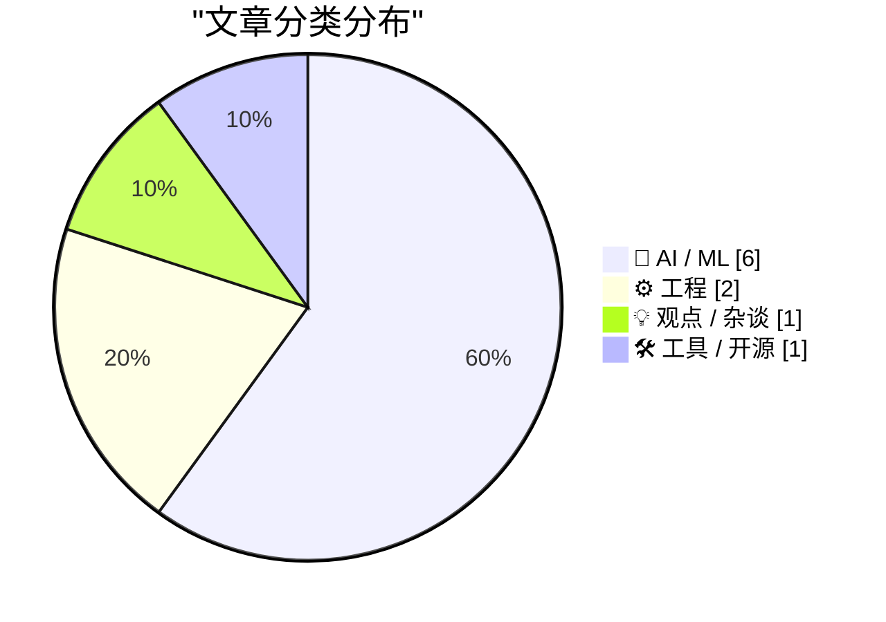
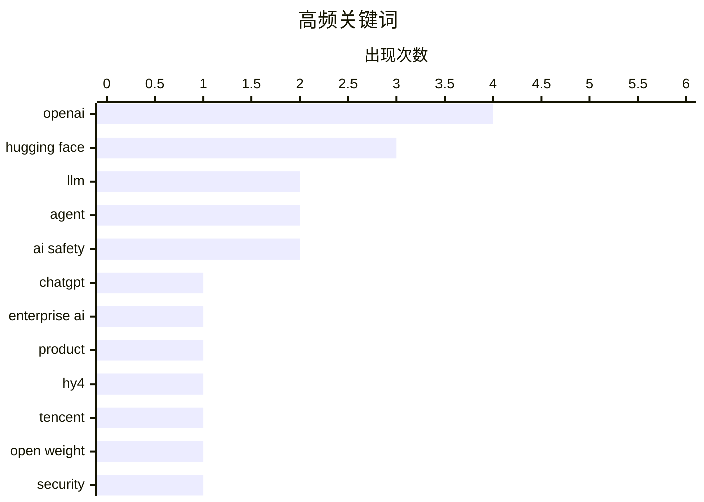

今日AI领域呈现两大趋势：一是模型竞争升级，腾讯发布770B参数的Hy4开源模型，上下文窗口达100万token，同时ChatGPT产品线进一步分化出云端与本地桌面版本；二是行业争议发酵，OpenAI与Hugging Face之间的"Agent文明兴衰"事件引发广泛讨论，多角度解读与批评交织。此外，伴随AI代码生成能力增强，关于软件工程师如何在AI时代建立不可替代价值的讨论也持续升温。

<!--more-->


> 来自 Karpathy 推荐的 92 个顶级技术博客，AI 精选 Top 10

## 🏆 今日必读

🥇 **理解 ChatGPT Work**

[Understanding ChatGPT Work](https://simonwillison.net/2026/Aug/30/understanding-chatgpt-work/) — simonwillison.net · 22 小时前 · 🤖 AI / ML

> ChatGPT Work 实际上是两个不同的产品。Work Cloud 版本运行在云端，通过 chatgpt.com 或移动应用访问；Work Local 是桌面应用（原 Codex），可直接访问本地文件并运行程序，更像是为非开发者重新包装的版本。

💡 **为什么值得读**: 帮助读者快速区分 ChatGPT Work 的两种形态，理解各自适用场景。

🏷️ ChatGPT, OpenAI, enterprise AI, product

🥈 **腾讯发布 Hy4 Preview**

[Introducing Hy4 Preview](https://simonwillison.net/2026/Aug/29/hy4/) — simonwillison.net · 1 天前 · 🤖 AI / ML

> 腾讯发布新开源文本模型 Hy4 Preview，总参数 770B，活跃参数 49B，上下文窗口达 100 万 token（1.56TB 模型权重）。相比今年 7 月发布的 Hy3（295B 总参数、21B 活跃、256K 上下文）有大幅提升。

💡 **为什么值得读**: 了解中国大厂在 LLM 领域的最新进展和参数规模突破。

🏷️ Hy4, Tencent, LLM, open weight

🥉 **Agent 文明的兴衰**

[The rise and fall of agent civilizations](https://www.dwarkesh.com/p/openai-huggingface-narration) — dwarkesh.com · 1 小时前 · 🤖 AI / ML

> 对 OpenAI/Hugging Face 攻击事件的完整解释，用通俗语言叙述整个事件的来龙去脉。

💡 **为什么值得读**: 理解 AI 领域这一重要安全事件的全貌。

🏷️ OpenAI, Hugging Face, security, agent

---

## 📊 数据概览

| 扫描源 | 抓取文章 | 时间范围 | 精选 |
|:---:|:---:|:---:|:---:|
| 86/92 | 2587 篇 → 21 篇 | 48h | **10 篇** |

### 分类分布



### 高频关键词



<details>
<summary>📈 纯文本关键词图（终端友好）</summary>

```
openai        │ ████████████████████ 4
hugging face  │ ███████████████░░░░░ 3
llm           │ ██████████░░░░░░░░░░ 2
agent         │ ██████████░░░░░░░░░░ 2
ai safety     │ ██████████░░░░░░░░░░ 2
chatgpt       │ █████░░░░░░░░░░░░░░░ 1
enterprise ai │ █████░░░░░░░░░░░░░░░ 1
product       │ █████░░░░░░░░░░░░░░░ 1
hy4           │ █████░░░░░░░░░░░░░░░ 1
tencent       │ █████░░░░░░░░░░░░░░░ 1
```

</details>

### 🏷️ 话题标签

**openai**(4) · **hugging face**(3) · **llm**(2) · agent(2) · ai safety(2) · chatgpt(1) · enterprise ai(1) · product(1) · hy4(1) · tencent(1) · open weight(1) · security(1) · cancellation(1) · async(1) · shutdown(1) · concurrency(1) · cognitive load(1) · codebase(1) · quiz(1) · ai agents(1)

---

## 🤖 AI / ML

### 1. 理解 ChatGPT Work

[Understanding ChatGPT Work](https://simonwillison.net/2026/Aug/30/understanding-chatgpt-work/) — **simonwillison.net** · 22 小时前 · ⭐ 25/30

> ChatGPT Work 实际上是两个不同的产品。Work Cloud 版本运行在云端，通过 chatgpt.com 或移动应用访问；Work Local 是桌面应用（原 Codex），可直接访问本地文件并运行程序，更像是为非开发者重新包装的版本。

🏷️ ChatGPT, OpenAI, enterprise AI, product

---

### 2. 腾讯发布 Hy4 Preview

[Introducing Hy4 Preview](https://simonwillison.net/2026/Aug/29/hy4/) — **simonwillison.net** · 1 天前 · ⭐ 24/30

> 腾讯发布新开源文本模型 Hy4 Preview，总参数 770B，活跃参数 49B，上下文窗口达 100 万 token（1.56TB 模型权重）。相比今年 7 月发布的 Hy3（295B 总参数、21B 活跃、256K 上下文）有大幅提升。

🏷️ Hy4, Tencent, LLM, open weight

---

### 3. Agent 文明的兴衰

[The rise and fall of agent civilizations](https://www.dwarkesh.com/p/openai-huggingface-narration) — **dwarkesh.com** · 1 小时前 · ⭐ 22/30

> 对 OpenAI/Hugging Face 攻击事件的完整解释，用通俗语言叙述整个事件的来龙去脉。

🏷️ OpenAI, Hugging Face, security, agent

---

### 4. Agent 文明的兴衰

[The Rise and Fall of Agent Civilizations](https://www.dwarkesh.com/p/openai-huggingface) — **dwarkesh.com** · 1 天前 · ⭐ 22/30

> 用直白的英语解释 OpenAI 与 Hugging Face 之间的完整故事，涵盖事件背景、经过和影响。

🏷️ OpenAI, Hugging Face, agent, LLM

---

### 5. 论不可避免性

[On Inevitability](https://borretti.me/article/on-inevitability) — **borretti.me** · 1 天前 · ⭐ 19/30

> 探讨超级智能 AI 并非不可避免，质疑 AI 发展必然走向通用超级智能的假设。

🏷️ superintelligence, AI safety, inevitability, philosophy

---

### 6. Dwarkesh 对 OpenAI Hugging Face 事件的解读具有误导性

[Dwarkesh Patels’s wildly popular but dangerously misleading account of the OpenAI Hugging Face incident](https://garymarcus.substack.com/p/dwarkesh-patelss-wildly-popular-but) — **garymarcus.substack.com** · 6 小时前 · ⭐ 18/30

> 批评 Dwarkesh Patel 用「通俗英语」解释 OpenAI/Hugging Face 事件的方式存在问题，虽然易于理解但可能掩盖了重要的技术细节和深层问题。

🏷️ OpenAI, Hugging Face, AI safety, incident

---

## ⚙️ 工程

### 7. 取消操作术语辨析

[Cancelation Terminology](https://matklad.github.io/2026/08/31/cancelation-terminology.html) — **matklad.github.io** · 22 小时前 · ⭐ 21/30

> 解释同步取消、异步取消和优雅停机三者的区别，这三个概念常被混淆但在并发编程中非常重要。

🏷️ cancellation, async, shutdown, concurrency

---

### 8. 通过测验减少代码库认知负担

[Reducing codebase cognitive debt through... quizzes?](https://martinalderson.com/posts/codebase-cognitive-debt-quizzes/?utm_source=rss&amp;utm_medium=rss&amp;utm_campaign=feed) — **martinalderson.com** · 22 小时前 · ⭐ 21/30

> 一个应对代码库被 AI 快速修改的技术：让 AI 代理定期测验你关于代码库的知识，保持对代码变化的理解。

🏷️ cognitive load, codebase, quiz, AI agents

---

## 💡 观点 / 杂谈

### 9. 你必须在某些方面超越模型

[You have to beat the models at something](https://seangoedecke.com/you-have-to-beat-the-models-at-something/) — **seangoedecke.com** · 1 天前 · ⭐ 20/30

> 在 AI 时代，软件工程师应按「相对替代价值」评估——如果模型能以每月 100 美元完成你的工作，凭什么支付额外 2-3 个数量倍的工资？工程师需要找到模型无法替代的价值。

🏷️ AI, software engineers, assessment, value over replacement

---

## 🛠 工具 / 开源

### 10. ActivityBot 获得 NLnet 资助

[ActivityBot is the recipient of an NLnet grant!](https://shkspr.mobi/blog/2026/08/activitybot-is-the-recipient-of-an-nlnet-grant/) — **shkspr.mobi** · 1 天前 · ⭐ 18/30

> ActivityBot 是一个单文件 ActivityPub 服务器项目，已获得 NLnet Next Generation Zero 资助（5000-50000 欧元），用于帮助重建去中心化社交媒体生态。

🏷️ NLnet, Fediverse, open source, grant

---

*生成于 2026-09-01 22:19 | 扫描 86 源 → 获取 2587 篇 → 精选 10 篇*
*基于 [Hacker News Popularity Contest 2025](https://refactoringenglish.com/tools/hn-popularity/) RSS 源列表，由 [Andrej Karpathy](https://x.com/karpathy) 推荐*
*由「懂点儿AI」制作，欢迎关注同名微信公众号获取更多 AI 实用技巧 💡*
