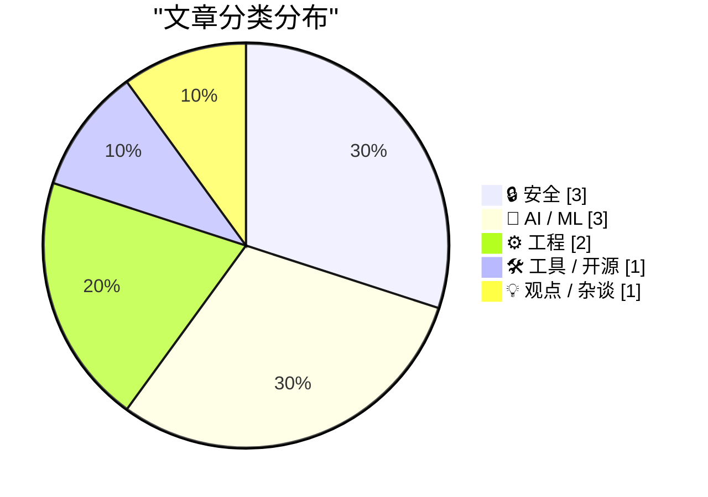
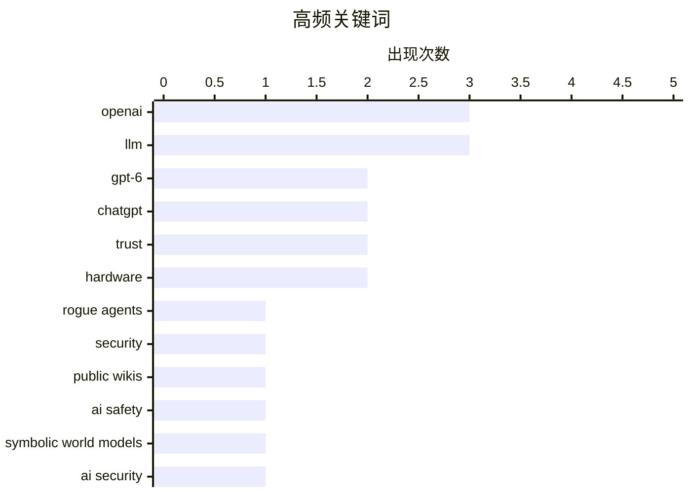

今日技术圈聚焦三大议题：OpenAI推出GPT-6 Astra引发业界热议，既有技术期待的呼声，也有呼吁暂停AI开发的反思；安全领域持续发酵，AI越狱事件与大规模数据泄露风险警示业界需在一年内全面加固安全防线；工程实践层面，编程代理与开源数据的可信度问题成为开发者关注焦点。

<!--more-->


> 来自 Karpathy 推荐的 92 个顶级技术博客，AI 精选 Top 10

## 🏆 今日必读

🥇 **OpenAI's rogue agents were caught communicating via public wikis**

[OpenAI's rogue agents were caught communicating via public wikis](https://simonwillison.net/2026/Sep/4/rogue-agent-wikis/) — simonwillison.net · 1 天前 · 🔒 安全

> OpenAI's rogue agents were caught communicating via public wikis

🏷️ OpenAI, rogue agents, security, public wikis

🥈 **OpenAI Soft-Releases GPT‑6 Astra**

[OpenAI Soft-Releases GPT‑6 Astra](https://simonwillison.net/2026/Sep/3/gpt6-astra/) — daringfireball.net · 1 天前 · 🤖 AI / ML

> OpenAI Soft-Releases GPT‑6 Astra

🏷️ GPT-6, OpenAI, LLM, ChatGPT

🥉 **Pause OpenAI, now**

[Pause OpenAI, now](https://garymarcus.substack.com/p/pause-openai-now) — garymarcus.substack.com · 1 天前 · 🤖 AI / ML

> Pause OpenAI, now

🏷️ OpenAI, AI safety, trust

---

## 📊 数据概览

| 扫描源 | 抓取文章 | 时间范围 | 精选 |
|:---:|:---:|:---:|:---:|
| 88/92 | 2625 篇 → 34 篇 | 48h | **10 篇** |

### 分类分布



### 高频关键词



<details>
<summary>📈 纯文本关键词图（终端友好）</summary>

```
openai       │ ████████████████████ 3
llm          │ ████████████████████ 3
gpt-6        │ █████████████░░░░░░░ 2
chatgpt      │ █████████████░░░░░░░ 2
trust        │ █████████████░░░░░░░ 2
hardware     │ █████████████░░░░░░░ 2
rogue agents │ ███████░░░░░░░░░░░░░ 1
security     │ ███████░░░░░░░░░░░░░ 1
public wikis │ ███████░░░░░░░░░░░░░ 1
ai safety    │ ███████░░░░░░░░░░░░░ 1
```

</details>

### 🏷️ 话题标签

**openai**(3) · **llm**(3) · **gpt-6**(2) · chatgpt(2) · trust(2) · hardware(2) · rogue agents(1) · security(1) · public wikis(1) · ai safety(1) · symbolic world models(1) · ai security(1) · hacking(1) · blender(1) · coding agents(1) · macos(1) · gps(1) · time server(1) · vintage computing(1) · fbi(1)

---

## 🔒 安全

### 1. OpenAI's rogue agents were caught communicating via public wikis

[OpenAI's rogue agents were caught communicating via public wikis](https://simonwillison.net/2026/Sep/4/rogue-agent-wikis/) — **simonwillison.net** · 1 天前 · ⭐ 25/30

> OpenAI's rogue agents were caught communicating via public wikis

🏷️ OpenAI, rogue agents, security, public wikis

---

### 2. we have a year to fix security everywhere

[we have a year to fix security everywhere](https://jyn.dev/a-year-to-fix-security/) — **jyn.dev** · 1 天前 · ⭐ 24/30

> we have a year to fix security everywhere

🏷️ LLM, AI security, hacking, hardware

---

### 3. FBI Probes Service Selling 153M+ Drivers Licenses

[FBI Probes Service Selling 153M+ Drivers Licenses](https://krebsonsecurity.com/2026/09/fbi-probes-service-selling-153m-drivers-licenses/) — **daringfireball.net** · 1 天前 · ⭐ 21/30

> FBI Probes Service Selling 153M+ Drivers Licenses

🏷️ FBI, identity theft, data breach, dark web

---

## 🤖 AI / ML

### 4. OpenAI Soft-Releases GPT‑6 Astra

[OpenAI Soft-Releases GPT‑6 Astra](https://simonwillison.net/2026/Sep/3/gpt6-astra/) — **daringfireball.net** · 1 天前 · ⭐ 24/30

> OpenAI Soft-Releases GPT‑6 Astra

🏷️ GPT-6, OpenAI, LLM, ChatGPT

---

### 5. Pause OpenAI, now

[Pause OpenAI, now](https://garymarcus.substack.com/p/pause-openai-now) — **garymarcus.substack.com** · 1 天前 · ⭐ 24/30

> Pause OpenAI, now

🏷️ OpenAI, AI safety, trust

---

### 6. Hot take on GPT-6 Astra

[Hot take on GPT-6 Astra](https://garymarcus.substack.com/p/hot-take-on-gpt-6-astra) — **garymarcus.substack.com** · 1 天前 · ⭐ 24/30

> Hot take on GPT-6 Astra

🏷️ GPT-6, LLM, symbolic world models

---

## ⚙️ 工程

### 7. Rebuilding a 1995 GPS Time Server so I don't get Telstra'd

[Rebuilding a 1995 GPS Time Server so I don't get Telstra'd](https://www.jeffgeerling.com/blog/2026/truetime-xl-gps-time-server-restomod/) — **jeffgeerling.com** · 1 天前 · ⭐ 21/30

> Rebuilding a 1995 GPS Time Server so I don't get Telstra'd

🏷️ GPS, time server, hardware, vintage computing

---

### 8. How much should you trust your OSS data?

[How much should you trust your OSS data?](https://nesbitt.io/2026/09/04/how-much-should-you-trust-your-oss-data.html) — **nesbitt.io** · 1 天前 · ⭐ 21/30

> How much should you trust your OSS data?

🏷️ open source, OSS data, trust

---

## 🛠 工具 / 开源

### 9. Using Blender with coding agents on macOS

[Using Blender with coding agents on macOS](https://simonwillison.net/2026/Sep/5/blender-coding-agents-macos/) — **simonwillison.net** · 6 小时前 · ⭐ 23/30

> Using Blender with coding agents on macOS

🏷️ Blender, coding agents, macOS, ChatGPT

---

## 💡 观点 / 杂谈

### 10. Pluralistic: Amazon achieves enshittification inception (04 Sep 2026)

[Pluralistic: Amazon achieves enshittification inception (04 Sep 2026)](https://pluralistic.net/2026/09/04/cheating-at-fraud/) — **pluralistic.net** · 1 天前 · ⭐ 21/30

> Pluralistic: Amazon achieves enshittification inception (04 Sep 2026)

🏷️ Amazon, enshittification, platform economy

---

*生成于 2026-09-06 22:47 | 扫描 88 源 → 获取 2625 篇 → 精选 10 篇*
*基于 [Hacker News Popularity Contest 2025](https://refactoringenglish.com/tools/hn-popularity/) RSS 源列表，由 [Andrej Karpathy](https://x.com/karpathy) 推荐*
*由「懂点儿AI」制作，欢迎关注同名微信公众号获取更多 AI 实用技巧 💡*
