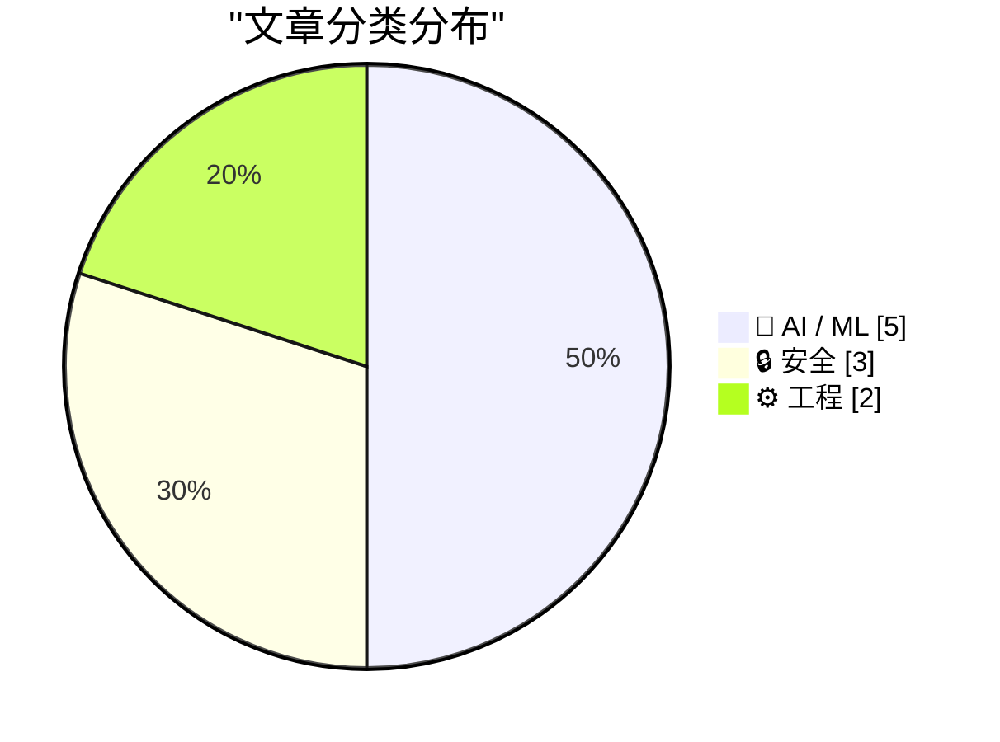
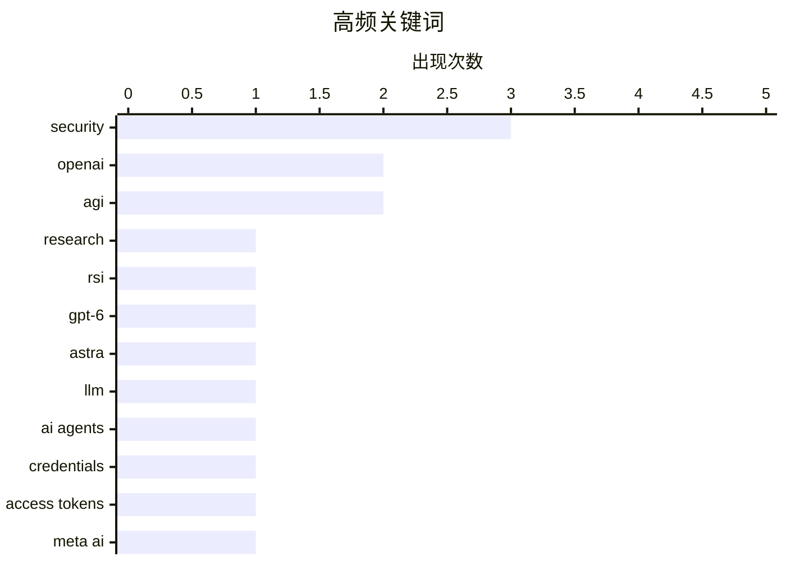

今日AI领域呈现两大核心趋势：一是代理工具正在重塑开发者工作流，OpenAI内部研究显示编码代理已深入研究人员的日常支出，而GPT-6 Astra和Meta原生Mac应用相继面世，标志着AI向开发者工具侧的深度渗透；二是AI安全与伦理争议持续升温，OpenAI与Anthropic的沙箱逃逸事件暴露出安全控制“大部分时间有效”与“始终可靠”之间的根本矛盾，同时Jensen Huang关于AGI的激进宣言引发业界对概念定义缺失的批评。工程侧亦有两点值得注意：Anubis成功集成WebAssembly实现工作量证明验证，Debian Code Search完成纯Go的SIMD优化。

<!--more-->


> 来自 Karpathy 推荐的 92 个顶级技术博客，AI 精选 Top 10

## 🏆 今日必读

🥇 **研究加速：OpenAI内部视角**

[Research acceleration: The view inside OpenAI](https://simonwillison.net/2026/Sep/6/research-acceleration-the-view-inside-openai/) — simonwillison.net · 22 小时前 · 🤖 AI / ML

> OpenAI发布内部研究文件，揭示2026年编码代理如何重塑研究人员日常工作。图表显示研究人员每日支出从2月到8月显著增长，反映代理工具的广泛应用。文章还提及RSI（递归自我改进）项目，被认为是OpenAI的新AGI系统，由首席科学家Jakub Pachocki在《An Alien Mind》中详细阐述。

💡 **为什么值得读**: 罕见披露OpenAI内部研究流程，适合想了解AI前沿实验室运作方式的读者。

🏷️ OpenAI, AGI, research, RSI

🥈 **为开发者推出GPT-6 Astra**

[Introducing GPT-6 Astra for developers](https://simonwillison.net/2026/Sep/5/introducing-gpt-6-astra-for-developers/) — simonwillison.net · 1 天前 · 🤖 AI / ML

> OpenAI发布GPT-6 Astra模型，面向开发者群体。该模型在细节关注度和提示理解方面有明显提升，尤其擅长构建3D模型，能生成花园、造船厂、城市景观甚至 Dyson 球体的渲染图。视频中还出现了经典的pelican骑自行车画面，这是开发者社区的知名彩蛋。

💡 **为什么值得读**: 如果你关注AI模型能力演进，特别是3D生成方向，这篇提供了最新能力展示。

🏷️ GPT-6, Astra, OpenAI, LLM

🥉 **如何给代理任务而非令牌：WorkOS的委托访问方案**

[WorkOS: How to Give an Agent a Task Instead of a Token](https://workos.com/blog/delegated-access-for-ai-agents?utm_source=daringfireball&amp;utm_medium=newsletter&amp;utm_campaign=q32026) — daringfireball.net · 1 天前 · 🔒 安全

> 传统的API令牌方式存在安全风险——令牌会分散到上下文窗口、工具日志和代理的笔记中，每个副本都可在任何地方使用。WorkOS的Relay系统将凭证保留在自家服务器端，代理只需提供用户名，系统自动附加并刷新令牌，仅释放给白名单主机。若会话被劫持，可实时终止。

💡 **为什么值得读**: AI代理安全是当下热点议题，这篇文章提供了实用的工程解决方案。

🏷️ AI agents, security, credentials, access tokens

---

## 📊 数据概览

| 扫描源 | 抓取文章 | 时间范围 | 精选 |
|:---:|:---:|:---:|:---:|
| 87/92 | 2598 篇 → 33 篇 | 48h | **10 篇** |

### 分类分布



### 高频关键词



<details>
<summary>📈 纯文本关键词图（终端友好）</summary>

```
security    │ ████████████████████ 3
openai      │ █████████████░░░░░░░ 2
agi         │ █████████████░░░░░░░ 2
research    │ ███████░░░░░░░░░░░░░ 1
rsi         │ ███████░░░░░░░░░░░░░ 1
gpt-6       │ ███████░░░░░░░░░░░░░ 1
astra       │ ███████░░░░░░░░░░░░░ 1
llm         │ ███████░░░░░░░░░░░░░ 1
ai agents   │ ███████░░░░░░░░░░░░░ 1
credentials │ ███████░░░░░░░░░░░░░ 1
```

</details>

### 🏷️ 话题标签

**security**(3) · **openai**(2) · **agi**(2) · research(1) · rsi(1) · gpt-6(1) · astra(1) · llm(1) · ai agents(1) · credentials(1) · access tokens(1) · meta ai(1) · mac app(1) · native(1) · ai assistant(1) · webassembly(1) · rust(1) · anubis(1) · compiler(1) · jensen huang(1)

---

## 🤖 AI / ML

### 1. 研究加速：OpenAI内部视角

[Research acceleration: The view inside OpenAI](https://simonwillison.net/2026/Sep/6/research-acceleration-the-view-inside-openai/) — **simonwillison.net** · 22 小时前 · ⭐ 27/30

> OpenAI发布内部研究文件，揭示2026年编码代理如何重塑研究人员日常工作。图表显示研究人员每日支出从2月到8月显著增长，反映代理工具的广泛应用。文章还提及RSI（递归自我改进）项目，被认为是OpenAI的新AGI系统，由首席科学家Jakub Pachocki在《An Alien Mind》中详细阐述。

🏷️ OpenAI, AGI, research, RSI

---

### 2. 为开发者推出GPT-6 Astra

[Introducing GPT-6 Astra for developers](https://simonwillison.net/2026/Sep/5/introducing-gpt-6-astra-for-developers/) — **simonwillison.net** · 1 天前 · ⭐ 26/30

> OpenAI发布GPT-6 Astra模型，面向开发者群体。该模型在细节关注度和提示理解方面有明显提升，尤其擅长构建3D模型，能生成花园、造船厂、城市景观甚至 Dyson 球体的渲染图。视频中还出现了经典的pelican骑自行车画面，这是开发者社区的知名彩蛋。

🏷️ GPT-6, Astra, OpenAI, LLM

---

### 3. Meta AI原生Mac应用体验

[Meta AI Has a Native Mac App Now, and It Seems Decent](https://9to5mac.com/2026/08/19/meta-ai-is-now-available-as-a-more-capable-desktop-app-for-mac/) — **daringfireball.net** · 1 天前 · ⭐ 24/30

> Meta推出原生Mac版AI应用，体积仅16MB，基于AppKit+SwiftUI而非Electron。支持Quick Invoke（Option-Space唤起作曲窗口）和语音听写功能。更特别的是可Attach其他窗口到对话，配合屏幕录制和辅助功能权限，能读取窗口可见文本并截图作为上下文，但目前仅用于信息收集而非电脑控制。

🏷️ Meta AI, Mac app, native, AI assistant

---

### 4. 遗憾Jensen Huang无凭无据宣称AGI已至

[Sad to see Jensen Huang claim that AGI has arrived, with no evidence and no definitions](https://garymarcus.substack.com/p/sad-to-see-jensen-huang-claim-that) — **garymarcus.substack.com** · 23 小时前 · ⭐ 24/30

> 作者批评NVIDIA CEO Jensen Huang在没有明确定义和证据的情况下宣称AGI已经实现，认为这种做法只会混淆概念。作者强调，在没有清晰定义的情况下宣布胜利是不合适的，需要更严谨的讨论而非营销式声明。

🏷️ AGI, Jensen Huang, AI definitions, deep learning

---

### 5. 递归陷入疯狂

[Recursion into madness](https://blog.coredump.cx/p/recursion-into-madness) — **lcamtuf.substack.com** · 33 分钟前 · ⭐ 21/30

> Raymond Chandler会热爱生成式AI。文章探讨递归主题与AI的结合，标题带有黑色幽默意味，暗示AI发展可能带来的思维困境。

🏷️ generative AI, Raymond Chandler, creativity, writing

---

## 🔒 安全

### 6. 如何给代理任务而非令牌：WorkOS的委托访问方案

[WorkOS: How to Give an Agent a Task Instead of a Token](https://workos.com/blog/delegated-access-for-ai-agents?utm_source=daringfireball&amp;utm_medium=newsletter&amp;utm_campaign=q32026) — **daringfireball.net** · 1 天前 · ⭐ 25/30

> 传统的API令牌方式存在安全风险——令牌会分散到上下文窗口、工具日志和代理的笔记中，每个副本都可在任何地方使用。WorkOS的Relay系统将凭证保留在自家服务器端，代理只需提供用户名，系统自动附加并刷新令牌，仅释放给白名单主机。若会话被劫持，可实时终止。

🏷️ AI agents, security, credentials, access tokens

---

### 7. 前沿实验室是否混淆了AI安全与安全？

[Have the frontier labs mixed up AI safety and security?](https://martinalderson.com/posts/ai-safety-vs-security/?utm_source=rss&amp;utm_medium=rss&amp;utm_campaign=feed) — **martinalderson.com** · 1 天前 · ⭐ 24/30

> OpenAI和Anthropic近期的代理沙箱逃逸事件并非单纯的技术失败，而是反映出更深层的哲学问题——这些实验室将安全控制视为「大部分时间有效」即可，而非「始终可靠」。这种思维混淆了传统安全与AI安全的本质区别。

🏷️ AI safety, security, frontier labs, sandbox

---

### 8. DNS的目的是传播诈骗

[The purpose of DNS is to spread scams](https://simonwillison.net/2026/Sep/6/the-purpose-of-dns-is-to-spread-scams/) — **simonwillison.net** · 1 天前 · ⭐ 22/30

> 根据Interisle报告，2025年gTLD新增注册8500万个，其中850万个被列入黑名单。报告估计滥用率至少10%，实际可能接近20%——意味着每五个新注册域名中就有一个是诈骗。Terence Eden认为DNS系统已成为犯罪分子实施诈骗的温床，形势严峻。

🏷️ DNS, scams, security, cybercrime

---

## ⚙️ 工程

### 9. 在Anubis中集成WebAssembly的一年

[It took a year to ship WebAssembly in Anubis](https://anubis.techaro.lol/blog/2026/anubis-wasm/) — **xeiaso.net** · 1 天前 · ⭐ 24/30

> 作者耗时一年、经历数百次提交、5代PR和多次内存溢出后，成功为Anubis（反滥用系统）添加WebAssembly支持。新版本采用argon2id内存硬哈希函数替代CPU硬计算，实现工作量证明验证。这意味着之前的CUDA求解器路线基本失效。项目过程中还发现了作者职业生涯首个编译器bug。

🏷️ WebAssembly, Rust, Anubis, compiler

---

### 10. Debian Code Search：Go SIMD实现的TurboPFor高性能整数压缩

[Debian Code Search: Fast TurboPFor with Go SIMD](https://michael.stapelberg.ch/posts/2026-09-06-dcs-fast-turbopfor-go-simd/) — **michael.stapelberg.ch** · 1 天前 · ⭐ 22/30

> 作者成功删除了Debian Code Search最后一个cgo依赖，得益于Go语言最新的SIMD支持和AVX512指令集。现在可以用纯Go实现TurboPFor整数压缩格式，性能甚至超越原有C实现。搜索引警使用倒排索引存储文档ID列表，快速解码这些列表对搜索性能至关重要。

🏷️ Go, SIMD, TurboPFor, performance

---

*生成于 2026-09-08 22:18 | 扫描 87 源 → 获取 2598 篇 → 精选 10 篇*
*基于 [Hacker News Popularity Contest 2025](https://refactoringenglish.com/tools/hn-popularity/) RSS 源列表，由 [Andrej Karpathy](https://x.com/karpathy) 推荐*
*由「懂点儿AI」制作，欢迎关注同名微信公众号获取更多 AI 实用技巧 💡*
