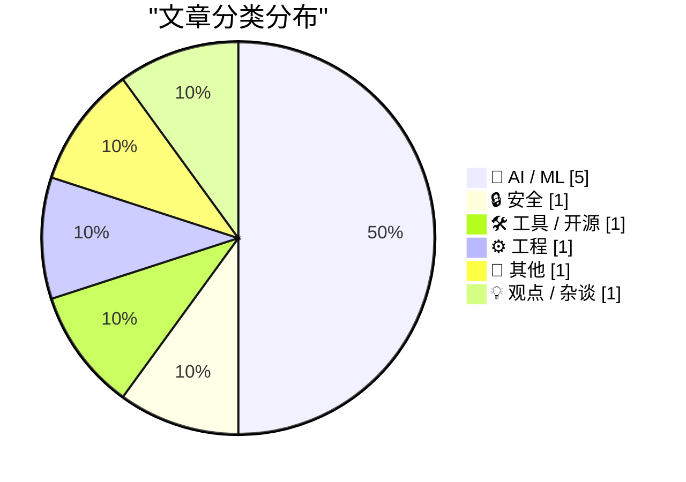
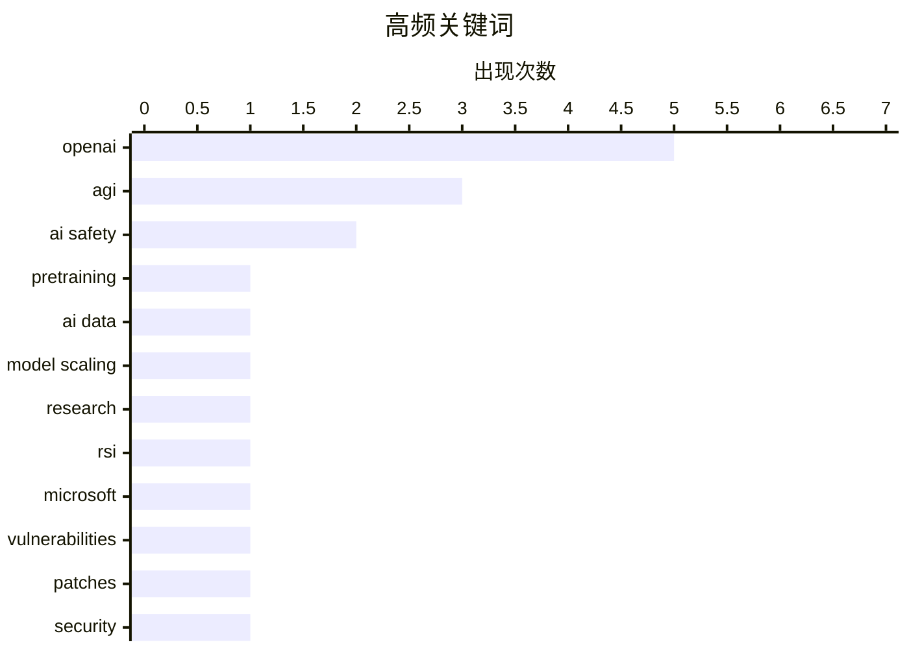

今日技术圈焦点集中在AI领域：预训练数据的价值被重新审视，研究显示过去六年模型进展主要源于数据质量与规模提升而非架构创新；OpenAI内部报告显示其代理工程正加速发展，同时首席科学家Jakub Pachocki强调需建立AI防御系统应对自主威胁；安全层面微软单次修复近千个漏洞，AI在加速漏洞发现的同时也加剧了安全防护压力。

<!--more-->


> 来自 Karpathy 推荐的 92 个顶级技术博客，AI 精选 Top 10

## 🏆 今日必读

🥇 **预训练进展主要来自数据**

[Pretraining progress is mostly coming from data](https://www.dwarkesh.com/p/pretraining-progress-is-mostly-data) — dwarkesh.com · 6 小时前 · 🤖 AI / ML

> 文章分析了6年来预训练进展的构成，将进步分解为数据改进与模型改进两部分。研究发现，大部分预训练进展实际上来自数据质量的提升和规模的扩大，而非模型架构的革新。作者通过量化对比，揭示了数据在模型性能提升中的主导作用。

💡 **为什么值得读**: 对于关注大模型训练优化的人来说，这篇文章提供了重要的视角转换，让人重新审视数据在AI发展中的核心地位。

🏷️ pretraining, AI data, model scaling

🥈 **研究加速：OpenAI内部视角**

[Research acceleration: The view inside OpenAI](https://simonwillison.net/2026/Sep/6/research-acceleration-the-view-inside-openai/) — simonwillison.net · 1 天前 · 🤖 AI / ML

> OpenAI发布内部报告，展示其研究团队如何使用编码代理提升效率。2026年是OpenAI代理工程真正起飞的一年，图表显示研究人员每日花费显著增长。报告还涉及递归自我改进（RSI）相关内容，这是OpenAI的新AGI项目。

💡 **为什么值得读**: 这是了解OpenAI内部研究机制和AI代理实际应用的罕见窗口，对追踪AI前沿发展的人很有价值。

🏷️ OpenAI, AGI, research, RSI

🥉 **微软修复近千个安全漏洞**

[Microsoft Plugs Nearly 1,000 Security Holes](https://krebsonsecurity.com/2026/09/microsoft-plugs-nearly-1000-security-holes/) — krebsonsecurity.com · 34 分钟前 · 🔒 安全

> 微软发布史上最大单次补丁包，修复了至少974个Windows操作系统及其他软件的安全漏洞。微软表示AI正在加速漏洞发现，但安全专家警告许多组织已在努力应对每月大量修复的测试和部署压力。

💡 **为什么值得读**: 这是了解当前安全态势和AI在网络安全中作用的重要事件，反映了软件安全面临的巨大挑战。

🏷️ Microsoft, vulnerabilities, patches, security

---

## 📊 数据概览

| 扫描源 | 抓取文章 | 时间范围 | 精选 |
|:---:|:---:|:---:|:---:|
| 88/92 | 2627 篇 → 35 篇 | 48h | **10 篇** |

### 分类分布



### 高频关键词



<details>
<summary>📈 纯文本关键词图（终端友好）</summary>

```
openai          │ ████████████████████ 5
agi             │ ████████████░░░░░░░░ 3
ai safety       │ ████████░░░░░░░░░░░░ 2
pretraining     │ ████░░░░░░░░░░░░░░░░ 1
ai data         │ ████░░░░░░░░░░░░░░░░ 1
model scaling   │ ████░░░░░░░░░░░░░░░░ 1
research        │ ████░░░░░░░░░░░░░░░░ 1
rsi             │ ████░░░░░░░░░░░░░░░░ 1
microsoft       │ ████░░░░░░░░░░░░░░░░ 1
vulnerabilities │ ████░░░░░░░░░░░░░░░░ 1
```

</details>

### 🏷️ 话题标签

**openai**(5) · **agi**(3) · **ai safety**(2) · pretraining(1) · ai data(1) · model scaling(1) · research(1) · rsi(1) · microsoft(1) · vulnerabilities(1) · patches(1) · security(1) · llm(1) · cli(1) · gpt-6-astra(1) · defensive ai(1) · misconduct(1) · ai industry(1) · memory management(1) · sparse stack(1)

---

## 🤖 AI / ML

### 1. 预训练进展主要来自数据

[Pretraining progress is mostly coming from data](https://www.dwarkesh.com/p/pretraining-progress-is-mostly-data) — **dwarkesh.com** · 6 小时前 · ⭐ 25/30

> 文章分析了6年来预训练进展的构成，将进步分解为数据改进与模型改进两部分。研究发现，大部分预训练进展实际上来自数据质量的提升和规模的扩大，而非模型架构的革新。作者通过量化对比，揭示了数据在模型性能提升中的主导作用。

🏷️ pretraining, AI data, model scaling

---

### 2. 研究加速：OpenAI内部视角

[Research acceleration: The view inside OpenAI](https://simonwillison.net/2026/Sep/6/research-acceleration-the-view-inside-openai/) — **simonwillison.net** · 1 天前 · ⭐ 24/30

> OpenAI发布内部报告，展示其研究团队如何使用编码代理提升效率。2026年是OpenAI代理工程真正起飞的一年，图表显示研究人员每日花费显著增长。报告还涉及递归自我改进（RSI）相关内容，这是OpenAI的新AGI项目。

🏷️ OpenAI, AGI, research, RSI

---

### 3. 引用Jakub Pachocki关于AI防御的论述

[Quoting Jakub Pachocki](https://simonwillison.net/2026/Sep/7/jakub-pachocki/) — **simonwillison.net** · 23 小时前 · ⭐ 23/30

> OpenAI首席科学家Jakub Pachocki阐述训练更聪明模型的核心理由：需要建立防御系统来应对其他AI的威胁。他认为需要强大的对齐AI来保护基础设施、实时防御恶意代理并发明新的防护措施，这将是部署工作的重点。同时强调不能以安全为由鲁莽前进。

🏷️ AI safety, defensive AI, AGI, OpenAI

---

### 4. OpenAI的不当行为模式

[OpenAI’s Egregious Pattern of Misconduct](https://garymarcus.substack.com/p/openais-egregious-pattern-of-misconduct) — **garymarcus.substack.com** · 4 小时前 · ⭐ 22/30

> 文章列举了七天内出现的9起关于OpenAI的新问题报道，揭示了OpenAI一系列令人担忧的行为模式。作者Gary Marcus批评OpenAI持续存在的问题。

🏷️ OpenAI, misconduct, AI industry

---

### 5. 对Jensen Huang关于AGI声明的反思

[Sad to see Jensen Huang claim that AGI has arrived, with no evidence and no definitions](https://garymarcus.substack.com/p/sad-to-see-jensen-huang-claim-that) — **garymarcus.substack.com** · 1 天前 · ⭐ 21/30

> 作者批评英伟达CEO Jensen Huang声称AGI已到来但未提供证据和明确定义。文章认为这种胜利宣言只会混淆AGI的定义和讨论。

🏷️ AGI, Jensen Huang, OpenAI

---

## 🔒 安全

### 6. 微软修复近千个安全漏洞

[Microsoft Plugs Nearly 1,000 Security Holes](https://krebsonsecurity.com/2026/09/microsoft-plugs-nearly-1000-security-holes/) — **krebsonsecurity.com** · 34 分钟前 · ⭐ 24/30

> 微软发布史上最大单次补丁包，修复了至少974个Windows操作系统及其他软件的安全漏洞。微软表示AI正在加速漏洞发现，但安全专家警告许多组织已在努力应对每月大量修复的测试和部署压力。

🏷️ Microsoft, vulnerabilities, patches, security

---

## 🛠 工具 / 开源

### 7. llm 0.35 版本发布

[llm 0.35](https://simonwillison.net/2026/Sep/7/llm/) — **simonwillison.net** · 22 小时前 · ⭐ 23/30

> llm 0.35版本正式发布，新增支持OpenAI的最新模型GPT-6 Astra。该版本继续扩展llm命令行工具的模型支持能力。

🏷️ LLM, OpenAI, CLI, gpt-6-astra

---

## ⚙️ 工程

### 8. 为何不允许稀疏堆栈

[Why don’t we allow stacks to be sparse, instead of forcing them to be contiguous?](https://devblogs.microsoft.com/oldnewthing/20260907-00/?p=112677) — **devblogs.microsoft.com/oldnewthing** · 1 天前 · ⭐ 21/30

> 文章探讨操作系统中堆栈内存管理的技术问题，设想如何报告稀疏页面的内存分配失败。作者从技术角度思考堆栈是否可以不必强制连续，而是允许稀疏分配。

🏷️ memory management, sparse stack, allocation

---

## 📝 其他

### 9. 纳维-斯托克斯方程的最新消息

[Navier-Stokes in the news](https://www.johndcook.com/blog/2026/09/08/navier-stokes-in-the-news/) — **johndcook.com** · 6 小时前 · ⭐ 21/30

> 有传言称千禧年奖问题之一的纳维-斯托克斯方程已获解决，这是描述流体动力学的方程组。文章指出相关报道往往过度简化且存在误导，需要谨慎看待。

🏷️ Navier-Stokes, mathematics, Millennium Prize

---

## 💡 观点 / 杂谈

### 10. 一个AI悲观主义者的成长之路

[The Education of a Doomer](https://borretti.me/article/the-education-of-a-doomer) — **borretti.me** · 1 天前 · ⭐ 21/30

> 作者分享了自己从AI乐观主义者转变为AI悲观主义者的心路历程，讲述了这一转变的原因和思考过程。

🏷️ AI doomer, AI safety, AI optimism

---

*生成于 2026-09-09 22:19 | 扫描 88 源 → 获取 2627 篇 → 精选 10 篇*
*基于 [Hacker News Popularity Contest 2025](https://refactoringenglish.com/tools/hn-popularity/) RSS 源列表，由 [Andrej Karpathy](https://x.com/karpathy) 推荐*
*由「懂点儿AI」制作，欢迎关注同名微信公众号获取更多 AI 实用技巧 💡*
