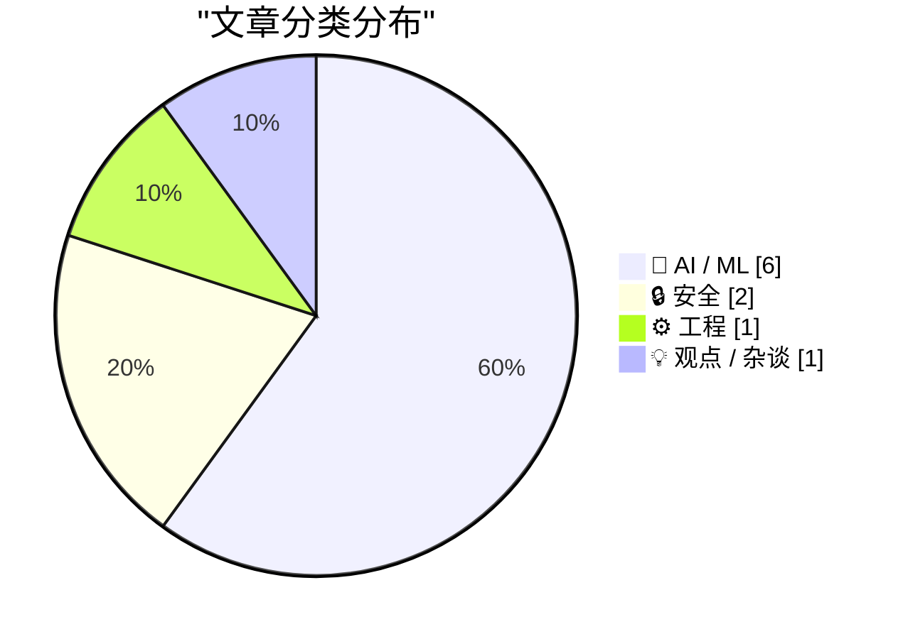
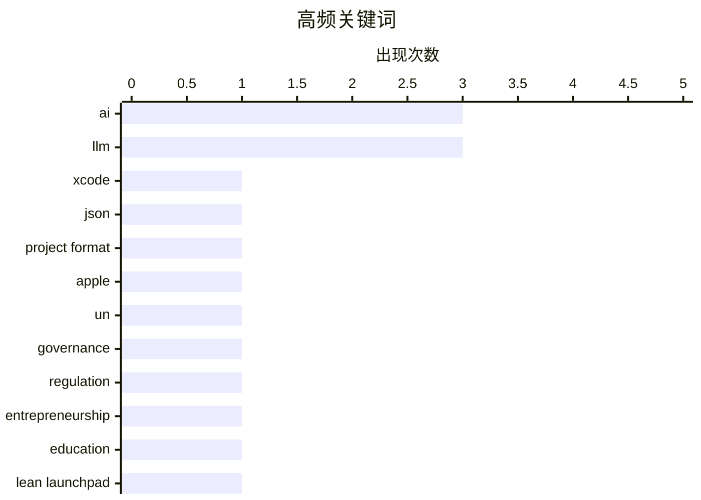

今日技术圈呈现三大趋势：AI领域继续激战，OpenAI与Anthropic分别推出GPT-6与Claude新版本并大打价格战，同时Google发布超强TTS模型；AI应用层面持续扩展至创业教育、文档生成甚至联合国AI治理等更广泛场景；但同时AI的局限性也被持续审视，模型在简单任务上仍会出错，输出结果的隐性错误防不胜防，提示业界在追求能力提升的同时需更加重视可靠性与安全性。

<!--more-->


> 来自 Karpathy 推荐的 92 个顶级技术博客，AI 精选 Top 10

## 🏆 今日必读

🥇 **Xcode 27.2 现已支持全新的 JSON 项目文件格式**

[Xcode 27.2 Now Supports a New JSON Project File Format](https://developer.apple.com/documentation/xcode-release-notes/xcode-27_2-release-notes) — daringfireball.net · 1 天前 · ⚙️ 工程

> Xcode 27.2 正式支持基于 JSON 的 .xcproj 项目格式，该格式更易读、易于合并，且方便 AI 编码代理编辑，可通过文件检查器启用。Apple 还在 GitHub 上发布了用于读写和操作该格式的 Swift 库及 CLI 工具。开发者社区反应普遍积极，但也有人感慨这是为了帮助 AI 而非帮助人类推动的改进。

💡 **为什么值得读**: 如果你日常使用 Xcode 开发，了解这一变化将影响项目工作流和团队协作方式。

🏷️ Xcode, JSON, project format, Apple

🥈 **历史性的联合国安理会人工智能简报会**

[Historic UN Security Council Briefing on AI](https://garymarcus.substack.com/p/historic-un-security-council-briefing) — garymarcus.substack.com · 48 分钟前 · 🤖 AI / ML

> 联合国安理会举行了首次关于人工智能的简报会，各方对需要采取的行动达成一致，会议主题为“我们同意需要做什么，现在让我们去做”。

💡 **为什么值得读**: 这是 AI 治理领域的里程碑事件，反映了全球对 AI 安全与监管的重视程度。

🏷️ UN, AI, governance, regulation

🥉 **AI 来袭之年：创业教育将永远不同**

[The Year AI Came For Us: Teaching Entrepreneurship Will Never Be The Same](https://steveblank.com/2026/09/23/the-year-ai-came-for-us-teaching-entrepreneurship-will-never-be-the-same/) — steveblank.com · 9 小时前 · 💡 观点 / 杂谈

> 作者 Steve Blank 反思 AI 是否“杀死”了其创办的 Lean LaunchPad 创业课程，该课程过去 15 年在全球数百所大学开设并帮助创建了数千家创业公司。AI 的发展使得 entrepreneurship 教学方式面临根本性挑战，传统教学方法可能被重新定义。

💡 **为什么值得读**: 对于教育者和创业者来说，AI 如何改变传统商业教育是一个值得深思的问题。

🏷️ AI, entrepreneurship, education, Lean LaunchPad

---

## 📊 数据概览

| 扫描源 | 抓取文章 | 时间范围 | 精选 |
|:---:|:---:|:---:|:---:|
| 83/92 | 2567 篇 → 44 篇 | 48h | **10 篇** |

### 分类分布



### 高频关键词



<details>
<summary>📈 纯文本关键词图（终端友好）</summary>

```
ai               │ ████████████████████ 3
llm              │ ████████████████████ 3
xcode            │ ███████░░░░░░░░░░░░░ 1
json             │ ███████░░░░░░░░░░░░░ 1
project format   │ ███████░░░░░░░░░░░░░ 1
apple            │ ███████░░░░░░░░░░░░░ 1
un               │ ███████░░░░░░░░░░░░░ 1
governance       │ ███████░░░░░░░░░░░░░ 1
regulation       │ ███████░░░░░░░░░░░░░ 1
entrepreneurship │ ███████░░░░░░░░░░░░░ 1
```

</details>

### 🏷️ 话题标签

**ai**(3) · **llm**(3) · **xcode**(1) · json(1) · project format(1) · apple(1) · un(1) · governance(1) · regulation(1) · entrepreneurship(1) · education(1) · lean launchpad(1) · gemini(1) · tts(1) · text-to-speech(1) · google(1) · claude(1) · gpt-6(1) · ai models(1) · price war(1)

---

## 🤖 AI / ML

### 1. 历史性的联合国安理会人工智能简报会

[Historic UN Security Council Briefing on AI](https://garymarcus.substack.com/p/historic-un-security-council-briefing) — **garymarcus.substack.com** · 48 分钟前 · ⭐ 25/30

> 联合国安理会举行了首次关于人工智能的简报会，各方对需要采取的行动达成一致，会议主题为“我们同意需要做什么，现在让我们去做”。

🏷️ UN, AI, governance, regulation

---

### 2. Gemini 3.8 TTS Playground 体验

[Gemini 3.8 TTS Playground](https://simonwillison.net/2026/Sep/23/gemini-tts-playground/) — **simonwillison.net** · 5 小时前 · ⭐ 24/30

> Google 发布了 gemini-3.8-flash-tts 和 gemini-3.8-flash-lite-tts 两款新的文本转语音模型，提供超过 2000 个声音库，并支持仅用 30 秒音频样本创建自定义声音。Simon Willison 使用 GPT-6 Astra 快速搭建了一个带有开放 CORS 策略的 Playground 界面。

🏷️ Gemini, TTS, text-to-speech, Google

---

### 3. Claude Opus 5.5 与 GPT-6 Sol/Luna 发布及价格战

[Claude Opus 5.5, GPT-6 Sol, GPT-6 Luna, and a new price war](https://simonwillison.net/2026/Sep/22/opus-and-sol-and-luna/) — **simonwillison.net** · 22 小时前 · ⭐ 24/30

> Anthropic 发布 Claude Opus 5.5 后，OpenAI 紧接着发布 GPT-6 Sol 和 GPT-6 Luna。GPT-6 Luna 价格仅为 GPT-5.6 Luna 的一半继续保持性价比优势，GPT-6 Sol 和 Luna 的价格也各自是 GPT-5.6 对应版本的一半。

🏷️ Claude, GPT-6, AI models, price war

---

### 4. Jev：新型 LLM——System One（决策模型）

[Jev introduces a new shape of LLM - System One, aka Decision Models](https://simonwillison.net/2026/Sep/21/jev/) — **simonwillison.net** · 1 天前 · ⭐ 23/30

> TypeSafe AI 推出 Jev，定位为新型“System One 模型”或“决策模型”，接受非结构化文本输入但输出浮点数、分类结果、是/否判断及置信度，而非传统文本输出。该模型速度极快且成本极低，定价方式也不同于传统按 Token 收费的模式。

🏷️ System One, Decision Models, LLM, TypeSafe AI

---

### 5. 不仅仅是真，更是假

[It's Not Just True, It's False](https://idiallo.com/byte-size/its-not-just-true-its-false) — **idiallo.com** · 1 天前 · ⭐ 22/30

> 作者反思在工作中使用 LLM 撰写文档的体验：AI 在将会议转录为摘要、总结行动项方面节省时间，但结果充满隐形错误。作者发现 AI 将会议中不存在的“embroidery”（刺绣）一词误认为行动项，最终还需花时间校对。

🏷️ LLM, writing, workplace, productivity

---

### 6. LLM 在某些简单任务上仍然出乎意料地差吗？

[Are LLMs still surprisingly bad at some simple tasks?](https://shkspr.mobi/blog/2026/09/are-llms-still-surprisingly-bad-at-some-simple-tasks/) — **shkspr.mobi** · 1 天前 · ⭐ 22/30

> 作者去年测试现代 LLM 回答一个相对简单的问题，所有模型都回答错误：有些遗漏信息，有些编造了虚假陈述，没有一个答对。作者指出 AI 爱好者会找各种借口反驳测试结果。

🏷️ LLM, benchmark, limitations, AI

---

## 🔒 安全

### 7. 包管理器威胁模型再审视

[Package Manager Threat Model, Revisited](https://nesbitt.io/2026/09/22/package-manager-threat-model-revisited.html) — **nesbitt.io** · 1 天前 · ⭐ 23/30

> 安全审计发现，在十个被审计的包管理器中有八个存在通过清单字段进行路径遍历的漏洞，且在四个月内其他项目的安全公告中出现了三十三次该类漏洞。

🏷️ package manager, vulnerability, supply chain

---

### 8. 每周更新 522：来自奥斯陆的现场报道

[Weekly Update 522: Live From Oslo with Scott Helme](https://www.troyhunt.com/weekly-update-522/) — **troyhunt.com** · 17 小时前 · ⭐ 23/30

> Troy Hunt 与安全研究员 Scott Helme 讨论 Report URI 如何通过 CSP（内容安全策略）报告识别组织内受恶意软件感染的机器。

🏷️ CSP, malware, Report URI, security monitoring

---

## ⚙️ 工程

### 9. Xcode 27.2 现已支持全新的 JSON 项目文件格式

[Xcode 27.2 Now Supports a New JSON Project File Format](https://developer.apple.com/documentation/xcode-release-notes/xcode-27_2-release-notes) — **daringfireball.net** · 1 天前 · ⭐ 26/30

> Xcode 27.2 正式支持基于 JSON 的 .xcproj 项目格式，该格式更易读、易于合并，且方便 AI 编码代理编辑，可通过文件检查器启用。Apple 还在 GitHub 上发布了用于读写和操作该格式的 Swift 库及 CLI 工具。开发者社区反应普遍积极，但也有人感慨这是为了帮助 AI 而非帮助人类推动的改进。

🏷️ Xcode, JSON, project format, Apple

---

## 💡 观点 / 杂谈

### 10. AI 来袭之年：创业教育将永远不同

[The Year AI Came For Us: Teaching Entrepreneurship Will Never Be The Same](https://steveblank.com/2026/09/23/the-year-ai-came-for-us-teaching-entrepreneurship-will-never-be-the-same/) — **steveblank.com** · 9 小时前 · ⭐ 25/30

> 作者 Steve Blank 反思 AI 是否“杀死”了其创办的 Lean LaunchPad 创业课程，该课程过去 15 年在全球数百所大学开设并帮助创建了数千家创业公司。AI 的发展使得 entrepreneurship 教学方式面临根本性挑战，传统教学方法可能被重新定义。

🏷️ AI, entrepreneurship, education, Lean LaunchPad

---

*生成于 2026-09-24 22:34 | 扫描 83 源 → 获取 2567 篇 → 精选 10 篇*
*基于 [Hacker News Popularity Contest 2025](https://refactoringenglish.com/tools/hn-popularity/) RSS 源列表，由 [Andrej Karpathy](https://x.com/karpathy) 推荐*
*由「懂点儿AI」制作，欢迎关注同名微信公众号获取更多 AI 实用技巧 💡*
