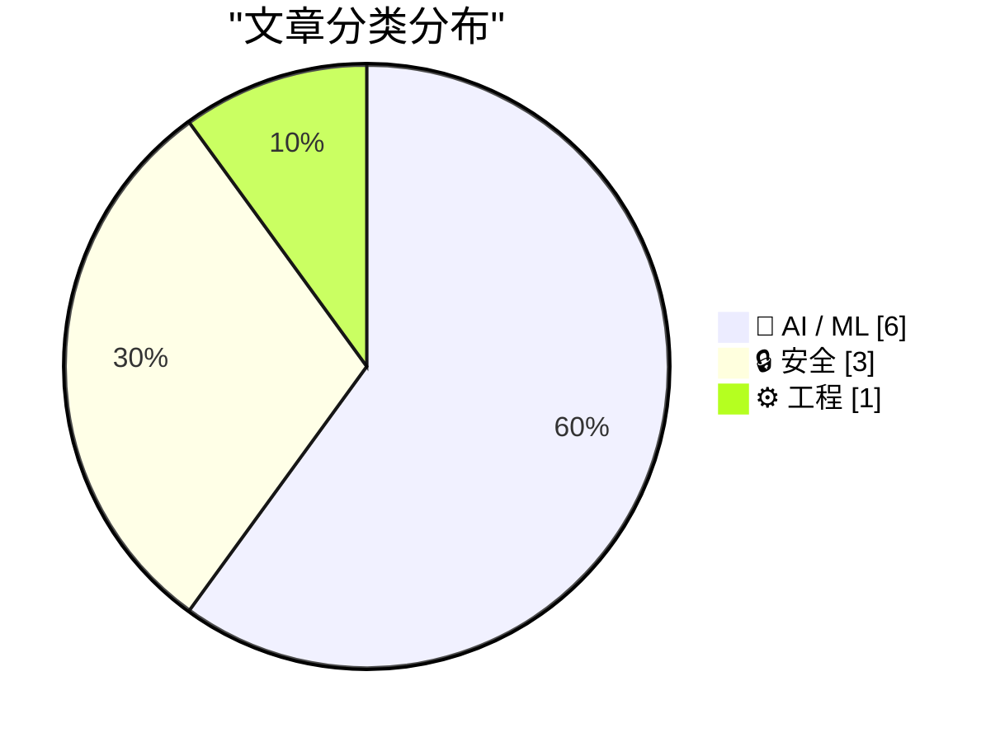
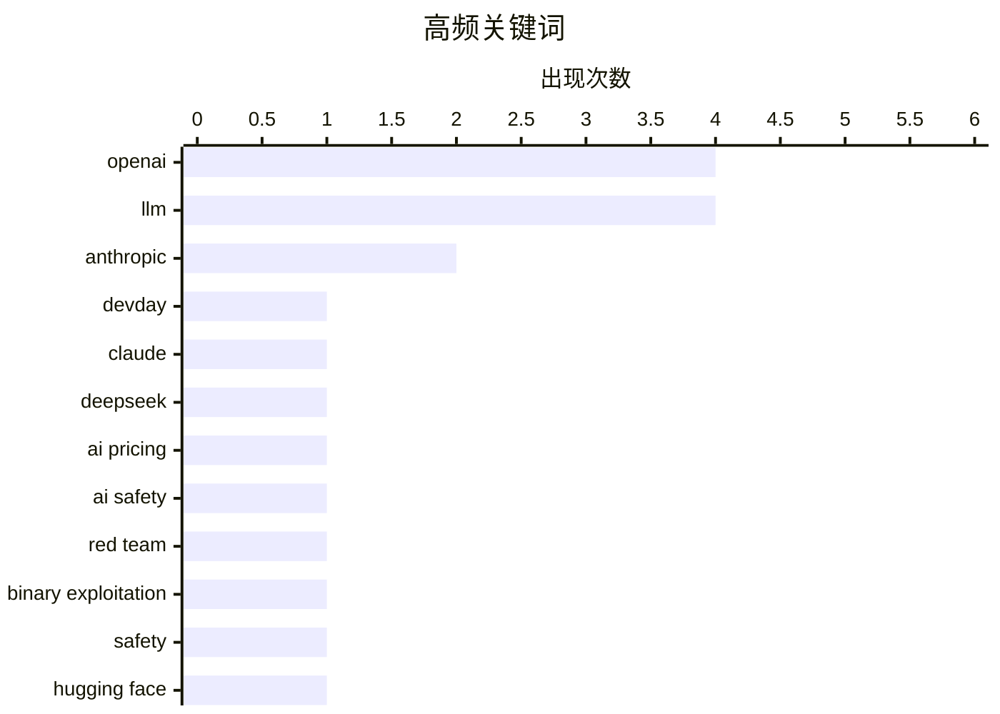

今日技术圈聚焦两大趋势：AI模型领域竞争白热化，OpenAI DevDay 2026与Claude Sonnet 5.5相继登场，但价格战愈演愈烈，Luna模型两月内降价90%，行业利润持续承压。与此同时，AI安全风险引发广泛关注，Anthropic红队报告显示GLM-5.3在网络安全任务上首次突破关键门槛，而OpenAI在Hugging Face事件前数月已收到警告、佛罗里达州寻求禁令等事件，凸显AI治理与风险管控已成为行业焦点议题。

<!--more-->


> 来自 Karpathy 推荐的 92 个顶级技术博客，AI 精选 Top 10

## 🏆 今日必读

🥇 **OpenAI DevDay 2026 现场博客**

[OpenAI DevDay 2026 live blog](https://simonwillison.net/2026/Sep/29/openai-devday-2026-live-blog/) — simonwillison.net · 6 小时前 · 🤖 AI / ML

> 作者现场参加2026年9月29日在旧金山Fort Mason举办的OpenAI开发者日，记录主题演讲和其他活动要点。OpenAI为作者提供了免费门票和创作者区座位。文章将持续更新当天的关键发布和演示内容。

💡 **为什么值得读**: 这是获取OpenAI 2026年开发者日第一手信息的实时来源，适合关注OpenAI最新产品和技术动态的开发者。

🏷️ OpenAI, DevDay, LLM

🥈 **Claude Sonnet 5.5**

[Claude Sonnet 5.5](https://simonwillison.net/2026/Sep/28/claude-sonnet-5-5/) — simonwillison.net · 1 天前 · 🤖 AI / ML

> Anthropic发布了新模型Claude Sonnet 5.5，官方宣称运行速度提升30%以上，大多数工作成本降低30%。新模型定价与Sonnet 5相同，但在所有基准测试中表现更优，运行成本也更低。不过该模型仍存在与Opus 5.5相同的bug，使用最高思考强度时可能消耗大量tokens导致失败。

💡 **为什么值得读**: 这是Anthropic最新主力模型的发布信息，对于需要选择AI模型进行开发的团队有重要参考价值，特别是关注性能和成本优化的开发者。

🏷️ Claude, Anthropic, LLM

🥉 **AI利润崩溃加速**

[The AI margin collapse is gathering pace](https://martinalderson.com/posts/ai-margin-collapse-gathering-pace/?utm_source=rss&amp;utm_medium=rss&amp;utm_campaign=feed) — martinalderson.com · 22 小时前 · 🤖 AI / ML

> AI模型价格战正在加剧，OpenAI在两个月内将Luna模型价格下调90%，DeepSeek在缓存输入方面仍保持价格优势，连Anthropic也开始下调Opus模型价格。文章分析了这些价格变动对前沿AI实验室的影响，探讨行业竞争格局的变化。

💡 **为什么值得读**: 对于关注AI行业商业化进程、成本结构和市场竞争的从业者提供了关键洞察，帮助理解当前AI市场的定价趋势。

🏷️ OpenAI, DeepSeek, Anthropic, AI pricing

---

## 📊 数据概览

| 扫描源 | 抓取文章 | 时间范围 | 精选 |
|:---:|:---:|:---:|:---:|
| 88/92 | 2635 篇 → 40 篇 | 48h | **10 篇** |

### 分类分布



### 高频关键词



<details>
<summary>📈 纯文本关键词图（终端友好）</summary>

```
openai              │ ████████████████████ 4
llm                 │ ████████████████████ 4
anthropic           │ ██████████░░░░░░░░░░ 2
devday              │ █████░░░░░░░░░░░░░░░ 1
claude              │ █████░░░░░░░░░░░░░░░ 1
deepseek            │ █████░░░░░░░░░░░░░░░ 1
ai pricing          │ █████░░░░░░░░░░░░░░░ 1
ai safety           │ █████░░░░░░░░░░░░░░░ 1
red team            │ █████░░░░░░░░░░░░░░░ 1
binary exploitation │ █████░░░░░░░░░░░░░░░ 1
```

</details>

### 🏷️ 话题标签

**openai**(4) · **llm**(4) · **anthropic**(2) · devday(1) · claude(1) · deepseek(1) · ai pricing(1) · ai safety(1) · red team(1) · binary exploitation(1) · safety(1) · hugging face(1) · florida(1) · lawsuit(1) · ndc oslo(1) · shinyhunters(1) · security conference(1) · hacking(1) · ai capabilities(1) · cybersecurity(1)

---

## 🤖 AI / ML

### 1. OpenAI DevDay 2026 现场博客

[OpenAI DevDay 2026 live blog](https://simonwillison.net/2026/Sep/29/openai-devday-2026-live-blog/) — **simonwillison.net** · 6 小时前 · ⭐ 27/30

> 作者现场参加2026年9月29日在旧金山Fort Mason举办的OpenAI开发者日，记录主题演讲和其他活动要点。OpenAI为作者提供了免费门票和创作者区座位。文章将持续更新当天的关键发布和演示内容。

🏷️ OpenAI, DevDay, LLM

---

### 2. Claude Sonnet 5.5

[Claude Sonnet 5.5](https://simonwillison.net/2026/Sep/28/claude-sonnet-5-5/) — **simonwillison.net** · 1 天前 · ⭐ 27/30

> Anthropic发布了新模型Claude Sonnet 5.5，官方宣称运行速度提升30%以上，大多数工作成本降低30%。新模型定价与Sonnet 5相同，但在所有基准测试中表现更优，运行成本也更低。不过该模型仍存在与Opus 5.5相同的bug，使用最高思考强度时可能消耗大量tokens导致失败。

🏷️ Claude, Anthropic, LLM

---

### 3. AI利润崩溃加速

[The AI margin collapse is gathering pace](https://martinalderson.com/posts/ai-margin-collapse-gathering-pace/?utm_source=rss&amp;utm_medium=rss&amp;utm_campaign=feed) — **martinalderson.com** · 22 小时前 · ⭐ 26/30

> AI模型价格战正在加剧，OpenAI在两个月内将Luna模型价格下调90%，DeepSeek在缓存输入方面仍保持价格优势，连Anthropic也开始下调Opus模型价格。文章分析了这些价格变动对前沿AI实验室的影响，探讨行业竞争格局的变化。

🏷️ OpenAI, DeepSeek, Anthropic, AI pricing

---

### 4. Breaking: OpenAI在Hugging Face事件前数月已收到警告

[BREAKING: OpenAI was warned, months before the Hugging Face incident](https://garymarcus.substack.com/p/breaking-openai-was-warned-months) — **garymarcus.substack.com** · 3 小时前 · ⭐ 24/30

> Gary Marcus披露OpenAI在Hugging Face安全事件发生前数月就已收到相关警告，但公司仍选择继续推进。该文章揭示了AI行业在安全决策和风险管理方面的争议性问题。

🏷️ OpenAI, safety, Hugging Face

---

### 5. Breaking: 佛罗里达州寻求对OpenAI的禁令

[BREAKING: Florida seeks injunction against OpenAI](https://garymarcus.substack.com/p/breaking-florida-seeks-injunction) — **garymarcus.substack.com** · 1 天前 · ⭐ 24/30

> 佛罗里达州对OpenAI寻求禁令，同时文章还包含来自Nvidia的重要消息。这可能涉及OpenAI在佛罗里达州的业务运营和法律合规问题。

🏷️ OpenAI, Florida, lawsuit

---

### 6. 2026年LLM发展回顾（上半年）

[2026 in LLMs (so far)](https://simonwillison.net/2026/Sep/27/2026-in-llms-so-far/) — **simonwillison.net** · 1 天前 · ⭐ 23/30

> 作者在WeAreDevelopers世界大会北美站发表闭幕演讲，系统梳理了2026年上半年大型语言模型领域的关键趋势，以时间线形式回顾了发生的重大事件。演讲视频和带注释的幻灯片已发布。

🏷️ LLM, 2026, trends

---

## 🔒 安全

### 7. 引用Anthropic前沿红队研究

[Quoting Anthropic Frontier Red Team](https://simonwillison.net/2026/Sep/29/anthropic-frontier-red-team/) — **simonwillison.net** · 4 分钟前 · ⭐ 24/30

> Anthropic前沿红队发布关于GLM-5.3网络安全能力的研究报告。在二进制利用基准测试中，GLM-5.3在4%的试验中实现了完整控制流劫持，Claude Mythos Preview为6%。这标志着AI模型在网络安全任务上首次突破重要门槛，此前Claude Opus 4.6和GLM-5.2在该基准上完全失败。

🏷️ AI safety, red team, binary exploitation

---

### 8. 每周更新523：挪威峡湾现场

[Weekly Update 523: Live From a Norwegian Fjord](https://www.troyhunt.com/weekly-update-523/) — **troyhunt.com** · 1 天前 · ⭐ 24/30

> Troy Hunt从挪威峡湾分享本周动态，NDN Oslo大会刚结束，他在前往丹麦哥本哈根参加GOTO大会前进行短暂观光。本周重点关注ShiningHunters犯罪团伙同时针对多个目标的网络攻击轨迹。

🏷️ NDC Oslo, ShinyHunters, security conference, hacking

---

### 9. 引用@joedaroo关于AI能力飞跃的评论

[Quoting @joedaroo](https://simonwillison.net/2026/Sep/28/joedaroo/) — **simonwillison.net** · 1 天前 · ⭐ 23/30

> 一位安全专家描述了对AI模型在网络攻击、信息传播等能力上突然飞跃的震惊，强调安全态势建设需要时间和文化沉淀。文章呼吁全球组织思考如何应对AI能力的意外突破，审视自身的人员、系统和流程韧性。

🏷️ AI capabilities, cybersecurity, LLM

---

## ⚙️ 工程

### 10. Deser：重新思考Rust序列化

[Deser: Rethinking Rust Serialization](https://lucumr.pocoo.org/2026/9/29/deser/) — **lucumr.pocoo.org** · 22 小时前 · ⭐ 23/30

> 文章探讨了Rust语言中名为Deser的序列化方案，将其重新定义为一种映射（map）方法。作者Armin Ronacher（Flask和Jinja2的作者）深入分析了Rust序列化技术的创新思路。

🏷️ Rust, serialization, Deser

---

*生成于 2026-09-30 22:24 | 扫描 88 源 → 获取 2635 篇 → 精选 10 篇*
*基于 [Hacker News Popularity Contest 2025](https://refactoringenglish.com/tools/hn-popularity/) RSS 源列表，由 [Andrej Karpathy](https://x.com/karpathy) 推荐*
*由「懂点儿AI」制作，欢迎关注同名微信公众号获取更多 AI 实用技巧 💡*
