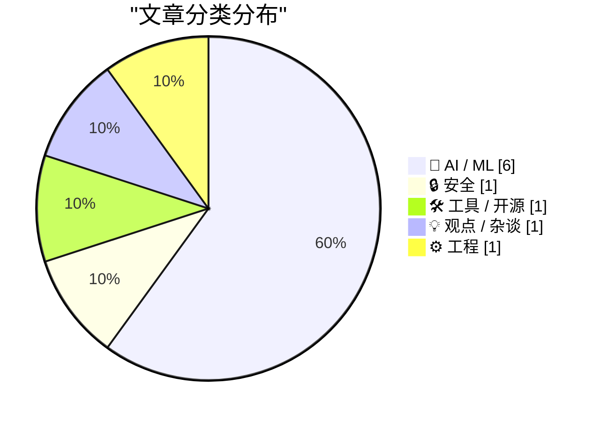
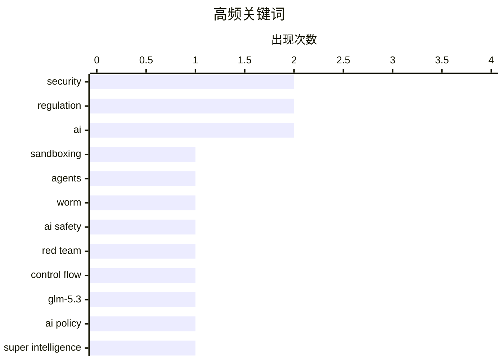

今日AI圈聚焦两大议题：AI安全与对齐成为焦点，Anthropic等公司加码Red Team研究，同时White House关于"超级智能"的协议被批力度不足；AI商业化路径再引争议，Anthropic IPO招股说明书引发热议，学界开始追问OpenAI等巨头能否逃避法律责任；开源社区继续深耕数据质量与模型优化，GPT-2权重比较揭示训练数据差异的核心影响。

<!--more-->


> 来自 Karpathy 推荐的 92 个顶级技术博客，AI 精选 Top 10

## 🏆 今日必读

🥇 **Quoting Matthew Green**

[Quoting Matthew Green](https://simonwillison.net/2026/Oct/1/matthew-green/) — simonwillison.net · 15 小时前 · 🔒 安全

> Quoting Matthew Green

🏷️ sandboxing, agents, security, worm

🥈 **Quoting Anthropic Frontier Red Team**

[Quoting Anthropic Frontier Red Team](https://simonwillison.net/2026/Sep/29/anthropic-frontier-red-team/) — simonwillison.net · 1 天前 · 🤖 AI / ML

> Quoting Anthropic Frontier Red Team

🏷️ AI safety, red team, control flow, GLM-5.3

🥉 **Hot take on a weak White House Accord on “Super Intelligence”**

[Hot take on a weak White House Accord on “Super Intelligence”](https://garymarcus.substack.com/p/hot-take-on-a-weak-white-house-accord) — garymarcus.substack.com · 1 天前 · 🤖 AI / ML

> Hot take on a weak White House Accord on “Super Intelligence”

🏷️ AI policy, Super Intelligence, White House, regulation

---

## 📊 数据概览

| 扫描源 | 抓取文章 | 时间范围 | 精选 |
|:---:|:---:|:---:|:---:|
| 87/92 | 2417 篇 → 25 篇 | 48h | **10 篇** |

### 分类分布



### 高频关键词



<details>
<summary>📈 纯文本关键词图（终端友好）</summary>

```
security     │ ████████████████████ 2
regulation   │ ████████████████████ 2
ai           │ ████████████████████ 2
sandboxing   │ ██████████░░░░░░░░░░ 1
agents       │ ██████████░░░░░░░░░░ 1
worm         │ ██████████░░░░░░░░░░ 1
ai safety    │ ██████████░░░░░░░░░░ 1
red team     │ ██████████░░░░░░░░░░ 1
control flow │ ██████████░░░░░░░░░░ 1
glm-5.3      │ ██████████░░░░░░░░░░ 1
```

</details>

### 🏷️ 话题标签

**security**(2) · **regulation**(2) · **ai**(2) · sandboxing(1) · agents(1) · worm(1) · ai safety(1) · red team(1) · control flow(1) · glm-5.3(1) · ai policy(1) · super intelligence(1) · white house(1) · anthropic(1) · ipo(1) · ai industry(1) · gpt-2(1) · llm training(1) · data quality(1) · model weights(1)

---

## 🤖 AI / ML

### 1. Quoting Anthropic Frontier Red Team

[Quoting Anthropic Frontier Red Team](https://simonwillison.net/2026/Sep/29/anthropic-frontier-red-team/) — **simonwillison.net** · 1 天前 · ⭐ 24/30

> Quoting Anthropic Frontier Red Team

🏷️ AI safety, red team, control flow, GLM-5.3

---

### 2. Hot take on a weak White House Accord on “Super Intelligence”

[Hot take on a weak White House Accord on “Super Intelligence”](https://garymarcus.substack.com/p/hot-take-on-a-weak-white-house-accord) — **garymarcus.substack.com** · 1 天前 · ⭐ 24/30

> Hot take on a weak White House Accord on “Super Intelligence”

🏷️ AI policy, Super Intelligence, White House, regulation

---

### 3. Anthropic’s IPO Prospectus Is a Fucking Doozy

[Anthropic’s IPO Prospectus Is a Fucking Doozy](https://www.reuters.com/business/finance/anthropics-ipo-prospectus-shows-sweeping-ai-vision-surging-costs-2026-09-28/) — **daringfireball.net** · 1 天前 · ⭐ 23/30

> Anthropic’s IPO Prospectus Is a Fucking Doozy

🏷️ Anthropic, IPO, AI industry

---

### 4. Why do OpenAI's GPT-2 weights beat mine?  Part five: data quality

[Why do OpenAI's GPT-2 weights beat mine?  Part five: data quality](https://www.gilesthomas.com/2026/10/why-do-openai-gpt2-weights-beat-mine-5-data-quality) — **gilesthomas.com** · 4 小时前 · ⭐ 23/30

> Why do OpenAI's GPT-2 weights beat mine?  Part five: data quality

🏷️ GPT-2, LLM training, data quality, model weights

---

### 5. Lean LaunchPad – The Next Generation

[Lean LaunchPad – The Next Generation](https://steveblank.com/2026/09/30/lean-launchpad-the-next-generation/) — **steveblank.com** · 1 天前 · ⭐ 22/30

> Lean LaunchPad – The Next Generation

🏷️ AI, education, Lean LaunchPad, entrepreneurship

---

### 6. Understanding the AI That Drives Robots

[Understanding the AI That Drives Robots](https://www.construction-physics.com/p/understanding-the-ai-that-drives) — **construction-physics.com** · 10 小时前 · ⭐ 21/30

> Understanding the AI That Drives Robots

🏷️ VLA model, robotics, Vision-Language-Action, AI

---

## 🔒 安全

### 7. Quoting Matthew Green

[Quoting Matthew Green](https://simonwillison.net/2026/Oct/1/matthew-green/) — **simonwillison.net** · 15 小时前 · ⭐ 24/30

> Quoting Matthew Green

🏷️ sandboxing, agents, security, worm

---

## 🛠 工具 / 开源

### 8. [Sponsor] WorkOS: How SSO Works and the Fastest Way to Add It

[[Sponsor] WorkOS: How SSO Works and the Fastest Way to Add It](https://workos.com/guide/the-developers-guide-to-sso?utm_source=daringfireball&amp;utm_medium=newsletter&amp;utm_campaign=q32026) — **daringfireball.net** · 1 天前 · ⭐ 21/30

> [Sponsor] WorkOS: How SSO Works and the Fastest Way to Add It

🏷️ SSO, SAML, security, enterprise

---

## 💡 观点 / 杂谈

### 9. Can companies like OpenAI keep getting away with what they are doing? An interview with Fordham law professor Zephyr Teachout

[Can companies like OpenAI keep getting away with what they are doing? An interview with Fordham law professor Zephyr Teachout](https://garymarcus.substack.com/p/can-companies-like-openai-keep-getting) — **garymarcus.substack.com** · 1 天前 · ⭐ 21/30

> Can companies like OpenAI keep getting away with what they are doing? An interview with Fordham law professor Zephyr Teachout

🏷️ OpenAI, regulation, AI accountability

---

## ⚙️ 工程

### 10. What TLA+ can and can't check

[What TLA+ can and can't check](https://buttondown.com/hillelwayne/archive/what-tla-can-and-cant-check/) — **buttondown.com/hillelwayne** · 1 天前 · ⭐ 21/30

> What TLA+ can and can't check

🏷️ TLA+, formal verification, software testing, race conditions

---

*生成于 2026-10-02 22:18 | 扫描 87 源 → 获取 2417 篇 → 精选 10 篇*
*基于 [Hacker News Popularity Contest 2025](https://refactoringenglish.com/tools/hn-popularity/) RSS 源列表，由 [Andrej Karpathy](https://x.com/karpathy) 推荐*
*由「懂点儿AI」制作，欢迎关注同名微信公众号获取更多 AI 实用技巧 💡*
