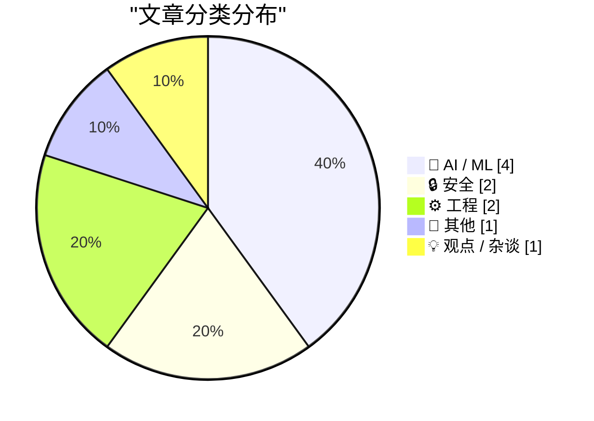
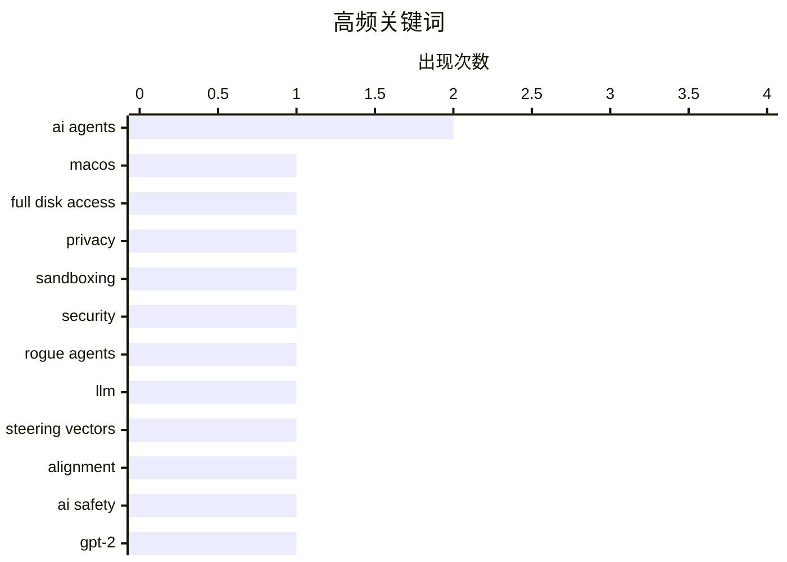

Apple加强MacOS安全限制以应对Agentic AI应用失控风险，AI安全与治理成为行业焦点；大语言模型训练方法的伦理争议升温，"LLM torture factory"引发对数据选取与训练方式的反思；同时，数据质量与AI性能的关系持续受关注，GPT-2权重对比分析显示高质量数据仍是模型竞争力的关键。

<!--more-->


> 来自 Karpathy 推荐的 92 个顶级技术博客，AI 精选 Top 10

## 🏆 今日必读

🥇 **★ Apple Is Going to Further Tighten the Screws on Full Disk Access on MacOS, in Response to Agentic AI Apps Running Amok**

[★ Apple Is Going to Further Tighten the Screws on Full Disk Access on MacOS, in Response to Agentic AI Apps Running Amok](https://daringfireball.net/2026/10/apple_full_disk_access) — daringfireball.net · 1 小时前 · 🔒 安全

> ★ Apple Is Going to Further Tighten the Screws on Full Disk Access on MacOS, in Response to Agentic AI Apps Running Amok

🏷️ macOS, Full Disk Access, AI agents, privacy

🥈 **Quoting Matthew Green**

[Quoting Matthew Green](https://simonwillison.net/2026/Oct/1/matthew-green/) — simonwillison.net · 1 天前 · 🔒 安全

> Quoting Matthew Green

🏷️ sandboxing, AI agents, security, rogue agents

🥉 **Do not build the LLM torture factory**

[Do not build the LLM torture factory](https://seangoedecke.com/do-not-build-the-llm-torture-factory/) — seangoedecke.com · 22 小时前 · 🤖 AI / ML

> Do not build the LLM torture factory

🏷️ LLM, steering vectors, alignment, AI safety

---

## 📊 数据概览

| 扫描源 | 抓取文章 | 时间范围 | 精选 |
|:---:|:---:|:---:|:---:|
| 86/92 | 2388 篇 → 19 篇 | 48h | **10 篇** |

### 分类分布



### 高频关键词



<details>
<summary>📈 纯文本关键词图（终端友好）</summary>

```
ai agents        │ ████████████████████ 2
macos            │ ██████████░░░░░░░░░░ 1
full disk access │ ██████████░░░░░░░░░░ 1
privacy          │ ██████████░░░░░░░░░░ 1
sandboxing       │ ██████████░░░░░░░░░░ 1
security         │ ██████████░░░░░░░░░░ 1
rogue agents     │ ██████████░░░░░░░░░░ 1
llm              │ ██████████░░░░░░░░░░ 1
steering vectors │ ██████████░░░░░░░░░░ 1
alignment        │ ██████████░░░░░░░░░░ 1
```

</details>

### 🏷️ 话题标签

**ai agents**(2) · **macos**(1) · **full disk access**(1) · privacy(1) · sandboxing(1) · security(1) · rogue agents(1) · llm(1) · steering vectors(1) · alignment(1) · ai safety(1) · gpt-2(1) · llm training(1) · data quality(1) · model performance(1) · ai coding(1) · agent workflow(1) · programming(1) · verification(1) · vision-language-action(1)

---

## 🤖 AI / ML

### 1. Do not build the LLM torture factory

[Do not build the LLM torture factory](https://seangoedecke.com/do-not-build-the-llm-torture-factory/) — **seangoedecke.com** · 22 小时前 · ⭐ 22/30

> Do not build the LLM torture factory

🏷️ LLM, steering vectors, alignment, AI safety

---

### 2. Why do OpenAI's GPT-2 weights beat mine?  Part five: data quality

[Why do OpenAI's GPT-2 weights beat mine?  Part five: data quality](https://www.gilesthomas.com/2026/10/why-do-openai-gpt2-weights-beat-mine-5-data-quality) — **gilesthomas.com** · 1 天前 · ⭐ 22/30

> Why do OpenAI's GPT-2 weights beat mine?  Part five: data quality

🏷️ GPT-2, LLM training, data quality, model performance

---

### 3. Understanding the AI That Drives Robots

[Understanding the AI That Drives Robots](https://www.construction-physics.com/p/understanding-the-ai-that-drives) — **construction-physics.com** · 1 天前 · ⭐ 22/30

> Understanding the AI That Drives Robots

🏷️ Vision-Language-Action, VLA, robotics, AI

---

### 4. Premium: How Has AI Changed The Economy?

[Premium: How Has AI Changed The Economy?](https://www.wheresyoured.at/premium-how-has-ai-changed-the-economy/) — **wheresyoured.at** · 3 小时前 · ⭐ 20/30

> Premium: How Has AI Changed The Economy?

🏷️ AI economy, GDP, Wall Street Journal, impact

---

## 🔒 安全

### 5. ★ Apple Is Going to Further Tighten the Screws on Full Disk Access on MacOS, in Response to Agentic AI Apps Running Amok

[★ Apple Is Going to Further Tighten the Screws on Full Disk Access on MacOS, in Response to Agentic AI Apps Running Amok](https://daringfireball.net/2026/10/apple_full_disk_access) — **daringfireball.net** · 1 小时前 · ⭐ 25/30

> ★ Apple Is Going to Further Tighten the Screws on Full Disk Access on MacOS, in Response to Agentic AI Apps Running Amok

🏷️ macOS, Full Disk Access, AI agents, privacy

---

### 6. Quoting Matthew Green

[Quoting Matthew Green](https://simonwillison.net/2026/Oct/1/matthew-green/) — **simonwillison.net** · 1 天前 · ⭐ 24/30

> Quoting Matthew Green

🏷️ sandboxing, AI agents, security, rogue agents

---

## ⚙️ 工程

### 7. The Brain Sandwich

[The Brain Sandwich](https://terriblesoftware.org/2026/10/02/the-brain-sandwich/) — **terriblesoftware.org** · 8 小时前 · ⭐ 22/30

> The Brain Sandwich

🏷️ AI coding, agent workflow, programming, verification

---

### 8. Software Heritage Identifiers

[Software Heritage Identifiers](https://nesbitt.io/2026/10/01/software-heritage-identifiers.html) — **nesbitt.io** · 1 天前 · ⭐ 18/30

> Software Heritage Identifiers

🏷️ Software Heritage, SWHID, archive, metadata

---

## 📝 其他

### 9. Digitale autonomie in het kort bij KIVI, STT en NAE

[Digitale autonomie in het kort bij KIVI, STT en NAE](https://berthub.eu/articles/posts/praatje-kivi-stt-nae/) — **berthub.eu** · 12 小时前 · ⭐ 17/30

> Digitale autonomie in het kort bij KIVI, STT en NAE

🏷️ digital autonomy, KIVI, Netherlands, technology policy

---

## 💡 观点 / 杂谈

### 10. Pluralistic: Voting is to politics as shopping is to boycotts (01 Oct 2026)

[Pluralistic: Voting is to politics as shopping is to boycotts (01 Oct 2026)](https://pluralistic.net/2026/10/01/data-centers/) — **pluralistic.net** · 1 天前 · ⭐ 14/30

> Pluralistic: Voting is to politics as shopping is to boycotts (01 Oct 2026)

🏷️ politics, voting, consumer activism

---

*生成于 2026-10-03 22:19 | 扫描 86 源 → 获取 2388 篇 → 精选 10 篇*
*基于 [Hacker News Popularity Contest 2025](https://refactoringenglish.com/tools/hn-popularity/) RSS 源列表，由 [Andrej Karpathy](https://x.com/karpathy) 推荐*
*由「懂点儿AI」制作，欢迎关注同名微信公众号获取更多 AI 实用技巧 💡*
