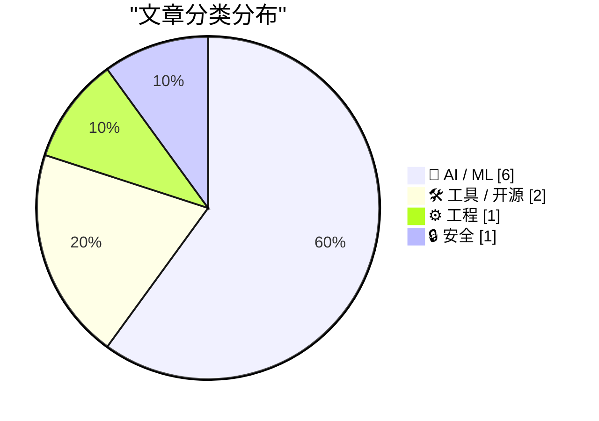
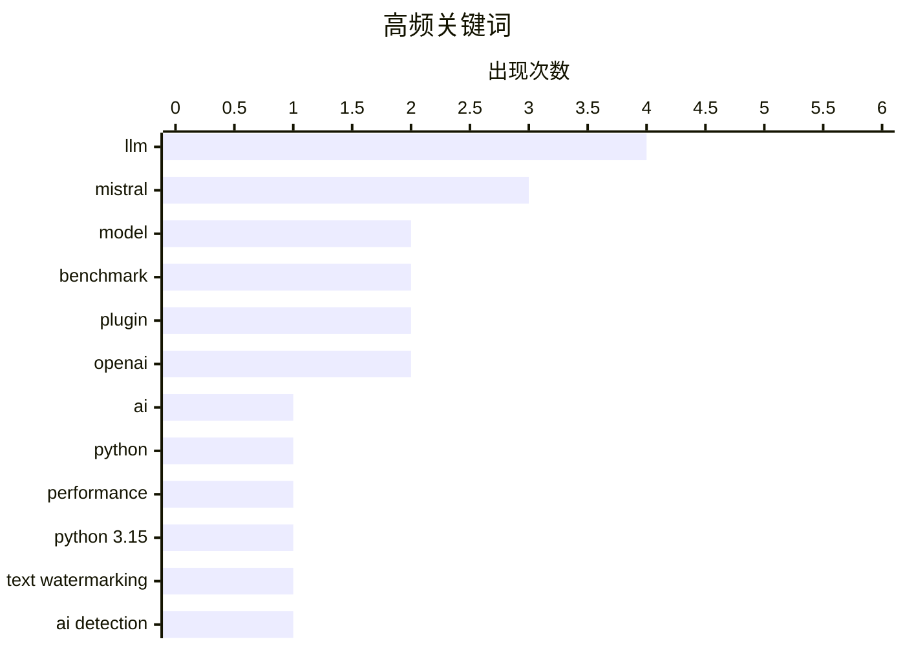

今日技术圈聚焦三大趋势：一是AI大模型军备竞赛持续升级，Mistral发布万亿参数模型Large 4，月底将开源权重；二是AI监管与用户控制权成为焦点，OpenAI推出文本水印应对欧盟AI法案，同时社区开发工具移除macOS AI功能彰显用户对本地AI的主导权；三是前沿模型基准测试饱和问题引发讨论，业界开始反思现有评测体系与实际能力的脱节。

<!--more-->


> 来自 Karpathy 推荐的 92 个顶级技术博客，AI 精选 Top 10

## 🏆 今日必读

🥇 **Mistral Large 4 正式发布：Le chonk**

[Introducing Mistral Large 4: Le chonk](https://simonwillison.net/2026/Oct/6/le-chonk/) — simonwillison.net · 2 小时前 · 🤖 AI / ML

> Mistral 发布 Mistral Large 4 预览版，这是一款拥有 1 万亿参数、490 亿活跃参数的模型，使用 3,800 个 NVIDIA Grace Blackwell GPU 训练而成。目前仅通过 API 提供，支持「none」和「high」两级推理模式。模型对比测试显示「high」模式输出 2,717 tokens 而「none」模式输出 3,275 tokens。官方承诺本月底开源权重。

💡 **为什么值得读**: 这是 Mistral 回归大模型竞争的重要产品，参数规模和技术细节值得关注的 AI 从业者了解。

🏷️ Mistral, LLM, model, AI

🥈 **Python 3.15 性能有多快？**

[How fast is Python 3.15?](https://blog.miguelgrinberg.com/post/how-fast-is-python-3-15) — miguelgrinberg.com · 1 天前 · ⚙️ 工程

> 作者对 Python 3.15.0rc3 进行了性能基准测试，对比从 3.10 到 3.14 的各版本表现。这是作者自去年 Python 3.14 评测后的又一次年度性能对比。文章包含详细的图表和数据表格，结论部分在文章末尾。

💡 **为什么值得读**: Python 性能优化是后端开发者的核心关注点，3.15 相比前版本的性能提升对升级决策有重要参考价值。

🏷️ Python, performance, benchmark, Python 3.15

🥉 **llm-mistral 0.16 发布**

[llm-mistral 0.16](https://simonwillison.net/2026/Oct/6/llm-mistral/) — simonwillison.net · 46 分钟前 · 🛠 工具 / 开源

> llm-mistral 插件发布 0.16 版本，新增对推理模型的支持，包括最新发布的 Mistral Large 4。

💡 **为什么值得读**: 如果你是 LLM 工具链用户，这个版本更新能让你体验 Mistral 的新推理模型。

🏷️ llm, mistral, plugin, LLM

---

## 📊 数据概览

| 扫描源 | 抓取文章 | 时间范围 | 精选 |
|:---:|:---:|:---:|:---:|
| 85/92 | 2364 篇 → 32 篇 | 48h | **10 篇** |

### 分类分布



### 高频关键词



<details>
<summary>📈 纯文本关键词图（终端友好）</summary>

```
llm         │ ████████████████████ 4
mistral     │ ███████████████░░░░░ 3
model       │ ██████████░░░░░░░░░░ 2
benchmark   │ ██████████░░░░░░░░░░ 2
plugin      │ ██████████░░░░░░░░░░ 2
openai      │ ██████████░░░░░░░░░░ 2
ai          │ █████░░░░░░░░░░░░░░░ 1
python      │ █████░░░░░░░░░░░░░░░ 1
performance │ █████░░░░░░░░░░░░░░░ 1
python 3.15 │ █████░░░░░░░░░░░░░░░ 1
```

</details>

### 🏷️ 话题标签

**llm**(4) · **mistral**(3) · **model**(2) · benchmark(2) · plugin(2) · openai(2) · ai(1) · python(1) · performance(1) · python 3.15(1) · text watermarking(1) · ai detection(1) · eu ai act(1) · ai regulation(1) · new york(1) · ai risks(1) · policy(1) · apple intelligence(1) · macos(1) · cli(1)

---

## 🤖 AI / ML

### 1. Mistral Large 4 正式发布：Le chonk

[Introducing Mistral Large 4: Le chonk](https://simonwillison.net/2026/Oct/6/le-chonk/) — **simonwillison.net** · 2 小时前 · ⭐ 26/30

> Mistral 发布 Mistral Large 4 预览版，这是一款拥有 1 万亿参数、490 亿活跃参数的模型，使用 3,800 个 NVIDIA Grace Blackwell GPU 训练而成。目前仅通过 API 提供，支持「none」和「high」两级推理模式。模型对比测试显示「high」模式输出 2,717 tokens 而「none」模式输出 3,275 tokens。官方承诺本月底开源权重。

🏷️ Mistral, LLM, model, AI

---

### 2. OpenAI 公布文本水印计划

[OpenAI Announces Their Text Watermarking Plans](https://openai.com/index/eu-text-provenance/) — **daringfireball.net** · 23 小时前 · ⭐ 24/30

> OpenAI 公布文本水印方案以符合欧盟 AI Act 要求。即日起全球 API 用户可选择开启文本水印（默认关闭）；未来几周将在欧盟的 ChatGPT 和 Codex 文字输出中添加不可见水印；同时开放文本水印检测器的申请，最初仅提供给通过审核的研究机构和专家组织。

🏷️ OpenAI, text watermarking, AI detection, EU AI Act

---

### 3. 纽约市即将举行 AI 风险听证会

[Coming soon: New York City’s hearing on AI risks](https://garymarcus.substack.com/p/coming-soon-new-york-citys-hearing) — **garymarcus.substack.com** · 1 天前 · ⭐ 24/30

> 纽约市将举行 AI 风险相关听证会，文章预告了这一即将到来的活动。

🏷️ AI regulation, New York, AI risks, policy

---

### 4. Mistral Large 4 与基准测试饱和讨论

[Mistral Large 4](https://simonwillison.net/2026/Oct/6/hn-49982139/) — **simonwillison.net** · 3 小时前 · ⭐ 23/30

>  Hacker News 上关于 Mistral Large 4 的讨论，提到前沿模型的基准测试已经饱和，测试题目如同「在火星上穿渔网袜的犰狳闯红灯」般脱离实际。作者展示了用不同模型生成该 SVG 图像的对比测试。

🏷️ Mistral, LLM, benchmark

---

### 5. Qwen3.8 27B 用文字表达加法结果的能力测试

[Qwen3.8 27B addition in words](https://simonwillison.net/2026/Oct/4/qwen38-addition-in-words/) — **simonwillison.net** · 1 天前 · ⭐ 21/30

> 研究者 Colin Fraser 两年前的实验，用 GPT-4o 测试大语言模型将数字相加后用文字输出结果的能力。测试覆盖 1-13 位数的加法组合，结果显示随着数字位数增加准确率下降。

🏷️ Qwen, model, experiment, addition

---

### 6. Credit Crunch

[Credit Crunch](https://www.wheresyoured.at/credit-crunch/) — **wheresyoured.at** · 7 小时前 · ⭐ 21/30

> 这是一篇关于 NVIDIA、Anthropic 和 OpenAI 深度分析的文章，作者邀请读者订阅每周高级通讯（年付 70 美元、季付 18 美元、月付 7 美元）。

🏷️ NVIDIA, Anthropic, OpenAI, AI companies

---

## 🛠 工具 / 开源

### 7. llm-mistral 0.16 发布

[llm-mistral 0.16](https://simonwillison.net/2026/Oct/6/llm-mistral/) — **simonwillison.net** · 46 分钟前 · ⭐ 24/30

> llm-mistral 插件发布 0.16 版本，新增对推理模型的支持，包括最新发布的 Mistral Large 4。

🏷️ llm, mistral, plugin, LLM

---

### 8. datasette-atom 0.11a0 发布

[datasette-atom 0.11a0](https://simonwillison.net/2026/Oct/6/datasette-atom/) — **simonwillison.net** · 4 小时前 · ⭐ 22/30

> datasette-atom 插件发布 0.11a0 版本，修复了与最新 Datasette alpha 版本的兼容性问题，使 datasette.io 网站可以升级到 Datasette 1.0a41。

🏷️ datasette, atom, plugin

---

## ⚙️ 工程

### 9. Python 3.15 性能有多快？

[How fast is Python 3.15?](https://blog.miguelgrinberg.com/post/how-fast-is-python-3-15) — **miguelgrinberg.com** · 1 天前 · ⭐ 26/30

> 作者对 Python 3.15.0rc3 进行了性能基准测试，对比从 3.10 到 3.14 的各版本表现。这是作者自去年 Python 3.14 评测后的又一次年度性能对比。文章包含详细的图表和数据表格，结论部分在文章末尾。

🏷️ Python, performance, benchmark, Python 3.15

---

## 🔒 安全

### 10. 非官方命令行工具可移除 macOS 27 的 Apple Intelligence

[Unofficial Command-Line Tool Removes Apple Intelligence From MacOS 27](https://arstechnica.com/apple/2026/10/command-line-tool-quickly-removes-apple-intelligence-from-macos-27/) — **daringfireball.net** · 4 小时前 · ⭐ 23/30

> macOS 27 Golden Gate 没有提供关闭 Apple Intelligence 的选项，AI 模型会占用磁盘空间。开发者 Om Lahore 创建了 RemoveMacAI 工具，可完全且可逆地关闭 Siri、Writing Tools、Genmoji、Image Playground、ChatGPT 扩展及所有摘要功能，并删除模型防止再次下载。Apple 官方称模型约 12GB，实际占用超过 30GB。

🏷️ Apple Intelligence, macOS, CLI, privacy

---

*生成于 2026-10-07 22:19 | 扫描 85 源 → 获取 2364 篇 → 精选 10 篇*
*基于 [Hacker News Popularity Contest 2025](https://refactoringenglish.com/tools/hn-popularity/) RSS 源列表，由 [Andrej Karpathy](https://x.com/karpathy) 推荐*
*由「懂点儿AI」制作，欢迎关注同名微信公众号获取更多 AI 实用技巧 💡*
