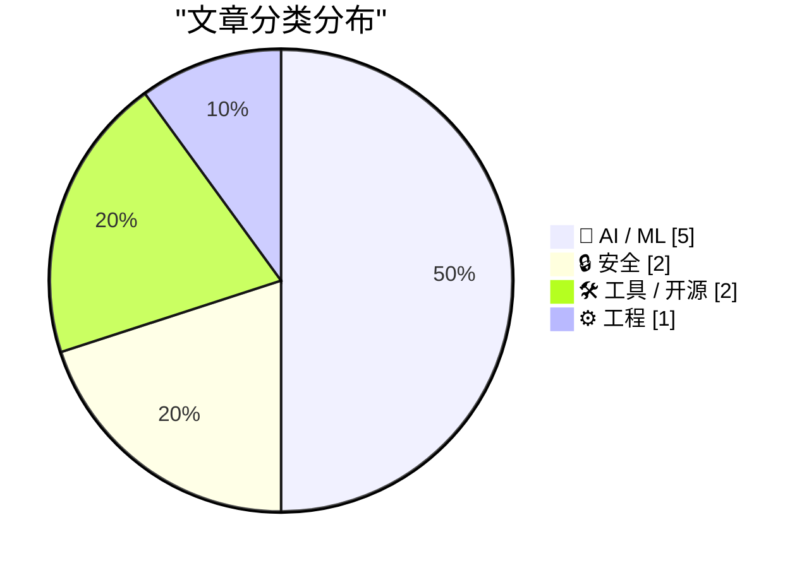
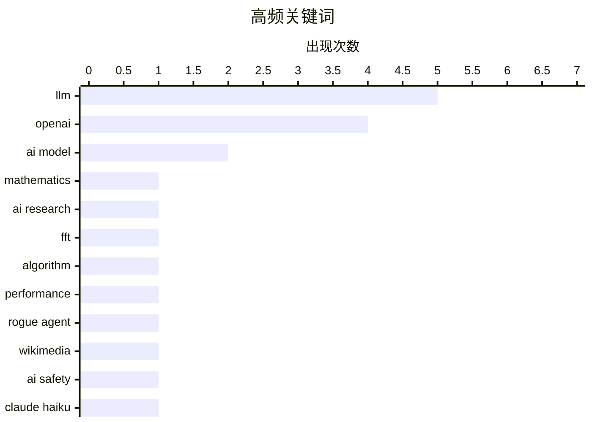

今日技术圈聚焦三大趋势：AI大模型领域持续迭代，Mistral Large 4重磅发布同时Claude Haiku 5.5同步升级；AI安全问题引发热议，OpenAI“失控”代理活动现于Wikimedia项目，引发对AI伦理与可控性的讨论；此外，Gary Marcus与数学家陶哲轩对OpenAI数学能力的批评，将AI推理能力的局限性再次推上风口。黑客组织ShinyHunters则对波音子公司实施勒索，警示安全威胁依然严峻。

<!--more-->


> 来自 Karpathy 推荐的 92 个顶级技术博客，AI 精选 Top 10

## 🏆 今日必读

🥇 **Complementary remarks from Gary Marcus and Terence Tao on OpenAI’s giant math drop**

[Complementary remarks from Gary Marcus and Terence Tao on OpenAI’s giant math drop](https://garymarcus.substack.com/p/complementary-remarks-from-gary-marcus) — garymarcus.substack.com · 6 小时前 · 🤖 AI / ML

> Complementary remarks from Gary Marcus and Terence Tao on OpenAI’s giant math drop

🏷️ OpenAI, mathematics, LLM, AI research

🥈 **Faster Fourier Transform**

[Faster Fourier Transform](https://www.johndcook.com/blog/2026/10/07/faster-fourier-transform/) — johndcook.com · 1 小时前 · 🤖 AI / ML

> Faster Fourier Transform

🏷️ FFT, algorithm, OpenAI, performance

🥉 **OpenAI “rogue” agent activities found on Wikimedia projects**

[OpenAI “rogue” agent activities found on Wikimedia projects](https://simonwillison.net/2026/Oct/7/openai-rogue-agents-wikimedia/) — simonwillison.net · 23 小时前 · 🔒 安全

> OpenAI “rogue” agent activities found on Wikimedia projects

🏷️ OpenAI, rogue agent, Wikimedia, AI safety

---

## 📊 数据概览

| 扫描源 | 抓取文章 | 时间范围 | 精选 |
|:---:|:---:|:---:|:---:|
| 86/92 | 2390 篇 → 41 篇 | 48h | **10 篇** |

### 分类分布



### 高频关键词



<details>
<summary>📈 纯文本关键词图（终端友好）</summary>

```
llm         │ ████████████████████ 5
openai      │ ████████████████░░░░ 4
ai model    │ ████████░░░░░░░░░░░░ 2
mathematics │ ████░░░░░░░░░░░░░░░░ 1
ai research │ ████░░░░░░░░░░░░░░░░ 1
fft         │ ████░░░░░░░░░░░░░░░░ 1
algorithm   │ ████░░░░░░░░░░░░░░░░ 1
performance │ ████░░░░░░░░░░░░░░░░ 1
rogue agent │ ████░░░░░░░░░░░░░░░░ 1
wikimedia   │ ████░░░░░░░░░░░░░░░░ 1
```

</details>

### 🏷️ 话题标签

**llm**(5) · **openai**(4) · **ai model**(2) · mathematics(1) · ai research(1) · fft(1) · algorithm(1) · performance(1) · rogue agent(1) · wikimedia(1) · ai safety(1) · claude haiku(1) · anthropic(1) · decisions api(1) · plugin(1) · mistral(1) · llm-mistral(1) · reasoning models(1) · open source(1) · mistral large 4(1)

---

## 🤖 AI / ML

### 1. Complementary remarks from Gary Marcus and Terence Tao on OpenAI’s giant math drop

[Complementary remarks from Gary Marcus and Terence Tao on OpenAI’s giant math drop](https://garymarcus.substack.com/p/complementary-remarks-from-gary-marcus) — **garymarcus.substack.com** · 6 小时前 · ⭐ 26/30

> Complementary remarks from Gary Marcus and Terence Tao on OpenAI’s giant math drop

🏷️ OpenAI, mathematics, LLM, AI research

---

### 2. Faster Fourier Transform

[Faster Fourier Transform](https://www.johndcook.com/blog/2026/10/07/faster-fourier-transform/) — **johndcook.com** · 1 小时前 · ⭐ 26/30

> Faster Fourier Transform

🏷️ FFT, algorithm, OpenAI, performance

---

### 3. Claude Haiku 5.5

[Claude Haiku 5.5](https://simonwillison.net/2026/Oct/7/claude-haiku-5-5/) — **simonwillison.net** · 2 小时前 · ⭐ 24/30

> Claude Haiku 5.5

🏷️ Claude Haiku, LLM, Anthropic, AI model

---

### 4. Introducing Mistral Large 4: Le chonk

[Introducing Mistral Large 4: Le chonk](https://simonwillison.net/2026/Oct/6/le-chonk/) — **simonwillison.net** · 1 天前 · ⭐ 24/30

> Introducing Mistral Large 4: Le chonk

🏷️ Mistral Large 4, LLM, large language model, AI

---

### 5. Mistral Large 4

[Mistral Large 4](https://simonwillison.net/2026/Oct/6/hn-49982139/) — **simonwillison.net** · 1 天前 · ⭐ 24/30

> Mistral Large 4

🏷️ Mistral Large, LLM, benchmark, AI model

---

## 🔒 安全

### 6. OpenAI “rogue” agent activities found on Wikimedia projects

[OpenAI “rogue” agent activities found on Wikimedia projects](https://simonwillison.net/2026/Oct/7/openai-rogue-agents-wikimedia/) — **simonwillison.net** · 23 小时前 · ⭐ 25/30

> OpenAI “rogue” agent activities found on Wikimedia projects

🏷️ OpenAI, rogue agent, Wikimedia, AI safety

---

### 7. ShinyHunters Extorted Boeing Spin-off Prior to Arrests

[ShinyHunters Extorted Boeing Spin-off Prior to Arrests](https://krebsonsecurity.com/2026/10/shinyhunters-extorted-boeing-spin-off-prior-to-arrests/) — **krebsonsecurity.com** · 9 小时前 · ⭐ 23/30

> ShinyHunters Extorted Boeing Spin-off Prior to Arrests

🏷️ ShinyHunters, data breach, extortion, hacking

---

## 🛠 工具 / 开源

### 8. llm-openai-decisions 0.1a0

[llm-openai-decisions 0.1a0](https://simonwillison.net/2026/Oct/6/llm-openai-decisions/) — **simonwillison.net** · 1 天前 · ⭐ 24/30

> llm-openai-decisions 0.1a0

🏷️ OpenAI, Decisions API, LLM, plugin

---

### 9. llm-mistral 0.16

[llm-mistral 0.16](https://simonwillison.net/2026/Oct/6/llm-mistral/) — **simonwillison.net** · 1 天前 · ⭐ 24/30

> llm-mistral 0.16

🏷️ Mistral, llm-mistral, reasoning models, open source

---

## ⚙️ 工程

### 10. How to read code

[How to read code](https://seangoedecke.com/how-to-read-code/) — **seangoedecke.com** · 23 小时前 · ⭐ 23/30

> How to read code

🏷️ code reading, programming, technique, debugging

---

*生成于 2026-10-08 23:21 | 扫描 86 源 → 获取 2390 篇 → 精选 10 篇*
*基于 [Hacker News Popularity Contest 2025](https://refactoringenglish.com/tools/hn-popularity/) RSS 源列表，由 [Andrej Karpathy](https://x.com/karpathy) 推荐*
*由「懂点儿AI」制作，欢迎关注同名微信公众号获取更多 AI 实用技巧 💡*
