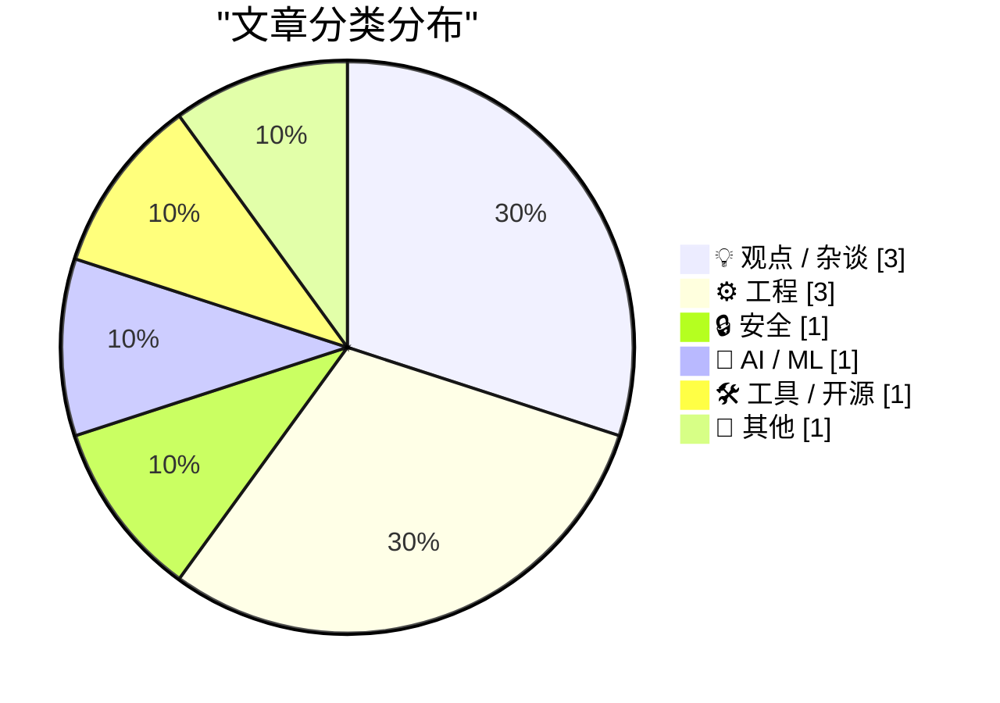
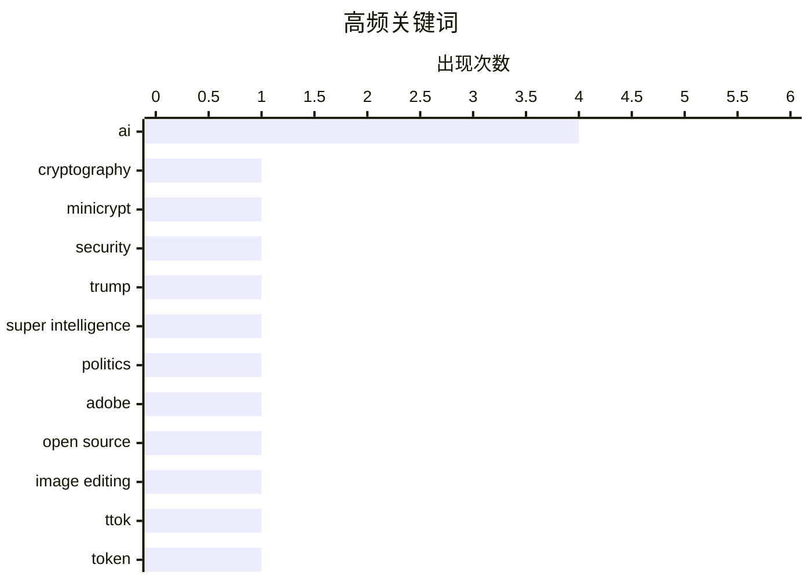

今日技术圈聚焦三大趋势：AI与机器学习持续渗透创意工具，Photoshop等传统软件正被解构重构；硬件领域持续升温，Radxa新品以双倍树莓派性能抢占嵌入式市场；同时，软件工程界开始反思"现代化跑步机"效应，开发者寻求摆脱持续升级的疲惫循环。苹果iOS 27采用率低迷则反映出系统迭代面临的用户倦怠挑战。

<!--more-->


> 来自 Karpathy 推荐的 92 个顶级技术博客，AI 精选 Top 10

## 🏆 今日必读

🥇 **Quoting Matthew Green**

[Quoting Matthew Green](https://simonwillison.net/2026/Oct/9/matthew-green/) — simonwillison.net · 7 小时前 · 🔒 安全

> Quoting Matthew Green

🏷️ cryptography, Minicrypt, AI, security

🥈 **Let’s Check In on Trump’s Blog**

[Let’s Check In on Trump’s Blog](https://truthsocial.com/@realDonaldTrump/posts/117406176604364910) — daringfireball.net · 23 小时前 · 💡 观点 / 杂谈

> Let’s Check In on Trump’s Blog

🏷️ Trump, AI, Super Intelligence, politics

🥉 **Let’s Deconstruct Photoshop**

[Let’s Deconstruct Photoshop](https://feed.tedium.co/link/15204/17492299/artcraft-vibe-coding-creative-cloud-remake) — tedium.co · 1 天前 · 🤖 AI / ML

> Let’s Deconstruct Photoshop

🏷️ Adobe, AI, open source, image editing

---

## 📊 数据概览

| 扫描源 | 抓取文章 | 时间范围 | 精选 |
|:---:|:---:|:---:|:---:|
| 86/92 | 2396 篇 → 31 篇 | 48h | **10 篇** |

### 分类分布



### 高频关键词



<details>
<summary>📈 纯文本关键词图（终端友好）</summary>

```
ai                 │ ████████████████████ 4
cryptography       │ █████░░░░░░░░░░░░░░░ 1
minicrypt          │ █████░░░░░░░░░░░░░░░ 1
security           │ █████░░░░░░░░░░░░░░░ 1
trump              │ █████░░░░░░░░░░░░░░░ 1
super intelligence │ █████░░░░░░░░░░░░░░░ 1
politics           │ █████░░░░░░░░░░░░░░░ 1
adobe              │ █████░░░░░░░░░░░░░░░ 1
open source        │ █████░░░░░░░░░░░░░░░ 1
image editing      │ █████░░░░░░░░░░░░░░░ 1
```

</details>

### 🏷️ 话题标签

**ai**(4) · **cryptography**(1) · **minicrypt**(1) · security(1) · trump(1) · super intelligence(1) · politics(1) · adobe(1) · open source(1) · image editing(1) · ttok(1) · token(1) · cli(1) · openai(1) · programming(1) · complexity(1) · htmx(1) · learning(1) · radxa(1) · raspberry pi(1)

---

## 💡 观点 / 杂谈

### 1. Let’s Check In on Trump’s Blog

[Let’s Check In on Trump’s Blog](https://truthsocial.com/@realDonaldTrump/posts/117406176604364910) — **daringfireball.net** · 23 小时前 · ⭐ 22/30

> Let’s Check In on Trump’s Blog

🏷️ Trump, AI, Super Intelligence, politics

---

### 2. Quoting Carson Gross

[Quoting Carson Gross](https://simonwillison.net/2026/Oct/8/carson-gross/) — **simonwillison.net** · 1 天前 · ⭐ 20/30

> Quoting Carson Gross

🏷️ programming, complexity, htmx, learning

---

### 3. No Man Is an Island

[No Man Is an Island](https://borretti.me/article/no-man-is-an-island) — **borretti.me** · 1 天前 · ⭐ 20/30

> No Man Is an Island

🏷️ AI, knowledge work, intellectual contribution

---

## ⚙️ 工程

### 4. Radxa's Q8B has 2x the performance and expansion of the Pi 5

[Radxa's Q8B has 2x the performance and expansion of the Pi 5](https://www.jeffgeerling.com/blog/2026/radxa-q8b-double-pi-5/) — **jeffgeerling.com** · 2 小时前 · ⭐ 20/30

> Radxa's Q8B has 2x the performance and expansion of the Pi 5

🏷️ Radxa, Raspberry Pi, SBC, hardware

---

### 5. “Getting off the Modernization Treadmill”

[“Getting off the Modernization Treadmill”](https://blog.jim-nielsen.com/2026/talk-notes-modernization-treadmill/) — **blog.jim-nielsen.com** · 1 天前 · ⭐ 20/30

> “Getting off the Modernization Treadmill”

🏷️ modernization, technical debt, software development

---

### 6. Monte-Carlo simulations

[Monte-Carlo simulations](https://eli.thegreenplace.net/2026/monte-carlo-simulations/) — **eli.thegreenplace.net** · 1 天前 · ⭐ 20/30

> Monte-Carlo simulations

🏷️ Monte Carlo, simulation, randomness, algorithms

---

## 🔒 安全

### 7. Quoting Matthew Green

[Quoting Matthew Green](https://simonwillison.net/2026/Oct/9/matthew-green/) — **simonwillison.net** · 7 小时前 · ⭐ 23/30

> Quoting Matthew Green

🏷️ cryptography, Minicrypt, AI, security

---

## 🤖 AI / ML

### 8. Let’s Deconstruct Photoshop

[Let’s Deconstruct Photoshop](https://feed.tedium.co/link/15204/17492299/artcraft-vibe-coding-creative-cloud-remake) — **tedium.co** · 1 天前 · ⭐ 22/30

> Let’s Deconstruct Photoshop

🏷️ Adobe, AI, open source, image editing

---

## 🛠 工具 / 开源

### 9. ttok 1.0

[ttok 1.0](https://simonwillison.net/2026/Oct/9/ttok/) — **simonwillison.net** · 21 小时前 · ⭐ 21/30

> ttok 1.0

🏷️ ttok, token, CLI, OpenAI

---

## 📝 其他

### 10. Apple Is Slow-Rolling iOS 27 Adoption, So Far

[Apple Is Slow-Rolling iOS 27 Adoption, So Far](https://mastodon.social/@_Davidsmith/117355154519434137) — **daringfireball.net** · 1 天前 · ⭐ 19/30

> Apple Is Slow-Rolling iOS 27 Adoption, So Far

🏷️ iOS, adoption, Apple, mobile

---

*生成于 2026-10-10 22:19 | 扫描 86 源 → 获取 2396 篇 → 精选 10 篇*
*基于 [Hacker News Popularity Contest 2025](https://refactoringenglish.com/tools/hn-popularity/) RSS 源列表，由 [Andrej Karpathy](https://x.com/karpathy) 推荐*
*由「懂点儿AI」制作，欢迎关注同名微信公众号获取更多 AI 实用技巧 💡*
