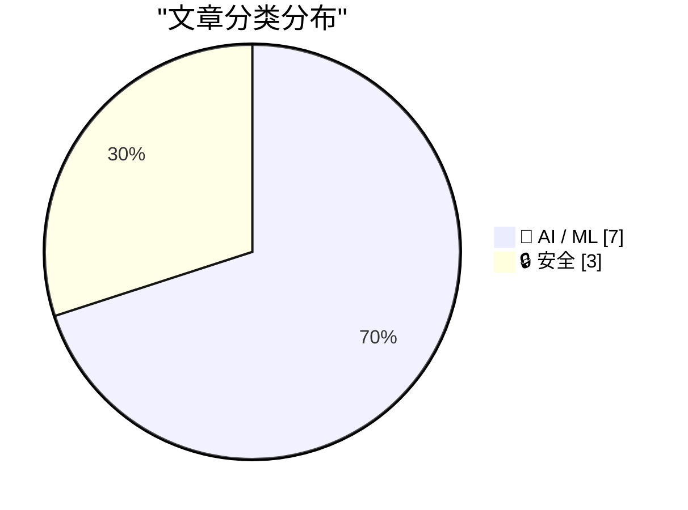
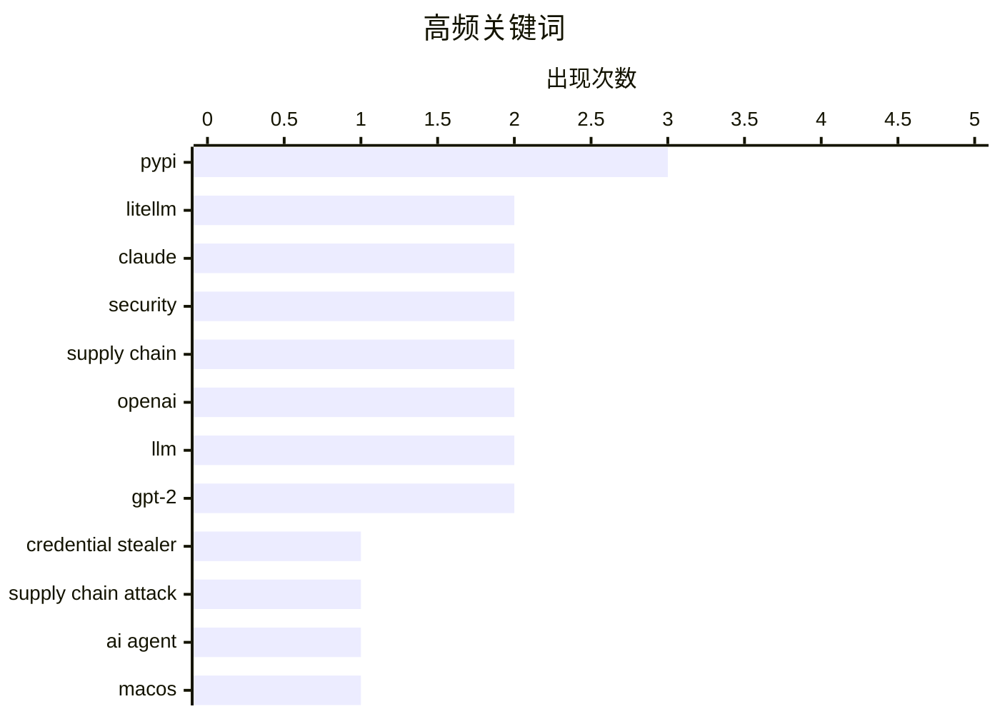

今日安全领域爆发供应链攻击事件，LiteLLM 包被植入凭据窃取器，46分钟内近5万次下载，暴露了包管理器依赖更新的风险。AI 助手能力持续扩展，Claude 新增 Mac 屏幕控制功能，同时 Claude Code 引入自动模式以平衡自动化与安全。OpenAI 策略转向整合，准备推出桌面超级应用统一 ChatGPT、Codex 和浏览器，而视频生成工具 Sora 上线仅两周便宣布关闭。

<!--more-->

## 🏆 今日必读

🥇 **LiteLLM 1.82.8 中的恶意 litellm_init.pth——凭据窃取器**

[Malicious litellm_init.pth in litellm 1.82.8 — credential stealer](https://simonwillison.net/2026/Mar/24/malicious-litellm/#atom-everything) — simonwillison.net · 1 天前 · 🔒 安全

> LiteLLM v1.82.8 发布到 PyPI 的包被植入恶意凭据窃取器，隐藏在 base64 编码的 litellm_init.pth 文件中。攻击在安装包时就会触发，无需执行 import litellm。1.82.7 版本也存在漏洞但位于 proxy/proxy_server.py 中，需要导入包才能生效。PyPI 已将 litellm 包隔离，攻击窗口仅有数小时。

💡 **为什么值得读**: 这是近期最重要的 PyPI 供应链攻击事件，涉及凭据窃取手法隐蔽，值得所有 Python 开发者关注。

🏷️ LiteLLM, credential stealer, PyPI, supply chain attack

🥈 **Claude 现在可以控制你的 Mac**

[Claude Can Now Take Control of Your Mac](https://claude.com/blog/dispatch-and-computer-use) — daringfireball.net · 21 小时前 · 🤖 AI / ML

> Claude 在 Cowork 和 Code 中新增了计算机控制功能，可以自动点击、导航屏幕来完成任务，无需任何设置。该功能目前向 Pro 和 Max 订阅用户开放研究预览。结合 Dispatch 功能，用户可以从手机分配任务给 Claude。作者认为在真实 Mac 上使用存在风险，但承认自己曾对许多前沿 AI 功能持怀疑态度后最终尝试。

💡 **为什么值得读**: 这是首个由 AI 公司而非苹果官方提供的 Mac 代理功能，代表了 AI 助手能力的重要里程碑。

🏷️ Claude, AI agent, macOS, computer use

🥉 **LiteLLM 攻击：你是否中招？47000 分之一？**

[LiteLLM Hack: Were You One of the 47,000?](https://simonwillison.net/2026/Mar/25/litellm-hack/#atom-everything) — simonwillison.net · 5 小时前 · 🔒 安全

> Daniel Hnyk 利用 BigQuery PyPI 数据集分析发现，恶意版 LiteLLM 包在 PyPI 上线 46 分钟内共有 46,996 次下载（涉及 1.82.7 和 1.82.8 两个版本）。还识别出 2,337 个依赖 LiteLLM 的包，其中 88% 未锁定版本以避免安装恶意版本。

💡 **为什么值得读**: 提供了具体的受影响范围数据，帮助开发者评估自身是否暴露于此次供应链攻击中。

🏷️ LiteLLM, security, PyPI, supply chain

---

## 📊 数据概览

| 扫描源 | 抓取文章 | 时间范围 | 精选 |
|:---:|:---:|:---:|:---:|
| 80/92 | 2344 篇 → 42 篇 | 48h | **10 篇** |

### 分类分布

### 高频关键词

---

## 🤖 AI / ML

### 1. Claude 现在可以控制你的 Mac

[Claude Can Now Take Control of Your Mac](https://claude.com/blog/dispatch-and-computer-use) — **daringfireball.net** · 21 小时前 · ⭐ 26/30

> Claude 在 Cowork 和 Code 中新增了计算机控制功能，可以自动点击、导航屏幕来完成任务，无需任何设置。该功能目前向 Pro 和 Max 订阅用户开放研究预览。结合 Dispatch 功能，用户可以从手机分配任务给 Claude。作者认为在真实 Mac 上使用存在风险，但承认自己曾对许多前沿 AI 功能持怀疑态度后最终尝试。

🏷️ Claude, AI agent, macOS, computer use

---

### 2. WSJ：OpenAI 计划推出桌面「超级应用」

[WSJ: 'OpenAI Plans Launch of Desktop "Superapp"'](https://www.wsj.com/tech/openai-plans-launch-of-desktop-superapp-to-refocus-simplify-user-experience-9e19931d?st=25wiu1) — **daringfireball.net** · 21 小时前 · ⭐ 25/30

> OpenAI 计划将 ChatGPT、编码平台 Codex 和浏览器整合为一个桌面「超级应用」，以简化用户体验并聚焦企业和工程客户。应用主管 Fidji Simo 将监督此次变革，总裁 Greg Brockman 将协助管理产品和相关组织调整。这一策略标志着去年一系列独立产品失败后的重大转变，OpenAI 希望通过统一应用来集中资源以对抗 Anthropic 的竞争。

🏷️ OpenAI, superapp, Codex, desktop

---

### 3. Claude Code 自动模式

[Auto mode for Claude Code](https://simonwillison.net/2026/Mar/24/auto-mode-for-claude-code/#atom-everything) — **simonwillison.net** · 22 小时前 · ⭐ 24/30

> Claude Code 推出自动模式作为 --dangerously-skip-permissions 的替代方案，让 Claude 代表用户做出权限决策，并有安全保障机制在操作运行前进行监控。该防护机制使用 Claude Sonnet 4.6 作为独立分类器模型，在每次操作前审查对话内容，阻止超出任务范围、针对不可信基础设施或由敌意内容驱动的操作。

🏷️ Claude Code, AI, permissions, automation

---

### 4. 哪份设计文档是人类写的？

[Which Design Doc Did a Human Write?](https://refactoringenglish.com/blog/ai-vs-human-design-doc/) — **refactoringenglish.com** · 22 小时前 · ⭐ 24/30

> 作者为同一开源 Web 应用创建了三份设计文档：手动耗时 16 小时完成一份、用 Claude Opus 4.6（中等努力）生成一份、用 GPT-5.4（高努力）生成一份。AI 版本仅用几分钟生成，编写 AI 文档的智能体未看到人类版本。

🏷️ AI design doc, LLM comparison, Claude, GPT-5

---

### 5. OpenAI 关闭 Sora

[OpenAI Is Closing Sora](https://x.com/soraofficialapp/status/2036546752535470382) — **daringfireball.net** · 21 小时前 · ⭐ 23/30

> OpenAI 宣布将关闭 Sora 应用，感谢创作者的支持并承诺分享应用和 API 的时间线以及保存作品的细节。Sora 作为视频生成工具上线后仅维持一两周的热度，作者认为其实际价值有限。

🏷️ OpenAI, Sora, AI video, shutdown

---

### 6. 从零写 LLM（32f）——干预：权重衰减

[Writing an LLM from scratch, part 32f -- Interventions: weight decay](https://www.gilesthomas.com/2026/03/llm-from-scratch-32f-interventions-weight-decay) — **gilesthomas.com** · 1 天前 · ⭐ 23/30

> 作者基于 Sebastian Raschka 的《Build a Large Language Model (from Scratch)》书籍代码，训练 GPT-2 small 基础模型以改进测试损失。训练代码中使用 torch.optim.AdamW 优化器，学习率设为 0.0004，权重衰减（weight_decay）设为 0.1。

🏷️ LLM, GPT-2, weight decay

---

### 7. 从零写 LLM（32g）——干预：权重绑定

[Writing an LLM from scratch, part 32g -- Interventions: weight tying](https://www.gilesthomas.com/2026/03/llm-from-scratch-32g-interventions-weight-tying) — **gilesthomas.com** · 1 天前 · ⭐ 23/30

> Sebastian Raschka 在书中指出权重绑定虽减少参数量但会使模型性能下降，现代 LLM 实际上不使用该技术。作者在尝试各种干预措施来提升 163M 参数小型模型性能时，检验权重绑定是否确实有害，因为原始 GPT-2 权重使用了权重绑定。

🏷️ LLM, GPT-2, weight tying

---

## 🔒 安全

### 8. LiteLLM 1.82.8 中的恶意 litellm_init.pth——凭据窃取器

[Malicious litellm_init.pth in litellm 1.82.8 — credential stealer](https://simonwillison.net/2026/Mar/24/malicious-litellm/#atom-everything) — **simonwillison.net** · 1 天前 · ⭐ 26/30

> LiteLLM v1.82.8 发布到 PyPI 的包被植入恶意凭据窃取器，隐藏在 base64 编码的 litellm_init.pth 文件中。攻击在安装包时就会触发，无需执行 import litellm。1.82.7 版本也存在漏洞但位于 proxy/proxy_server.py 中，需要导入包才能生效。PyPI 已将 litellm 包隔离，攻击窗口仅有数小时。

🏷️ LiteLLM, credential stealer, PyPI, supply chain attack

---

### 9. LiteLLM 攻击：你是否中招？47000 分之一？

[LiteLLM Hack: Were You One of the 47,000?](https://simonwillison.net/2026/Mar/25/litellm-hack/#atom-everything) — **simonwillison.net** · 5 小时前 · ⭐ 25/30

> Daniel Hnyk 利用 BigQuery PyPI 数据集分析发现，恶意版 LiteLLM 包在 PyPI 上线 46 分钟内共有 46,996 次下载（涉及 1.82.7 和 1.82.8 两个版本）。还识别出 2,337 个依赖 LiteLLM 的包，其中 88% 未锁定版本以避免安装恶意版本。

🏷️ LiteLLM, security, PyPI, supply chain

---

### 10. 包管理器需要冷静期

[Package Managers Need to Cool Down](https://simonwillison.net/2026/Mar/24/package-managers-need-to-cool-down/#atom-everything) — **simonwillison.net** · 1 天前 · ⭐ 24/30

> LiteLLM 供应链攻击促使作者重新审视依赖冷静期（dependency cooldowns）概念，即仅在更新版本发布数天后再安装，以社区有时间发现是否存在篡改。本文回顾了当前各大包管理器的冷静期机制支持情况，包括 pnpm 10.16 的 minimumReleaseAge 设置、npm 的 --prioritize-existing 功能以及 pip 和 Poetry 的相关实现。

🏷️ package managers, security, supply chain, PyPI

---

*生成于 2026-03-26 22:27 | 扫描 80 源 → 获取 2344 篇 → 精选 10 篇*
*基于 [Hacker News Popularity Contest 2025](https://refactoringenglish.com/tools/hn-popularity/) RSS 源列表，由 [Andrej Karpathy](https://x.com/karpathy) 推荐*
*由「懂点儿AI」制作，欢迎关注同名微信公众号获取更多 AI 实用技巧 💡*
