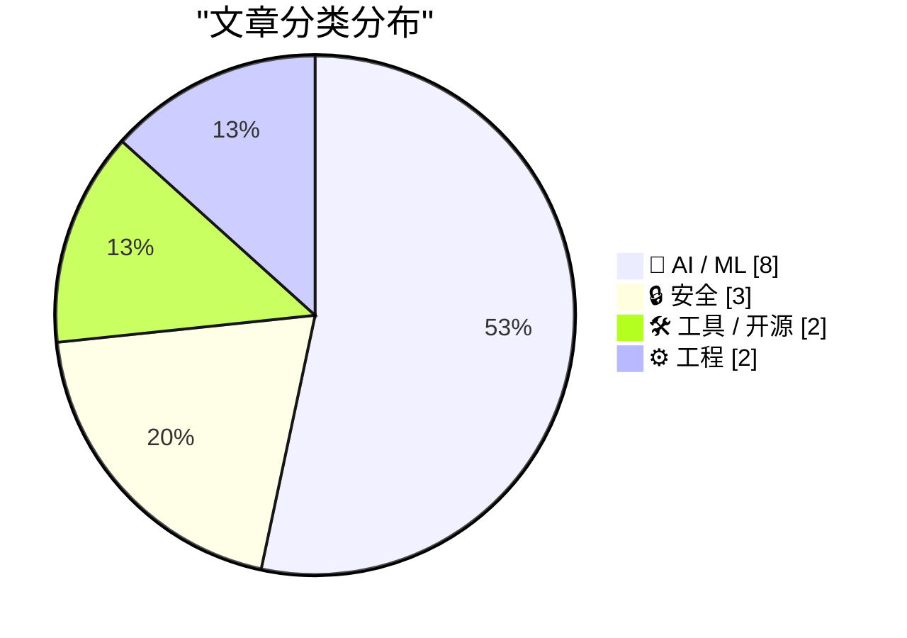
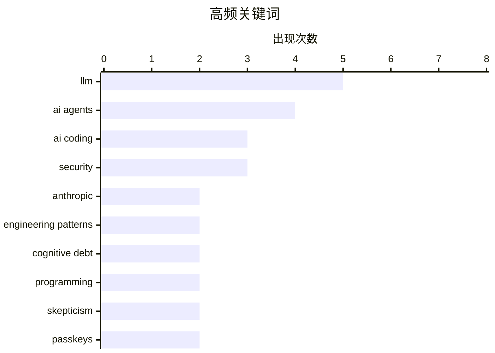

本周精选 15 篇 AI 与技术领域高质量文章，涵盖 AI 编码代理实践、passkeys 安全警示、开源社区支持等热点话题。欢迎阅读！

<!--more-->

# 📰 AI 博客每周精选 — 2026 年 3 月 2 日

> 来自 Karpathy 推荐的 92 个顶级技术博客，AI 精选 Top 15

## 📝 本周看点

本周 AI 编码代理成为技术圈焦点，从深度实践到理性质疑形成热烈讨论；安全领域发出重要警示，passkeys 加密数据的潜在风险引发广泛关注；主流 AI 厂商持续加大开源社区支持力度，Anthropic 宣布向大型开源项目维护者免费提供 Claude Max。

---

## 🏆 本周必读

🥇 **Interactive explanations — Agentic Engineering Patterns**

[Interactive explanations](https://simonwillison.net/guides/agentic-engineering-patterns/interactive-explanations/#atom-everything) — simonwillison.net · 🤖 AI / ML

> Simon Willison 详解智能体工程模式，探讨 AI agents 在工程实践中的应用模式与认知债务问题。

🏷️ AI agents, engineering patterns, cognitive debt, LLM

🥈 **An AI agent coding skeptic tries AI agent coding, in excessive detail**

[An AI agent coding skeptic tries AI agent coding, in excessive detail](https://simonwillison.net/2026/Feb/27/ai-agent-coding-in-excessive-detail/#atom-everything) — simonwillison.net · 🤖 AI / ML

> 一位 AI 编码怀疑论者深度体验 AI 编码代理的详细记录，包含实践中的洞察与反思。

🏷️ AI coding, AI agents, programming, skepticism

🥉 **Please, please, please stop using passkeys for encrypting user data**

[Please, please, please stop using passkeys for encrypting user data](https://simonwillison.net/2026/Feb/27/passkeys/#atom-everything) — simonwillison.net · 🔒 安全

> 重要安全警示：passkeys 设计用于身份验证而非数据加密，误用可能导致用户数据永久丢失。

🏷️ passkeys, encryption, data loss, security

---

## 📊 数据概览

| 扫描源 | 抓取文章 | 时间范围 | 精选 |
|:---:|:---:|:---:|:---:|
| 80/92 | 2273 篇 → 35 篇 | 48h | **15 篇** |

### 分类分布

### 高频关键词

### 🏷️ 话题标签

**llm**(5) · **ai agents**(4) · **ai coding**(3) · **security**(3) · **anthropic**(2) · **engineering patterns**(2) · **cognitive debt**(2) · **programming**(2) · **skepticism**(2) · **passkeys**(2) · **encryption**(2) · **data loss**(1) · **claude max**(1) · **open source**(1) · **kimwolf**(1) · **botnet**(1)

---

## 🤖 AI / ML

### 1. Interactive explanations — Agentic Engineering Patterns

[Interactive explanations](https://simonwillison.net/guides/agentic-engineering-patterns/interactive-explanations/#atom-everything) — **simonwillison.net** · ⭐ 25/30

> 详解智能体工程模式，包括 AI agents 在工程实践中的应用、认知债务等核心概念。

🏷️ AI agents, engineering patterns, cognitive debt, LLM

---

### 2. An AI agent coding skeptic tries AI agent coding, in excessive detail

[An AI agent coding skeptic tries AI agent coding, in excessive detail](https://simonwillison.net/2026/Feb/27/ai-agent-coding-in-excessive-detail/#atom-everything) — **simonwillison.net** · ⭐ 25/30

> AI 编码怀疑论者的深度实践记录，详细记录使用 AI 编码代理的体验与反思。

🏷️ AI coding, AI agents, programming, skepticism

---

### 3. An AI agent coding skeptic tries AI agent coding, in excessive detail

[An AI agent coding skeptic tries AI agent coding, in excessive detail](https://minimaxir.com/2026/02/ai-agent-coding/) — **minimaxir.com** · ⭐ 25/30

> 从另一视角探讨 AI 编码代理的实践效果与局限性。

🏷️ AI coding, agents, software development, LLM

---

### 4. A Cookie for Dario? — Anthropic and selling death

[A Cookie for Dario? — Anthropic and selling death](https://anildash.com/2026/02/27/a-cookie-for-dario/) — **anildash.com** · ⭐ 22/30

> 探讨 Anthropic 与政府合作的伦理问题。

🏷️ Anthropic, AI ethics, LLM, government

---

### 5. Quoting claude.com/import-memory

[Quoting claude.com/import-memory](https://simonwillison.net/2026/Mar/1/claude-import-memory/#atom-everything) — **simonwillison.net** · ⭐ 21/30

> Claude 记忆导入功能的数据导出与隐私考量。

🏷️ Claude, data export, AI assistant, privacy

---

### 6. Free Claude Max for (large project) open source maintainers

[Free Claude Max for (large project) open source maintainers](https://simonwillison.net/2026/Feb/27/claude-max-oss-six-months/#atom-everything) — **simonwillison.net** · ⭐ 22/30

> Anthropic 宣布向大型开源项目维护者免费提供 Claude Max 六个月。

🏷️ Claude Max, open source, Anthropic, free

---

## 🔒 安全

### 7. Please, please, please stop using passkeys for encrypting user data

[Please, please, please stop using passkeys for encrypting user data](https://simonwillison.net/2026/Feb/27/passkeys/#atom-everything) — **simonwillison.net** · ⭐ 23/30

> 重要安全警示：passkeys 不应用于加密用户数据，存在数据丢失风险。

🏷️ passkeys, encryption, data loss, security

---

### 8. Who is the Kimwolf Botmaster "Dort"?

[Who is the Kimwolf Botmaster "Dort"?](https://krebsonsecurity.com/2026/02/who-is-the-kimwolf-botmaster-dort/) — **krebsonsecurity.com** · ⭐ 22/30

> 深度调查 Kimwolf 僵尸网络背后的操作者"Dort"。

🏷️ Kimwolf, botnet, security, Dort

---

## 🛠 工具 / 开源

### 9. Unicode Explorer using binary search over fetch() HTTP range requests

[Unicode Explorer using binary search over fetch() HTTP range requests](https://simonwillison.net/2026/Feb/27/unicode-explorer/#atom-everything) — **simonwillison.net** · ⭐ 20/30

> 使用 HTTP range requests 和二分搜索构建的 Unicode 探索工具。

🏷️ Unicode, HTTP range, binary search, web tool

---

## ⚙️ 工程

### 10. Redis patterns for coding

[Redis patterns for coding](http://antirez.com/2026/02/redis-patterns-for-coding/) — **antirez.com** · ⭐ 21/30

> Redis 作者 antirez 分享 Redis 在编码实践中的设计模式。

🏷️ Redis, patterns, documentation

---

## 📈 趋势观察

1. **AI 编码代理成熟度讨论**: 技术圈从盲目追捧转向理性评估，Simon Willison 和 Max Woolf 等权威人士发布深度实践报告
2. **安全警钟**: passkeys 误用风险被广泛传播，提醒开发者正确使用认证技术
3. **开源支持**: Anthropic 等 AI 厂商加大对开源社区的投入，形成良性生态

---

*生成于 2026-03-02 | 扫描 80 源 → 获取 2273 篇 → 精选 15 篇*
*基于 [Hacker News Popularity Contest 2025](https://refactoringenglish.com/tools/hn-popularity/) RSS 源列表，由 [Andrej Karpathy](https://x.com/karpathy) 推荐*
*由「懂点儿 AI」制作，欢迎关注同名微信公众号获取更多 AI 实用技巧 💡*
